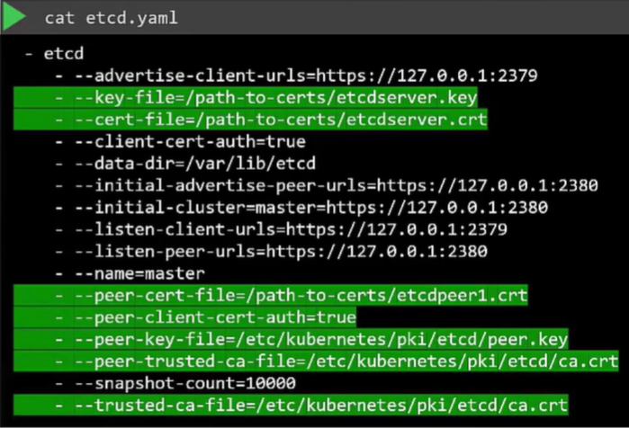
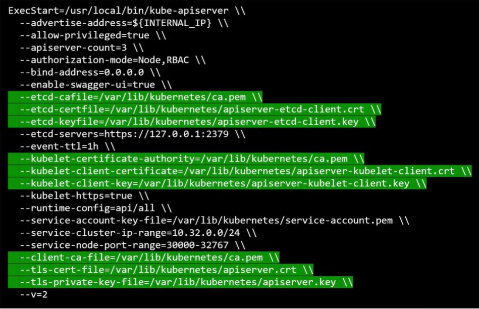

Для генерации сертификатов существуют различные инструменты, такие как *easyrsa*, *openssl*, *cfssl* и др. В данном уроке мы будем использовать openssl для генерации сертификатов.

Начнем с сертификатов CA.

- Сначала создаем приватный ключ: `openssl genrsa -out ca.key 2048`
- Затем создаем Certificate Signing Request: `openssl req -new -key ca.key -subj "/CN=KUBERNETES-CA" -out ca.csr`.

CSR - это как сертификат со всеми подробностями, но без подписи. В CSR мы указываем название компонента, для которого предназначен этот сертификат в поле `CN` (Common Name). Т.к. в данном случае мы создаем сертификат для Kubernetes CA, то назвали его соответствующим образом.

В конце мы подписываем сертификат: `openssl x509 -req -in ca.csr -signkey ca.key -out ca.crt`.

Т.к. сертификат предназначен для самого CA, то он самоподписан самим CA с использованием его собственного приватного ключа, сгенерированного на первом шаге. Далее мы будем использовать пару ключей CA для подписания и других сертификатов.

Теперь CA имеет приватный ключ и корневой сертификат. Отлично.

Теперь рассмотрим создание клиентских сертификатов. Начнем с пользователя admin.

- Сначала создаем приватный ключ: `openssl genrsa -out admin.key 2048`
- Затем создаем Certificate Signing Request: `openssl req -new -key admin.key -subj "/CN=kube-admin" -out admin.csr`.

Имя не обязательно должно быть `kube-admin`, это может быть что угодно. Но помните, что с этим именем будет аутентифицироваться клиент kubectl при использование kubectl-команд. Поэтому указанное имя вы будете видеть в логах аудита и в других местах. Соответственно указывайте в этом поле релевантное имя.

В конце генерируем подписанный сертификат, но в этот раз указываем ключ и сертификат CA:

`openssl x509 -req -in admin.csr -CA ca.crt -CAkey ca.key -out admin.crt`

Вы подписываете ваш сертификат с помощью пары ключей CA. Это создаст действительный сертификат в пределах кластера. Теперь с помощью сертификата `admin.crt` пользователь admin будет аутентифицироваться в K8s-кластере.

Процесс создания пары ключ/сертификат похож на процесс создания аккаунта для нового пользователя. Сертификат - проверенный ID пользователя, а ключ выступает в роли пароля. Только это намного безопаснее, чем простые имя пользователя и пароль.

Как вы будете различать пользователя admin и других пользователей? Аккаунт пользователя должен быть идентифицирован как пользователь admin, а не просто как еще один обычный пользователь. Делается это путем добавления в сертификат деталей о группе пользователя. В данном случае группа с именем `SYSTEM:MASTERS`, существующая в K8s, обладает административными привилегиями. Вы должны упомянуть эту информацию в вашем CSR. Это можно сделать путем добавления деталей о группе в параметр `OU` в процессе генерирования CSR:

`openssl req -new -key admin.key -subj "/CN=kube-admin/O=system:masters" -out admin.csr`

Как только он подписан, мы имеем сертификат для пользователя admin с административными привилегиями.

Следуя этому процессу, мы генерируем клиентские сертификаты для всех остальных компонентов, обращающихся к API-серверу.

Kube-scheduler - системный компонент, являющийся частью K8s control plane. Поэтому его имя должно иметь префикс "system" - `SYSTEM:KUBE-SCHEDULER`.

Аналогично для kube-controller-manager, который также является частью K8s control plane. Поэтому его имя должно иметь префикс "system" - `SYSTEM:KUBE-CONTROLLER-MANAGER`.

И наконец kube-proxy будет иметь имя `KUBE-PROXY`.

На данный момент мы создали сертификаты CA, все клиентские сертификаты, включая пользователя admin, scheduler, controller-manager, kube-proxy.

Мы будем следовать этой же процедуре для создания трех оставшихся клиентских сертификатов для API-сервера и kubelet, когда будем создавать для них серверные сертификаты. А пока отложим их в сторону.

Что нам нужно делать с этими сертификатами? Возьмем для примера админский сертификат для управления кластером. Вы можете использовать его вместо имени пользователя и пароля в REST API вызовах, которые вы делаете к API-серверу:

`curl https://kube-apiserver:6443/api/v1/pods --key admin.key --cert admin.crt --cacert ca.crt`

Это один способ. Другой способ - переместить все эти параметры в конфигурационный файл `kube-config.yaml`:

```yaml
apiVersion: v1
clusters:
- cluster:
    certificate-authority: ca.crt
    server: https://kube-apiserver:6443
  name: kubernetes
kind: Config
users:
- name: kubernetes-admin
  user:
    client-certificate: admin.crt
    client-key: admin.key
```

Важно помнить об одной вещи. Чтобы клиент мог проверить сертификат, отправленный сервером и наоборот, им требуется копия публичного сертификата CA, которая уже установлена в браузерах пользователей, в случае если мы говорим о веб-приложениях. Аналогично в K8s, чтобы различные компоненты могли проверить подлинность друг друга, всем им требуется копия корневого сертификата CA. Поэтому всякий раз, когда вы настраиваете клиент или сервер с помощью сертификатов, нужно также указывать корневой сертификат CA.

Теперь рассмотрим серверные сертификаты, начнем с etcd. Следую все той же процедуре как и прежде, сгенерируем сертификат для etcd и назоваем его `ETCD-SERVER`. Сервер etcd может быть развернут как кластер на нескольких серверах в HA-окружении. В этом случае для защиты взаимодействия между разными членами кластера, мы должны сгенерировать дополнительные peer-сертификаты. Как только сертификаты сгенерированы, укажите их в соответствуюищх настройках: `--key-file` и `--cert-file`. Также доступны опции для указания peer-сертификатов. Также необходимо указать корневой сертификат CA для проверки, что клиенты, подключающиеся к etcd, являются валидными.

<br>

Теперь поговорим о kube-apiserver. Как и прежде генерируем сертификаты для API-сервера. Однако стоит учесть, что kube-apiserver является самым популярным компонентом кластера. Все общаются с API-сервером, каждая операция проходит через него. Если что-то происходит в кластере, API-сервер узнает об этом. Если вам нужна информация, вы обращаетесь к API-серверу. У него много имен и псевдонимов (aliases) в кластере. Его настоящее имя - *kube-apiserver*. Некоторые называют его *kubernetes*, т.к. для большинства людей, которые не знают, что происходит под капотом K8s, kube-apiserver и есть kubernetes. Другие называет его *kubernetes.default*. Третьи ссылаются на него как *kubernetes.default.svc*. Кто-то обращается по полному имени *kubernetes.default.svc.cluster.local*. Наконец в некоторых случаях к нему могут обращаться просто по ip-адресу (хоста, на котором запущен kube-apiserver или ip-адресу pod-а, в котором он работает). Все эти имена должны быть представлены в сертификате, сгенерированном для kube-apiserver. Только тогда те, кто обращается к API-серверу по этим именам, смогут установить валидное соединение.

Далее используем все тот же набор команд.

- Создаем приватный ключ: `openssl genrsa -out apiserver.key 2048`
- Затем создаем Certificate Signing Request: `openssl req -new -key apiserver.key -subj "/CN=kube-apiserver" -out apiserver.csr`.

Но как нам указать все альтернативные имена? Для этого мы должны создать конфигурационный файл `openssl.cnf` и прописать их там наряду с ip-адресами:

```bash
[req]
req_extensions = v3_req
distinguished_name = req_distinguished_name
[req_distinguished_name]
[v3_req]
basicConstraints = CA:FALSE
keyUsage = nonRepudiation
subjectAltName = @alt_names
[alt_names]
DNS.1 = kubernetes
DNS.2 = kubernetes.default
DNS.3 = kubernetes.default.svc
DNS.4 = kubernetes.default.svc.cluster.local
IP.1 = 10.96.0.1
IP.2 = 172.17.0.87
```

Далее нужно передать конфиг-файл в виде опции в процессе генерации CSR:

`openssl req -new -key apiserver.key -subj "/CN=kube-apiserver" -out apiserver.csr -config openssl.cnf`

Затем нужно подписать сертификат с помощью сертификата и ключа CA:

`openssl x509 -req -in apiserver.csr -CA ca.crt -CAkey ca.key -CAcreateserial -out apiserver.crt -extensions v3_req -extfile openssl.cnf -days 1000`

Теперь у вас есть серверный сертификат API-сервера. Посмотрим, где мы должны указать эти ключи. Также важно учитывать клиентские сертификаты, использующиеся API-сервером для взаимодействия в качестве клиента с серверами etcd и kubelet. Пути до этих сертификатов передаются в исполняемый файл kube-apiserver или конфигурационный файл сервиса. Первым делом нужно передать файл CA в опции `--client-ca-file`. Далее указываем сертификат API-сервера в опции `--tls-cert-file`. Далее указываем клиентские сертификаты, используемые kube-apiserver для подключения к серверу etcd (и снова месте с файлом CA) - это опции `--etcd-certfile`, `--etcd-keyfile`, `--etcd-ca-file`. И в конце прописываем клиентские сертификаты kube-apiserver для подключения к kubelet - опции `--kubelet-client-certificate`, `--kubelet-client-key`, `--kubelet-certificate-authority`.

<br>

Далее переходим к серверу kubelet. Kubelet представляет из себя HTTPS API сервер, запущенный на каждой ноде и отвечающий за управление нодой. API-сервер общается с kubelet для мониторинга ноды и отправляет ему информацию касательно pod-ов, которые нужно запланировать/разместить на этой ноде. По сути вам нужна пара ключ/сертификат для каждой ноды в кластере. Как назвать эти сертификаты? Все они должны называться *kubelet*? Нет, они будут названы в соответствии с нодами - *node01*, *node02* и *node03*. Как только сертификаты созданы, используйте их в конфигурационном файле `kubelet-config.yaml` (node01).

```yaml
kind: KubeletConfiguration
apiVersion: kubelet.config.k8s.io/v1beta1
authentication:
  x509:
    clientCAFile: "/var/lib/kubernetes/ca.pem"   # указываем корневой сертификат CA
authorization:
  mode: Webhook
clusterDomain: "cluster.local"
clusterDNS:
  - "10.32.0.10"
podCIDR: "${POD_CIDR}"
resolvConf: "/run/systemd/resolve/resolve.conf"
runtimeRequestTimeout: "15m"
tlsCertFile: "/var/lib/kubelet/kubelet-node01.crt"   # указываем сертификат ноды
tlsPrivateKeyFile: "/var/lib/kubelet/kubelet-node01.key"   # указываем приватный ключ ноды
```

Это нужно сделать для каждой ноды кластера.

Также мы говорили о наборе клиентских сертификатов, которые будут использоваться kubelet для взаимодействия с kube-apiserver. Они используются kubelet для аутентификации в kube-apiserver. Они также должны быть сгенерированы. Как назвать эти сертификаты? API-сервер должен знать какая нода аутентифицировалась и выдать ей правильный набор permissions. Поэтому ноды должны иметь правильные имена в правильном формате. Т.к. ноды являются системными компонентами наряду с kube-scheduler и kube-controller-manager, то их название должно соответствовать формату `system:node:node01`.

Каким образом API-сервер выдаст ноде правильный набор permissions? Вспоминаем как мы указывали название группы для пользователя admin для получения административных привилегий. Аналогично нода должна быть добавлена в группу `SYSTEM:NODES`. Далее сгенерированные сертификаты передаются в конфигурационный файл `kube-config` как мы обсуждали ранее.