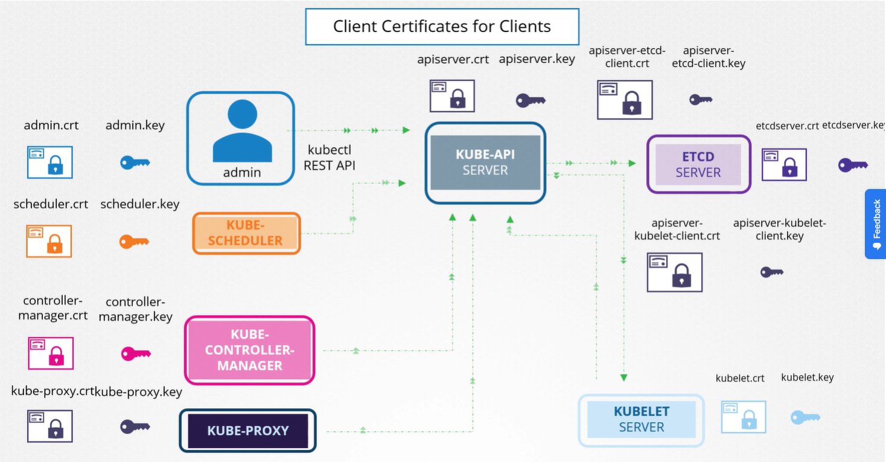

Существует три типа сертификатов:
- серверные сертификаты, настроенные на серверах приложений (`server.crt` или `server.pem`)
- корневые сертификаты, настроенные на серверах CA (`ca.crt` и `ca.key`)
- клиентские сертификаты, настроенные на клиентах (`client.crt` или `client.pem`)

Все взаимодействия между нодами кластера K8s должны быть защищены и зашифрованы. Все взаимодействия между сервисами и их клиентами также должны быть защищены. Например администратор, взаимодействующий с кластером K8s с помощью утилиты kubectl или с помощью прямых вызовов API, должен установить безопасное TLS-соединение. Связь между всем компонентами кластера также должна быть защищена.

Существуют два главных требования - все различные сервисы в кластере должны использовать серверные сертификаты, а все клиенты должны использовать клиентские сертификаты для проверки, что они действительно являются теми, за кого себя выдают.

Рассмотрим серверные сертификаты в кластере.

Начнем с kube-apiserver. Как мы уже знаем, API-сервер публикует наружу HTTPS-сервис, который используется другими компонентами, а также внешними пользователями для управления кластером. Т.к. это сервер, то ему требуются сертификаты для защиты взаимодействия с клиентами. Поэтому мы генерируем сертификат и пару ключей - `apiserver.crt` и `apiserver.key`.

В зависимости от того каким образом был развернут кластер, имена сертификатов и ключей могут различаться.

Другой сервер в кластере - это etcd. Etcd-сервер хранит информацию обо всем кластере. Поэтому ему требуется пара ключ/сертификат для себя - `etcdserver.crt` и `etcdserver.key`.

Другие серверные компоненты кластера находятся на worker-нодах. Сервер kubelet также публикует HTTPS API endpoint, с которым может общаться kube-apiserver для взаимодействия с worker-нодами. И снова требуется пара ключ/сертификат - `kubelet.crt` и `kubelet.key`.

Теперь перейдем к клиентским сертификатам.

Кто в этом случае является клиентом, взаимодействующим с этими сервисами? Клиенты, обращающиеся к API-серверу, это мы, администраторы. Пользователю admin нужны сертификат и пара ключей для аутентификации в API-сервере - `admin.crt` и `admin.key`. Scheduler общается с API-сервером для мониторинга pod-ов, нуждающихся в планировании, и затем наказывает API-серверу запланировать pod-ы на подходящую worker-ноду. Scheduler в данном случае является клиентом, обращающимся к API-серверу. Что касается самого API-сервера, для него scheduler просто еще один клиент, такой же как пользователь admin. Scheduler должен подтвердить свою личность, используя клиентский TLS-сертификат. Ему нужна своя собственная пара ключ/сертификат - `scheduler.crt` и `scheduler.key`.

Kube-controller-manager - еще один клиент, обращающийся к kube-apiserver. Ему также нужен сертификат для аутентификации в API-сервере. Соответственно мы создаем пару ключ/сертификат - `controller-manager.crt` и `controller-manager.key`.

Последний клиентский компонент - kube-proxy. Для kube-proxy требуется клиентский сертификат для аутентификации в kube-apiserver. Соответственно он требует наличия своей собственной пары ключ/сертификат - `kube-proxy.crt` и `kube-proxy.key`.

Серверы также взаимодействуют между собой. Например API-сервер взаимодействует с сервером etcd. По сути из всех компонентов только API-сервер общается с сервером etcd. Поэтому с точки зрения etcd, kube-apiserver является клиентом и ему необходимо аутентифицироваться. Kube-apiserver может использовать те же ключи, которые использовались ранее для работы его собственного сервиса API - `apiserver.crt` и `apiserver.key`. Либо вы можете сгенерировать новую пару сертификатов конкретно для kube-apiserver для его аутентификации в etcd-сервере.

Также kube-apiserver общается с сервером kubelet на каждой из нод. Так API-сервер мониторит worker-ноды. Для этого он опять же может использовать первоначальные сертификаты или сгенерировать новые конкретно для этой цели.

 

Итоговое разбиение сертификатов по группам:

 

Как мы уже знаем, также нам нужен Certificate Authority, чтобы подписывать все эти сертификаты. K8s требует наличия как минимум одного CA для вашего кластера. Фактически вы можете иметь более одного CA - один для всех компонентов в кластере и другой конкретно для etcd. В этом случае серверные сертификаты etcd и клиентские сертификаты сервера etcd, которые в данном случае являются клиентскими сертификатам kube-apiserver, будут подписаны CA сервера etcd. Пока мы будем исходить из наличия только одного CA-сервера для нашего кластера.

Как мы знаем CA имеет свою собственную пару ключ/сертификат - `ca.crt` и `ca.key`.