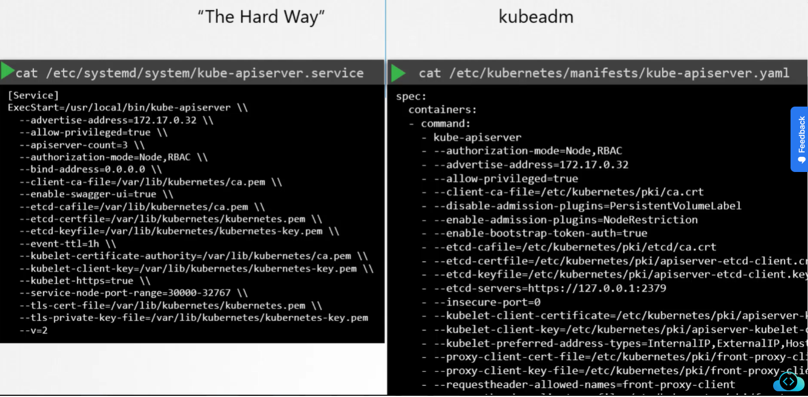
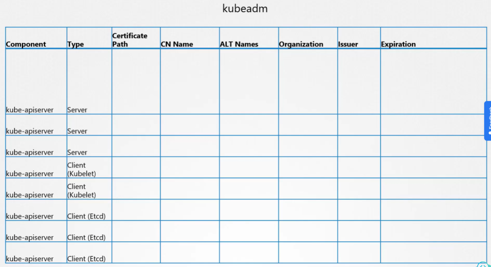
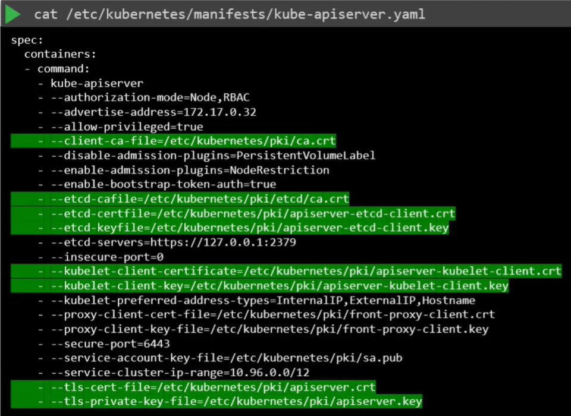
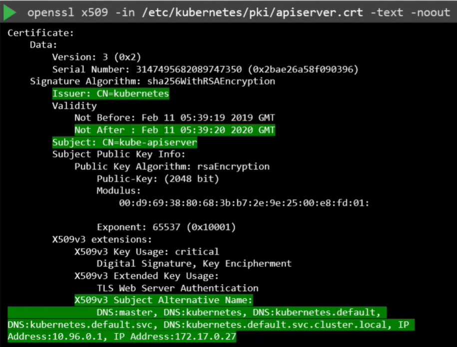

Первое, что нужно понять, каким образом был развернут кластер. Существуют различные решения для деплоя K8s-кластера, соответственно они используют различные методы для генерации и управления сертификатами.

Если вы разворачиваете кластер с нуля (from scratch), то генерируете сертификаты самостоятельно, как мы делали это в предыдущем уроке (TLS in Kubernetes). Если же вы используете инструмент автоматического provisioning, такой как kubeadm, он позаботится об автоматическом создании и настройке кластера для вас.

В то время как при "hard way" подходе все компоненты разворачиваются в виде native-сервисов на нодах, утилита kubeadm разворачивает их как pod-ы.

 

В этом уроке мы рассмотрим в качестве примера кластер, развернутый с помощью kubeadm. Для того чтобы выполнить health check, начнем с идентификации всех используемых в системе сертификатов. Для этого можно использовать [таблицу](https://github.com/mmumshad/kubernetes-the-hard-way/tree/master/tools). Идея заключается в создании списка файлов сертификатов, содержащего все необходимые детали.

 

Начнем с используемых файлов сертификатов. В окружении, развернутом с помощью kubeadm, посмотрим содержимое манифеста kube-apiserver:

 

Определяем файлы сертификатов, используемых для каждой цели, и записываем в таблицу. Затем возьмем каждый сертификат и заглянем внутрь, чтобы узнать о нем больше информации. Команда `openssl x509 -in /etc/kubernetes/pki/apiserver.crt -text -noout`.

 