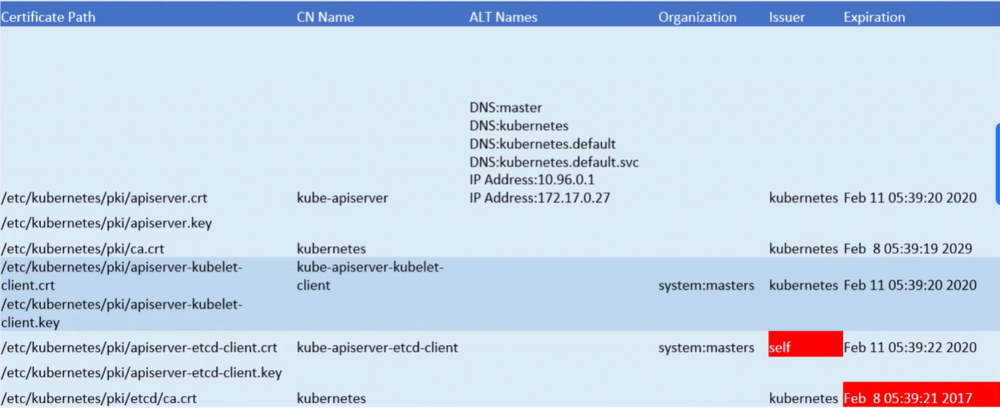
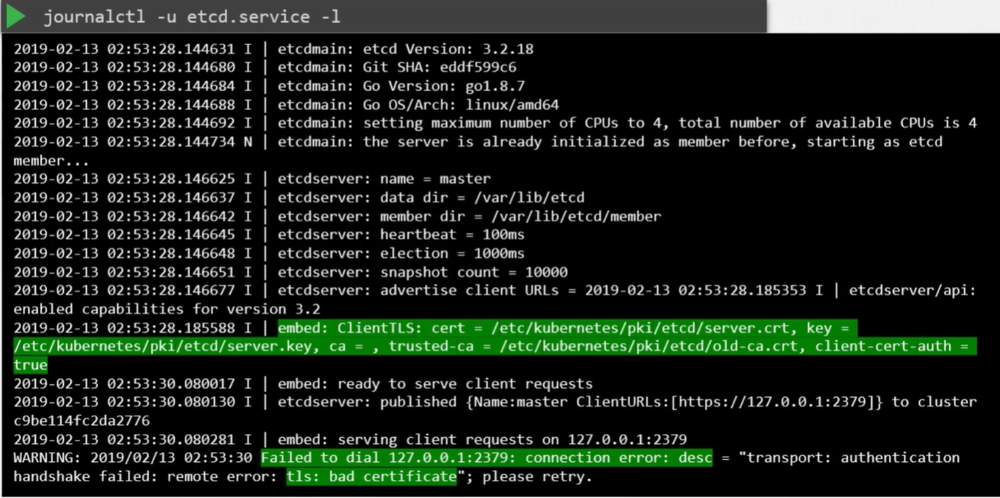

Первое, что нужно понять, каким образом был развернут кластер. Существуют различные решения для деплоя K8s-кластера, соответственно они используют различные методы для генерации и управления сертификатами.

Если вы разворачиваете кластер с нуля (from scratch), то генерируете сертификаты самостоятельно, как мы делали это в предыдущем уроке (TLS in Kubernetes). Если же вы используете инструмент автоматического provisioning, такой как kubeadm, он позаботится об автоматическом создании и настройке кластера для вас.

В то время как при "hard way" подходе все компоненты разворачиваются в виде native-сервисов на нодах, утилита kubeadm разворачивает их как pod-ы.

 

В этом уроке мы рассмотрим в качестве примера кластер, развернутый с помощью kubeadm. Для того чтобы выполнить health check, начнем с идентификации всех используемых в системе сертификатов. Для этого можно использовать [таблицу](https://github.com/mmumshad/kubernetes-the-hard-way/tree/master/tools). Идея заключается в создании списка файлов сертификатов, содержащего все необходимые детали.

 

Начнем с используемых файлов сертификатов. В окружении, развернутом с помощью kubeadm, посмотрим содержимое манифеста kube-apiserver:

 

Определяем файлы сертификатов, используемых для каждой цели, и записываем в таблицу. Затем возьмем каждый сертификат и заглянем внутрь, чтобы узнать о нем больше информации. Команда `openssl x509 -in /etc/kubernetes/pki/apiserver.crt -text -noout`.

 

По аналогии получаем информацию обо всех оставшихся сертификатах.

Вещи, на которые нужно обращать внимание:
- сертификаты имеют правильные имена (CN)
- сертификаты имеют правильные альтернативные имена (SAN)
- сертификаты являются частью правильной организации
- сертификаты выпущены правильным издателем (issuer)
- не истек срок действия сертификатов

 

Требования к сертификатам опубликованы в [документации](https://kubernetes.io/docs/setup/best-practices/certificates/).

При возникновении проблем вы вероятно захотите посмотреть логи. Если кластер разворачивался самостоятельно с нуля и сервисы сконфигурированы как native-сервисы в ОС, то возможно вы захотите посмотреть их логи с помощью функционала логирования ОС. Например:

`journalctl -u etcd.service -l`

 

Если кластер разворачивался с помощью kubeadm, то различные его компоненты будут представлены в виде pod-ов. Соответственно вы можете посмотреть логи с помощь команды `kubectl logs pod-name`. Иногда могут быть недоступны даже такие core-компоненты как kube-apiserver или etcd-сервер, поэтому kubectl-команды не будут работать. В этом случае нужно будет спуститься на уровень ниже - обратиться к docker (или другой сontainer runtime) для получения логов. Смотрим список всех контейнеров командой `docker ps -a` и смотрим логи `docker logs container_id`.

С помощью kubeadm можно управлять сертификатам в кластере.

Смотреть информацию о сроке действия сертификатов: `kubeadm certs check-expiration`.

Обновить сертификат компонента кластера: `kubeadm certs renew apiserver` или `kubeadm certs renew scheduler.conf`.