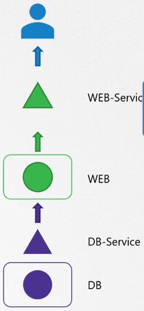

Представим себе, что у нас есть приложение, состоящее из веб-сервера и сервера БД. По сути это два pod-а и два Service.

 

Пользователи сообщили о проблемах с доступом к приложению.

Сначала проверяем доступен ли веб-сервер по ip-адресу Service и порту NodePort: `curl http://web-service-ip:node-port`.

Далее проверяем нашел ли Service соответствующие endpoint-ы: `kubectl describe service web-service`. Если нет, сравниваем Labels на pod-е и Labels в селекторе Service.

Далее проверяем сам pod веб-сервера, находится ли он в запущенном состоянии, а также количество рестартов pod-а.

Смотрим события pod-а: `kubectl describe pod web`.

Смотрим логи приложения: `kubectl logs web`.

Если pod постоянно перезапускается, то логи текущей версии pod-а, в котором запущена текущая версия контейнера, могут не отражать причину последнего падения.

Поэтому вы можете смотреть логи командой `kubectl logs web -f` и дождаться очередного падения pod-а.

Либо использовать опцию `--previous`, чтобы посмотреть логи предыдущего pod-а: `kubectl logs web -f --previous`.

Далее проверяем статус сервиса БД, pod-а БД, смотрим события и логи.