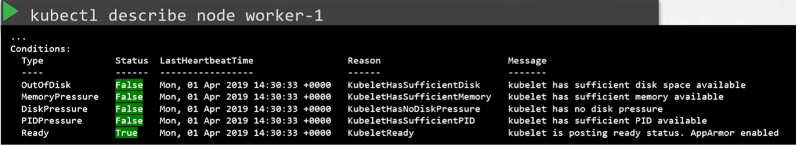
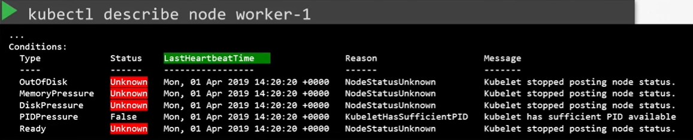

Сначала смотрим статус нод: `kubectl get nodes`.

Если какая-либо нода в статусе `NotReady`, то используем команду: `kubectl describe node worker-1`.

 

Каждая нода имеет набор Conditions (условий), которые могут задать направление для дальнейшего расследования. Они могут иметь значение `True`, `False` или `Unknown`.

Если какая-либо из опций имеет значение `True`:

- `OutOfDisk` - закончилось место на диске
- `MemoryPressure` - исчерпана RAM
- `DiskPressure` - заканчивается место на диске
- `PIDPressure` - слишком много процессов
- `Ready` - с нодой все в порядке

Если worker-нода прекратила взаимодействовать с master-ом, например из-за сбоя, статусы примут значение `Unknown`.

 

Это говорит о возможной потере ноды. Проверьте поле `LastHeartbeatTime`, чтобы вычислить время, когда произошел сбой.

На самой ноде проводим диагностику командами `top`, `df -h`, `free -h`.

Проверяем статус сервиса kubelet `service kubelet status` и его логи `journalctl -u kubelet`.

Проверяем сертификаты kubelet, не истек ли срок их действия, являются ли они частью правильной группы, выпущены ли они правильным CA.

`openssl x509 -in /var/lib/kubelet/worker-1.crt -text`