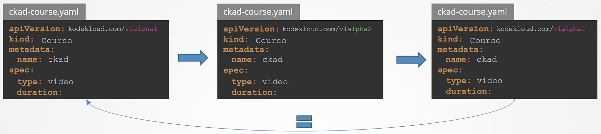

Как мы узнали из прошлого урока одна API Group может одновременно поддерживать несколько версий API. Зачем вам нужно поддерживать несколько версий? Как много версий вам нужно поддерживать? Когда вы можете удалить старую версию, если она больше не нужна? Ответ на эти вопросы дает API Deprecation Policy.

Рассмотрим жизненный цикл API Group. Допустим мы планируем делать вклад в проект K8s и создаем API Group `/kodekloud.com`, внутри которой будут два resource - `/course` и `/webinar`. Мы все протестировали и готовы мерджить в проект K8s, выпускается alpha-версия с именем `v1alpha1`. Теперь мы можем создать например объект Course:

```yaml
apiVersion: kodekloud.com/v1alpha1
kind: Course
metadata:
  name: ckad
spec:
```
Предположим, что объект Webinar не понравился пользователям и мы решили его удалить в следующем релизе K8s. Можем ли мы только удалить его из версии v1alpha1? Нет. И это первое правило API Deprecation Policy - *API elements may only be removed by incrementing the version of the API group*. Это означает, что мы можем удалить элемент Webinar из версии v1alpha2 API Group. При этом он продолжит существовать в версии v1alpha1.

```yaml
apiVersion: kodekloud.com/v1alpha2
kind: Course
metadata:
  name: ckad
spec:
```
При этом уже созданный ресурс в базе данных кластера все еще будет оставаться версии v1alpha1, а версия API у нас изменилась на v1alpha2. Это могло бы стать проблемой, ведь мы должны пройтись по всем yaml-файлам и изменить версию API на v1alpha2. Вот почему новый релиз должен поддерживать обе версии - v1alpha1 и v1alpha2, при этом preferred или storage версия может быть v1alpha2. Это значит, что пользователи могут использовать те же самые yaml-файлы для создания ресурсов, но они будут автоматически сконвертированы и сохранены в версии v1alpha2.

И мы плавно подошли ко второму правилу API Deprecation Policy - *API objects must be able to round-trip between API versions in a given release without information loss, with the exception of whole REST resources that do not exist in some versions*. То есть, если мы создали объект в версии v1alpha1 и он был сконвертирован в v1alpha2 и затем обратно в v1alpha1, он должен остаться таким же как оригинальный объект версии v1alpha1.

Например объект Course в версии v1alpha1 в секции `spec` имеет параметр `type: video`. Затем он был сконвертирован в версию v1alpha2, где появился дополнительный параметр `duration:`, которого не было в версии v1alpha1. Когда мы сконвертируем объект обратно в версию v1alpha1, он будет иметь новый параметр, которого не было в оригинальной версии v1alpha1. Поэтому мы должны добавить поле `duration:` и в оригинальную версию v1alpha1, чтобы объект сконвертированный в v1alpha1 был идентичен объекту в оригинальной версии v1alpha1.

<br>

Продолжая нашу историю, мы исправили множество багов и готовы к beta-релизу. Наша первая beta-версия готова называется v1beta1. Спустя несколько месяцев мы выпустили версию v1beta2. И в итоге представили финальную GA stable версию под названием v1.

Однако нам необязательно держать все имеющиеся версии доступными все время. Мы должны выводить и удалять старые версии по мере введения новых. Допустим мы выпустили v1alpha1 версию нашей разработанной API Group в релизе K8s X (12.1.1), то есть это первый раз когда наш пакет был включен в релиз. Т.к. это пока единственная версия, то она же является preferred и storage версией. С выходом релиза K8s X+1 мы выпустили v1alpha2 версию нашей API Group. Т.к. мы находимся в стадии alpha, нам не требуется хранить старую v1alpha1 версию. Это часть 4a правила Kubernetes Deprecation Policy:

*Other than the most recent API versions in each track, older API versions must be supported after their announced deprecation for a duration of no less then (кроме самых последних версий API в каждом треке, более старые версии API должны поддерживаться после объявления об их устаревании в течение не менее чем):*
- GA: 12 months or 3 releases (whichever is longer, в зависимости от того, что длиннее)
- Beta: 9 months or 3 releases (whichever is longer)
- Alpha: 0 releases

Соответственно alpha версии не нужно поддерживать в каких-либо релизах, а beta и GA версии должны поддерживаться от 9 до 12 месяцев. Вот почему релиз K8s X+1 не будет иметь версии v1alpha1. Однако это может "сломать" некоторые вещи для тех кто использовал версию v1alpha1. Соответственно мы должны сообщить об этом изменении в release notes соответствующей версии K8s.

В релизе K8s X+2 мы выпустили первую beta версию нашей API Group под названием v1beta1 и т.к. предыдущая версия была alpha версией (v1alpha2), то не требуется чтобы эта версия являлась частю нового релиза K8s. И как прежде мы должны сообщить в release notes о необходимости миграции с v1alpha2 на v1beta1.

В релизе K8s X+3 мы выпустили версию v1beta2 и как мы узнали выше, учитывая что это beta релиз, значит необходимо чтобы v1beta1 также была частью этого нового релиза K8s. Соответственно в релизе у нас будет сразу две beta версии - v1beta1 и v1beta2. Версия v1beta1 теперь будет deprecated, однако она НЕ будет удалена в этой версии и будет присутствовать в еще нескольких релизах K8s пока не будет окончательно удалена. Если мы будем использовать версию v1beta1, то будем получать deprecation warning-и. Стоит заметить, что v1beta1 все еще будет являться preferred версией. Почему так? Почему v1beta2 не будет являться preferred и storage версией? Ответ на этот вопрос - правило 4b:

*The "preferred" API version and the "storage version" for a given group may not advance until after a release has been made that supports both the new version and the previous version ("Preferred" версия API и "storage version" для данной группы не могут быть изменены до тех пор, пока не выйдет релиз, поддерживающий как новую версию, так и предыдущую версию)*.

В нашем случае релиз K8s X+3 - это первый релиз, где появилась новая v1beta2 и сохраняется предыдущая версия v1beta1. И мы еще не можем поменять preferred и storage версию. Мы должны дождаться следующего релиза X+4 (без особых изменений). Этот релиз также будет содержать обе версии v1beta1 и v1beta2, за исключением того, что теперь уже v1beta2 будет являться preferred и storage версией.

В релизе K8s X+5 мы наконец выпустили v1 GA stable версию. Параллельно с этим у нас сохраняются версии v1beta1 и v1beta2. v1beta2 все еще является preferred и storage версией, т.к. это первый релиз в который включена новая версия v1, но теперь v1beta2 становится deprecated, то есть обе версии v1beta1 и v1beta2 считаются deprecated.

В следующем релизе K8s X+6 мы можем удалить версию v1beta1, т.к. согласно правилу 4a beta версия должна поддерживаться в течении трех релизов K8s, а версия v1beta1 была объявлена deprecated в релизе K8s X+3 и сохранялась в релизах X+4 и X+5 и теперь может быть удалена. В релизе X+6 версия v1 может стать preferred и storage версией, а версия v1beta2 будет поддерживаться в течении трех релизов.

В релизе K8s X+7 ничего не менялось, v1beta2 сохраняется последний раз перед дальнейшим удалением.

В релизе K8s X+8 версия v1beta2 будет удалена и останется только GA stable версия v1.

В релизе K8s X+9 например появилась новая alpha версия уже под названием v2alpha1. Ранее как только появлялась новая версия, предыдущая сразу же становилась deprecated. Теперь когда появилась новая версия v2alpha1 можем ли мы объявить предыдущую GA stable версию v1 как deprecated? Нет. И это гласит правило 3:

*An API version in a given track may not be deprecated until a new API version at least as stable is released*.

Это значит, что GA версия может сделать deprecate версии alpha и beta, но не наоборот, alpha версия не может сделать deprecate GA версии. То есть наша версия v2alpha1 должна пройти полный жизненный цикл до stable версии v2, чтобы уже она смогла сделать deprecate версии v1.