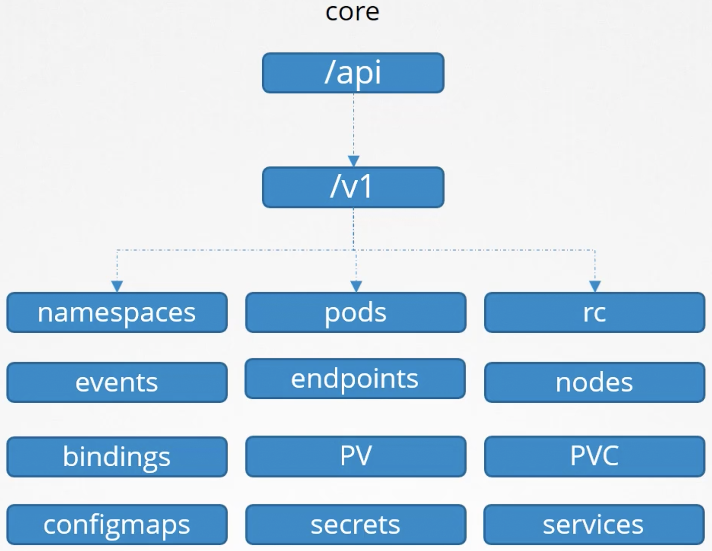
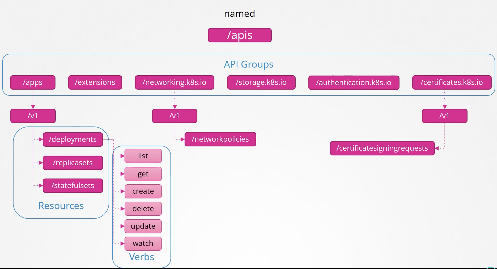

Посмотреть версию кластера: `curl https://kube-master:6443/version --key client.key --cert client.crt --cacert ca.crt`

Посмотреть pod-ы: `curl https://kube-master:6443/api/v1/pods --key client.key --cert client.crt --cacert ca.crt`

В этом уроке сфокусируемся на API paths - `/version` и `/api`. Kubernetes API сгруппированы в некоторые наборы в соответствии с назначением. Например:
- /metrics и /healthz - для мониторинга "здоровья" кластера
- /logs - для интеграции со сторонними поставщиками логирования

Сосредоточимся на API, которые отвечают за базовую функциональность кластера. Они делятся на две категории - core group (/api) и named group (/apis). В core group входят следующие:

 

Всякие новые фичи как правило появляются в named group:

 

На схеме выше `/apps`, `/extensions` и т.д. - это API Groups, `/deployments`, `/replicasets` и т.д. - это Resources внутри API Group `/apps`, каждый Resource имеет связанный с ним список действий, например `create deployment`, `delete deployment` и т.д. - это Verbs.

Посмотреть доступные API Groups: `curl -k https://kube-master:6443 --key client.key --cert client.crt --cacert ca.crt`

Посмотреть API Groups внутри Named Group: `curl -k https://kube-master:6443/apis --key client.key --cert client.crt --cacert ca.crt | grep "name"`

Запустить kubectl proxy-клиент на локальном хосте, порт 8001: `kubectl proxy`

Kubectl proxy-клиент будет использовать сертификаты и учетные данные из нашего kubeconfig-файла для доступа к кластеру. Соответственно нам не нужно будет каждый раз указывать эти опции в команде curl и мы можем обращаться на порт 8001 нашего локального хоста:

`curl -k http://localhost:8001&`

Важно понимать, что kube proxy НЕ равно kubectl proxy. 