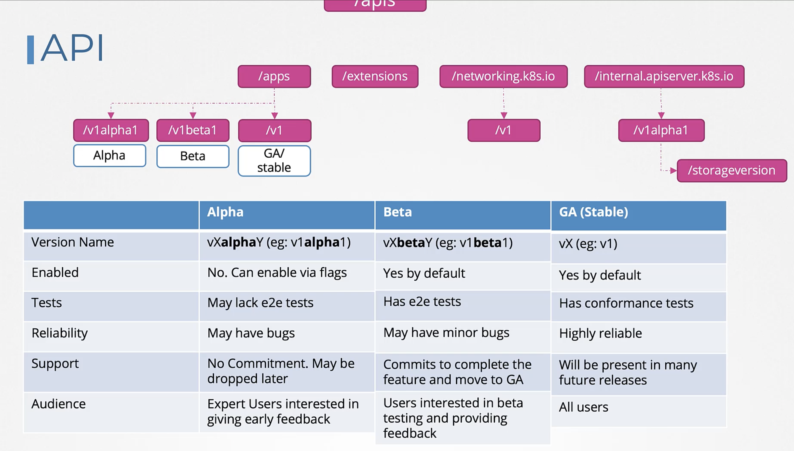
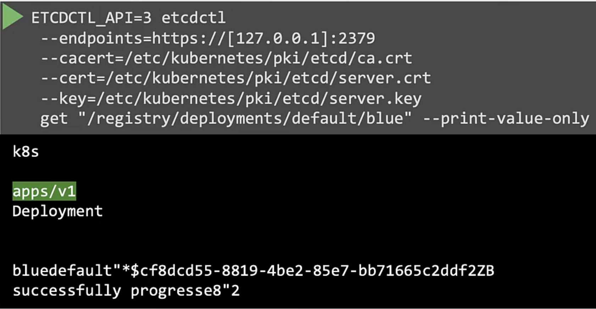

Каждая API Group имеет различные версии. `v1` означает GA (generally available) stable version. API Group может иметь и другие версии, например `v1beta1`, `v1alpha1`. Что означают эти версии?

Alpha - когда API впервые разработан, смерджен в K8s code base и первый раз стал частью K8s release. Имеет в названии "alpha". Эта API Group не включена по умолчанию. Например API Group `/internal.apiserver.k8s.io`, которая имеет resource `/storageversion` доступный только как версия `/v1alpha1`. Соответственно вот как выглядит definition-файл:

```yaml
apiVersion: internal.apiserver.k8s.io/v1alpha1
kind: StorageVersion
metadata:
  name: sv-1
spec:
```
Так как это alpha-версия, она может не иметь end-to-end тестов и иметь major-баги. Также нет гарантий, что она будет доступна в будущих релизах. Она может быть удалена без каких-либо уведомлений в будущих релизах. В основном предназначена для экспертов K8s, заинтересованных в тестировании и выдаче feedback-а.

Когда, спустя время, большинство критичных багов устранено и появились end-to-end тесты, версия переходит в стадию beta. Имеет в названии "beta". API Group в стадии beta включена по умолчанию, а также имеет end-to-end тесты. Но т.к. это еще не GA, она может иметь minor-баги. Может перейти в GA в будущем. Предназначена для пользователей заинтересованных в beta-тестировании.

После пребывания в стадии "beta" в течение нескольких месяцев и нескольких релизов API group переводится в GA stable version. Не имеет alpha или beta в названии, только v1. Включена по умолчанию, имеет все тесты. Высоко надежна, т.к. большинство багов были исправлены в alpha и beta версиях. Будет поддерживаться во множестве будущих релизов.

<br>

Некоторые API Groups могут иметь несколько версий. Это значит, что один и тот же объект мы можем создать в различных версиях API. Но даже если одновременно поддерживается несколько версий API, только одна может быть preferred или storage версией. 

Что такое preferred версия? Когда у нас включено несколько версий и мы выполняем например команду `kubectl get deployments`, какая версия будет запрошена? Это и определяется с помощью preferred версии. Также preferred версия отображается в выводе команды `kubectl explain`.

Аналогично если одновременно включено несколько версий API, только одна может быть storage версией. Это значит, если объект был создан версией отличной от storage, например v1beta1, то он будет сконвертирован в формате storage версии (например v1) перед сохранением в БД etcd, несмотря на версию указанную в definition yaml-файле.

Как правило preferred и storage версии одинаковые, но могут и отличаться.

Как посмотреть preferred версию? Например для API Group batch:`curl http://localhost:8001/apis/batch`
```json
{
  "kind": "APIGroup",
  "apiVersion": "v1",
  "name": "batch",
  "versions": [
    {
      "groupVersion": "batch/v1",
      "version": "v1"
    }
  ],
  "preferredVersion": {
    "groupVersion": "batch/v1",
    "version": "v1"
  }
}
```
Посмотреть storage версию можно только обратившись напрямую в etcd:

<br>

Чтобы включить или отключить определенную версию API, нужно добавить параметр `--runtime-config=batch/v2alpha1` в конфигурацию API сервера.