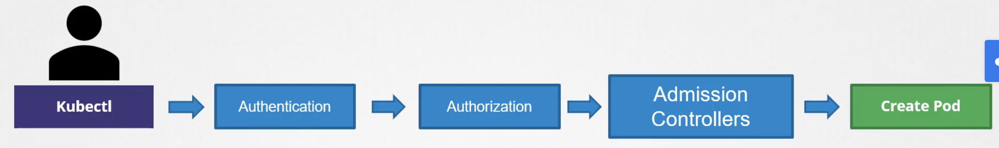

Как мы уже знаем, каждый раз когда мы выполняем какую-либо команду `kubectl`, например для создания pod-а, запрос уходит на API сервер, pod создается и информация об этом сохраняется в etcd. Когда запрос достигает API сервера, он проходит процесс аутентификации и как правило с помощью сертификатов. Если запрос посылается с помощью утилиты kubectl, то информация о сертификатах хранится в kubeconfig.
Процесс аутентификации распознает пользователя пославшего запрос и убеждается, что данный пользователь валиден. Далее запрос проходит процесс авторизации, который проверяет, что данный пользователь имеет соответствующие права на выполнение операции по созданию pod-а. Как правило это выполняется с помощью механизма RBAC. Например у нас создана роль Developer, которая назначена на пользователя пославшего запрос. Если в роли указана операция `create` для ресурса pod, тогда запрос будет принят, в противном случае отклонен.

С помощью RBAC мы можем настраивать различные ограничения, указывать какие действия разрешены и над какими объектами, можем указать определенные имена объектов, например разрешено работать только с pod-ами с именами blue, green, orange, или даже ограничить доступ определенным namespace-ом.

Но что если нам нужно больше возможностей для настройки, например чтобы конфигурационные файлы содержащиеся в запросах на создание pod-ов проверялись в части образов и мы хотим запретить скачивание этих самых образов из публичного Docker Hub Registry, а разрешить только с определенного внутреннего Registry. Или запретить использование latest tag на образах. Или если контейнер запускается от пользователя root, то нужно отклонить такой запрос. Или чтобы секция metadata в манифесте всегда содержала labels. Перечисленные "хотелки" невозможно реализовать с помощью механизма RBAC.

Здесь на помощь приходят Admission Controllers. Admission Controllers помогают нам обеспечить лучшую безопасность. Кроме простой валидации приходящих запросов, они также могут изменять эти самые запросы или выполнять дополнительные действия в backend, например перед созданием pod-а.

 

Существует множество различных Admission Controllers, некоторые уже встроены в K8s "из коробки", например:
- `AlwaysPullImages` - обеспечивает пуллинг образов каждый раз при создании pod-а
- `DefaultStorageClass` - следит за созданием PVCs и автоматически добавляет к ним default StorageClass, если явно не определен другой StorageClass
- `EventRateLimit` - ограничивает количество запросов поступающих к API серверу, предотвращая flooding
- `NamespaceExists` - отклоняет запросы к namespace-ам, которых не существует

Рассмотрим `NamespaceExists` Admission Controller. Если мы отправим запрос на создание pod-а в несуществующем namespace, то получим ошибку: `Error from server (NotFound): namespaces "blue" not found`, т.к. наш запрос, пройдя процессы аутентификации и авторизации, в итоге был отклонен `NamespaceExists` Admission Controller-ом, который включен по умолчанию в кластере.

Также существует Admission Controller `NamespaceAutoProvision`, который не включен по умолчанию. Он автоматически создает namespace, если namespace не существует.

Смотреть список Admission Controllers, включенных по умолчанию:

`kubectl exec kube-apiserver-minikube -n kube-system -- kube-apiserver -h | grep enable-admission-plugins`

`--enable-admission-plugins strings       admission plugins that should be enabled in addition to *default enabled ones (NamespaceLifecycle, LimitRanger, ServiceAccount, TaintNodesByCondition, PodSecurity, Priority, DefaultTolerationSeconds, DefaultStorageClass, StorageObjectInUseProtection, PersistentVolumeClaimResize, RuntimeClass, CertificateApproval, CertificateSigning, CertificateSubjectRestriction, DefaultIngressClass, MutatingAdmissionWebhook, ValidatingAdmissionWebhook, ResourceQuota)*. Comma-delimited list of admission plugins: AlwaysAdmit, AlwaysDeny, AlwaysPullImages, CertificateApproval, CertificateSigning, CertificateSubjectRestriction, DefaultIngressClass, DefaultStorageClass, DefaultTolerationSeconds, DenyServiceExternalIPs, EventRateLimit, ExtendedResourceToleration, ImagePolicyWebhook, LimitPodHardAntiAffinityTopology, LimitRanger, MutatingAdmissionWebhook, NamespaceAutoProvision, NamespaceExists, NamespaceLifecycle, NodeRestriction, OwnerReferencesPermissionEnforcement, PersistentVolumeClaimResize, PersistentVolumeLabel, PodNodeSelector, PodSecurity, PodTolerationRestriction, Priority, ResourceQuota, RuntimeClass, SecurityContextDeny, ServiceAccount, StorageObjectInUseProtection, TaintNodesByCondition, ValidatingAdmissionWebhook. The order of plugins in this flag does not matter.`

Чтобы добавить новый Admission Controller, необходимо отредактировать опцию `--enable-admission-plugins=` в файле `/etc/kubernetes/manifests/kube-apiserver.yaml`.

Чтобы отключить какой-либо Admission Controller, необходимо отредактировать опцию `--disable-admission-plugins=` в файле `/etc/kubernetes/manifests/kube-apiserver.yaml`.

Note that the `NamespaceExists` and `NamespaceAutoProvision` admission controllers are deprecated and now replaced by `NamespaceLifecycle` admission controller.

The NamespaceLifecycle admission controller will make sure that requests to a non-existent namespace is rejected and that the default namespaces such as default, kube-system and kube-public cannot be deleted.

Since the kube-apiserver is running as pod you can check the process to see enabled and disabled plugins.
`ps -ef | grep kube-apiserver | grep admission-plugins`