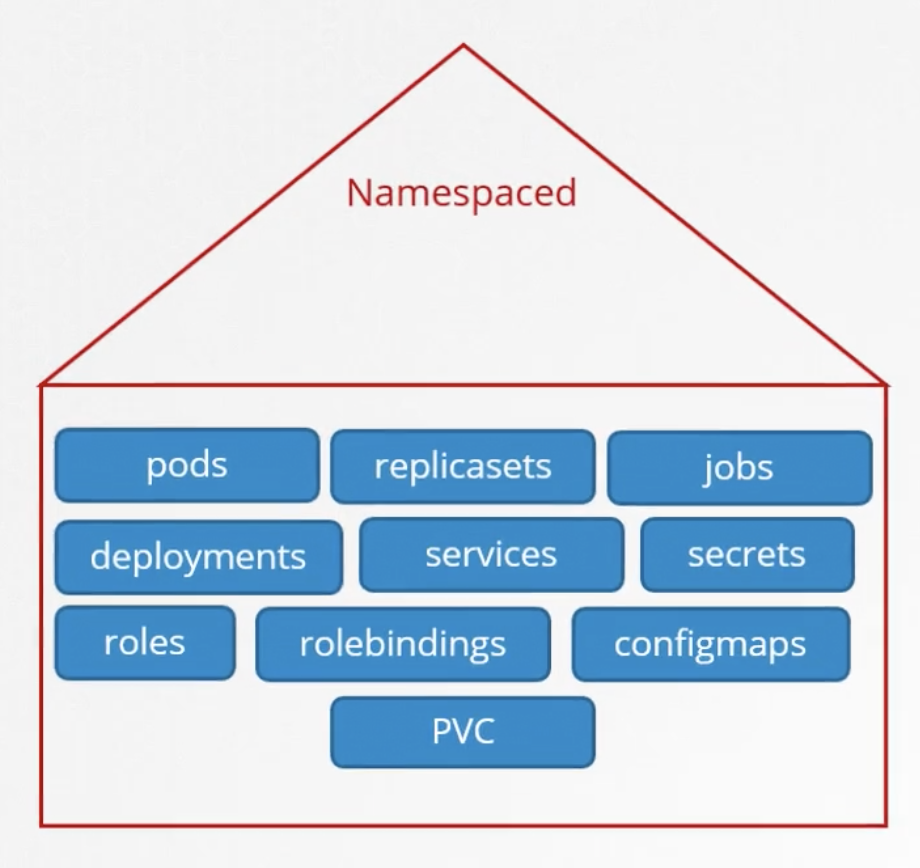
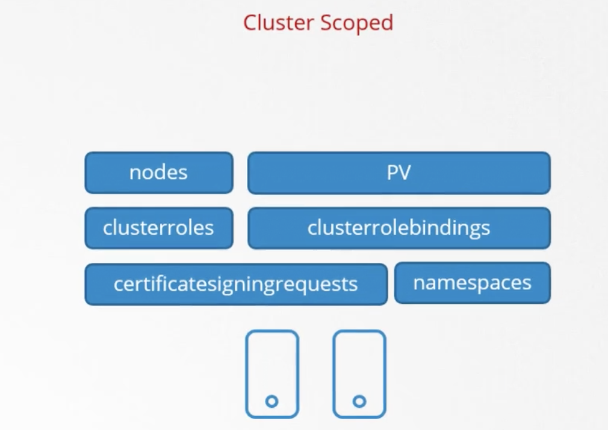

Как мы знаем namespaces нужны для изоляции таких объектов как Pods, Deployments, Services.

А как насчет других ресурсов, например нод кластера? Можем ли мы сгруппировать или изолировать ноды в рамках namespace? Например сказать node1 является частью dev namespace? Нет. Это cluster wide (scoped) ресурсы и они не могут быть ассоциированы с определенным namespace.

Таким образом ресурсы делятся на две категории - namespaced и cluster scoped.

Смотреть список namespaced ресурсов: `kubectl api-resources --namespaced=true`.

Смотреть список non-namespaced ресурсов: `kubectl api-resources --namespaced=false`.

 

Ранее мы рассмотрели механизмы авторизации пользователей в namespaced ресурсы - Roles и RoleBindings.

Каким образом авторизовать пользователя в cluster wide ресурс, например ноды или PVs?

Для этого нужно использовать объекты ClusterRoles и ClusterRoleBindings.

Отметим, что ClusterRole можно создать и для namespaced ресурса. В таком случае пользователь будет иметь доступ к заданному типу ресурса (например pods) во всех namespace-ах кластера.