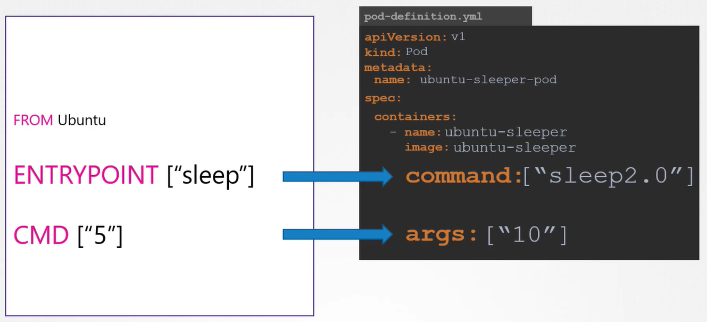

Сравнение с командами Docker из лекции "Docker. Commands vs Entrypoint".

Docker файл, из которого собирается образ `ubuntu-sleeper`:

```Dockerfile
FROM ubuntu
ENTRYPOINT ["sleep"]
CMD ["5"]
```

Запустить контейнер с именем `ubuntu-sleeper` из образа `ubuntu-sleeper` и переопределить дефолтные 5 секунд сна, заданные в образе `ubuntu-sleeper` на 10 секунд:

```shell
$ docker container run --name ubuntu-sleeper ubuntu-sleeper 10
```

Пример запуска pod-а из образа `ubuntu-sleeper` и переопределения дефолтных 5 секунд сна, заданных в образе, приведен в файле `pod-definition.yaml`:

```yaml
apiVersion: v1
kind: Pod
metadata:
  name: ubuntu-sleeper-pod
spec:
  containers:
    - name: ubuntu-sleeper
      image: ubuntu-sleeper
      args: ["10"]
```

Запустить контейнер с именем `ubuntu-sleeper` из образа `ubuntu-sleeper` и переопределить команду `sleep` на вымышленную команду `sleep2.0`:

```shell
$ docker container run --name ubuntu-sleeper --entrypoint sleep2.0 ubuntu-sleeper 10
```

Пример запуска pod-а из образа `ubuntu-sleeper` и переопределения команды `sleep` командой `sleep2.0` приведен в файле `pod-definition.yaml`:

```yaml
apiVersion: v1
kind: Pod
metadata:
  name: ubuntu-sleeper-pod
spec:
  containers:
    - name: ubuntu-sleeper
      image: ubuntu-sleeper
      command: ["sleep2.0"]
      args: ["10"]
```

Итого:

- поле `args` в pod definition файле переопределяет инструкцию `CMD` в Dockerfile
- поле `command` в pod definition файле переопределяет инструкцию `ENTRYPOINT` в Dockerfile



Пример ниже из лабы, где нужно переопределить дефолтный синий цвет приложения на зеленый.

Мы можем сделать это непосредственно командой, все что слева от "--" является опциями утилиты kubectl.

Все что справа от "--" является аргументами приложения в контейнере

```shell
$ kubectl run webapp-grenn --image=kodekloud/webapp-color -- --color green
```