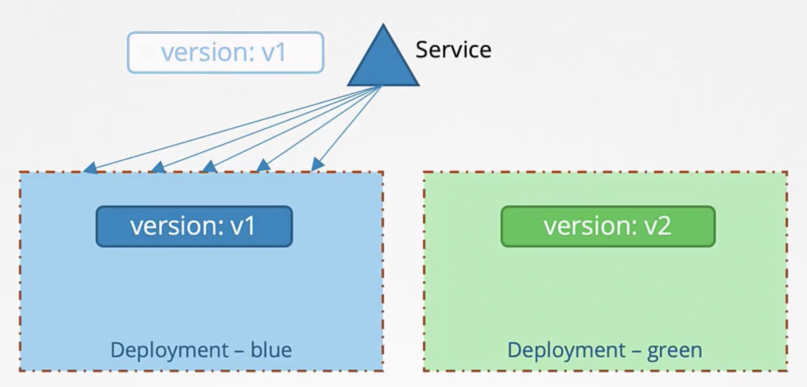
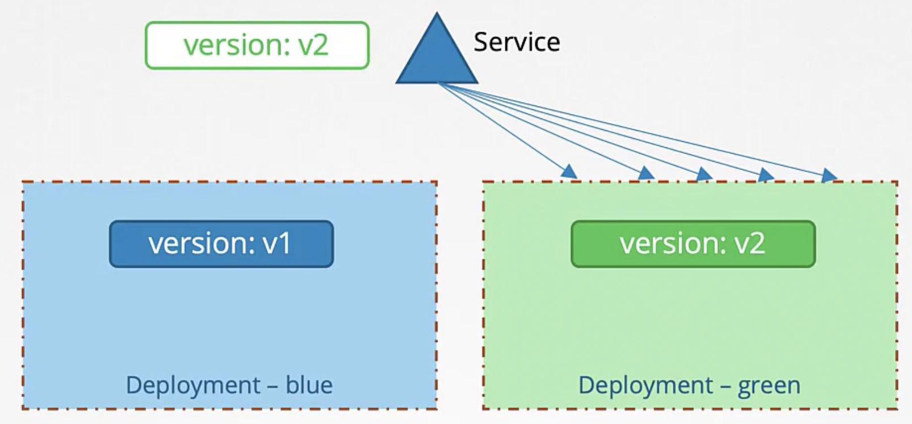

Ранее мы рассмотрели два типа Deployment Stategy:
- Recreate Strategy - сначала убить все контейнеры со старой версией приложения и затем поднять новые, приводит к простою, не является дефолтной стратегией
- Rolling Update - поочередно обновлять контейнер за контейнером, не приводит к простою, если не указать Deployment Stategy явно, то будет использована именно Rolling Update

Однако существует еще пара Deployment Strategy, которые мы не можем явно указать как опцию в Deployment, но которые могут быть использованы другим способом. Это *Blue Green* и *Canary* обновления.

Blue Green - это deployment стратегия, когда у нас развернута новая версия приложения параллельно со старой. Старая версия приложения - Blue, новая версия - Green. 100% трафика по прежнему направляется на старую версию приложения, в это же время "гоняются" тесты на новой версии приложения и как только все тесты успешно пройдены, весь трафик переключается на новую версию. Эта стратегия лучше всего реализуется с помощью Service Mesh Istio. Однако рассмотрим как это можно реализовать "родными" компонентами K8s - Services и Deployments.

Для начала у нас есть оригинальная версия нашего приложения развернутая в виде сервиса, назовем ее Blue Deployment. Затем мы создаем Service, чтобы маршрутизировать на него трафик. Чтобы ассоциировать Service с pod-ами в Deployment, мы устанавливаем Labels на pod-ах и используем аналогичный Label в Selector-е Service.

Далее мы разворачиваем второй Deployment с именем Green - это новая версия нашего приложения. Когда все тесты пройдены, мы перемаршрутизируем трафик на новое приложение с помощью установки нового Label в Selector-е Service.

