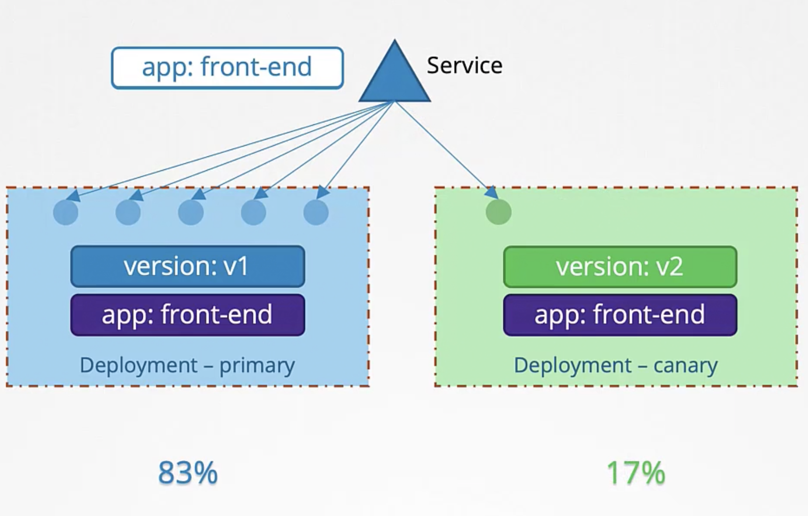

В этой стратегии мы разворачиваем новую версию нашего приложения и маршрутизируем только небольшой процент трафика на эту новую версию, при этом основная часть трафика все еще маршрутизируется на старую версию. Когда все тесты успешно пройдены, мы обновляем Deployment с нашей первоначальной версией до новой версии. Это может быть выполнено например с помощью Rolling Update Strategy. И в конце мы избавляемся от Canary Deployment. Рассмотрим как это можно реализовать "родными" компонентами K8s - Services и Deployments.

У нас есть первоначальная версия нашего приложения в виде Deployment с 5-ю pod-ами, назовем его Primary Deployment. Далее мы создаем Service, что маршрутизировать на него трафик. Чтобы ассоциировать Service с pod-ами в Deployment, мы устанавливаем Labels `version: v1` на pod-ах и используем аналогичный Label в Selector-е Service.

Далее мы разворачиваем новую версию нашего приложения в виде Deployment, назовем его Canary Deployment (Labels на pod-ах `version: v2`). Пока весь трафик маршрутизируется на v1. В рамках стратегии Canary мы хотим, чтобы трафик маршрутизировался на обе версии приложения одновременно. Как правило нам нужно, чтобы только небольшой процент трафика маршрутизировался на v2.

Для начала разберемся как нам маршрутизировать трафик с одного Service на pod-ы в двух Deployment одновременно? Нужно установить некий общий Label на всех pod-ах обоих Deployment, например `app: front-end`. А также нужно обновить Label в Selector-е Service на `app: front-end`. Таким образом мы решили первую проблему - трафик теперь маршрутизируется на обе версии нашего приложения. Но при этом 50% трафика поступает на первый Deployment и 50% на второй. Как нам уменьшить количество трафика поступающего на Canary Deployment? Мы можем уменьшить количество pod-ов в этом Deployment, например с 5 до 1.

 

Service продолжит равномерно распределять трафик между всеми pod-ами, соответственно 83% трафика будет направляться на Primary Deployment и 17% на Canary Deployment. Когда все тесты пройдены и мы уверены в новой версии приложения, можно обновлять pod-ы в Primary Deployment и удалять Canary Deployment.

Одним из предостережений для использования Canary Deployment таким способом, используя Services и Deployments, является ограниченная возможность контроля над распределением трафика между Deployments. Распределение трафика между Deployments всегда будет зависеть от количества pod-ов в каждом Deployment. Например мы не можем направить только 1% трафика в Canary Deployment, для этого нам понадобится как минимум суммарно 100 pod-ов в двух Deployment.

Поэтому Service Mesh, например Istio дает лучший контроль. В Istio мы можем задать точный процент трафика, который будет распределяться на каждый Deployment и это не зависит от количества pod-ов в Deployment.