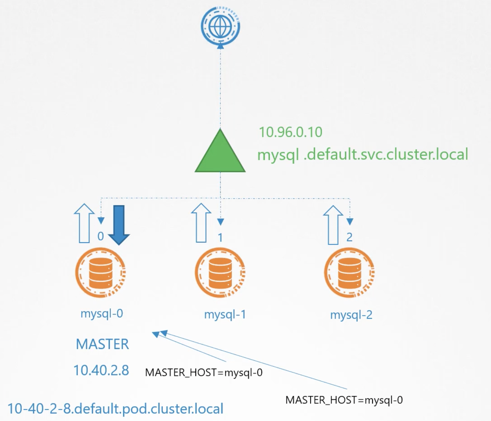

Как мы знаем, чтобы сделать одно приложение доступным для другого по сети в K8s, нужно использовать Service.

Service работает как LoadBalancer, трафик пришедший на него, далее распределяется между всеми pod-ами в рамках Deployment.

Service имеет свой ClusterIP и DNS-имя. Тогда например pod с веб-сервером может использовать это DNS-имя, чтобы достучаться до pod-ов с БД MySQL.

Как мы знаем из предыдущего урока в MySQL reads могут обслуживаться и master-ом и slave-ми, а writes только master-ом. Соответственно веб-сервер может успешно прочитать данные из БД, но не сможет ничего записать в БД.

 

Как же нам настроить веб-сервер для обращения только к master-у? Мы не можем указать ip-адрес или dns-имя master pod-а, т.к. они динамически обновляются при пересоздании pod-а.

Нам нужен Service, который не будет балансировать приходящие запросы, но даст нам DNS-записи для доступа к каждому pod-у. Вот что такое Headless Service.

Headless Service создается как обычный Service, но он не имеет своего собственного IP, как например ClusterIP для обычного Service. Он не балансирует трафик, а только создает DNS-записи для каждого pod-а, используя имя pod-а и поддомен.