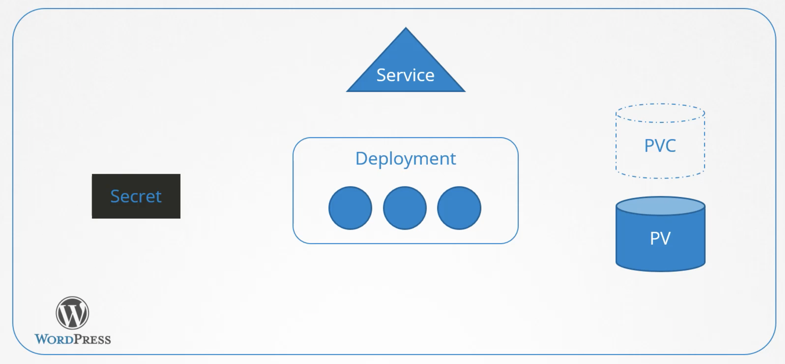

K8s очень хорошо подходит для управления сложной инфраструктурой. Люди же в свою очередь склонны бороться со сложностью. Приложения развернутые в кластере K8s могут быть достаточно сложными. Типичное приложение обычно состоит из целого набора объектов, которые должны быть связаны друг с другом, чтобы в итоге все работало. Например относительно простой сайт на WordPress требует следующего - Deployment, который запускает pod-ы например с БД MySQL или с веб-сервером, PV для хранения данных БД, PVC, Service для публикации веб-сервера наружу, Secret для хранения пароля администратора и многого другого в зависимости от потребностей.

 

Для каждого объекта нам нужен отдельный yaml-файл, нужно выполнить несколько раз команду `kubectl apply -f <filename>` для каждого файла, это утомительная задача. Допустим мы скачали все эти файла из интернета, но дефолтные настройки нам не подходят, например нужно изменить размер PV и т.д. Мы открываем каждый файл и вносим соответствующие правки. Спустя два месяца, нам нужно обновить некоторые компоненты нашего приложения, мы возвращаемся к нашим yaml-файлам и с большой осторожностью вносим правки, чтобы ничего не сломать. Нужно удалить приложение? Тогда мы должны помнить обо всех объектах и удалить их один за другим.

Конечно мы можем описать все объекты в одном yaml-файле, но это может еще больше усложнить процесс поиска нужной нам опции.

Helm меняет эту парадигму. K8s не забодится о нашем приложнее в целом. Он знает только об объявленных нами объектах и обеспечивает их существование в кластере. Он не знает, что Deployment, Service, Secret, PV и др. являются частью нашего большого приложения WordPress. Helm в свою очередь создавался с пониманием этой ситуации. Поэтому его часто называют менеджером пакетов K8s. Helm рассматривает эти объекты как части большого пакета, как группу. Когда нам нужно выполнить какое-либо действие, мы не говорим Helm-у объект, который он должен обработать. Мы говорим ему над каким пакетом мы хотим совершить действие, например пакет WordPress. Опираясь на имя пакета, он знает над каким объектом и какое действие нужно совершить, даже если этих объектов сотни.

Представим себе компьютерную игру, которая состоит из сотен или даже тысяч файлов. Существует несколько файлов с исполняемым кодом, аудио-файлы, файлы с графикой и текстурами, конфигурационные файлы и т.д. Представьте, что нам пришлось бы загружать каждый из этих файлов по отдельности. Это было бы очень утомительно. К счастью существует инсталлятор, который мы запускаем и он раскладывает все эти файлы по нужным директориям. Helm делает аналогичную работу для yaml-файлов и объектов K8s, из которых состоит наше приложение.

Мы выполняем всего одну команду `helm install wordpress ...` и helm автоматически добавляет все нужные объекты в K8s даже если их сотни. Мы можем легко кастомизировать настройки для нашего приложения, указав желаемые значения во время установки. Вместо редактирования множества yaml-файлов, мы имеем единое место, где можем объявить каждую кастомную настройку - файл values.yaml

Мы можем обновить наше приложение всего одной командой `helm upgrade wordpress ...` и Helm будет знать какие объекты нужно изменить.

Мы можем откатиться на предыдущую версию приложения командой `helm rollback wordpress ...`

Мы можем удалить наше приложение командой `helm uninstall wordpress ...`