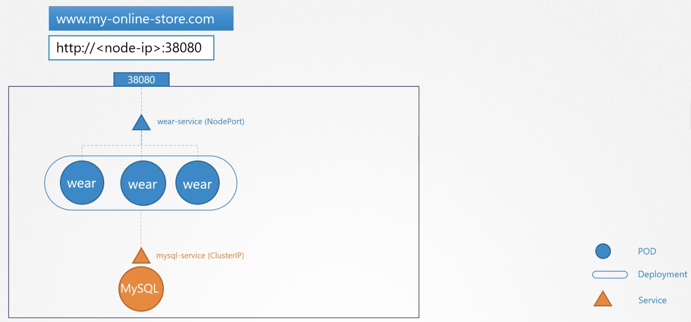
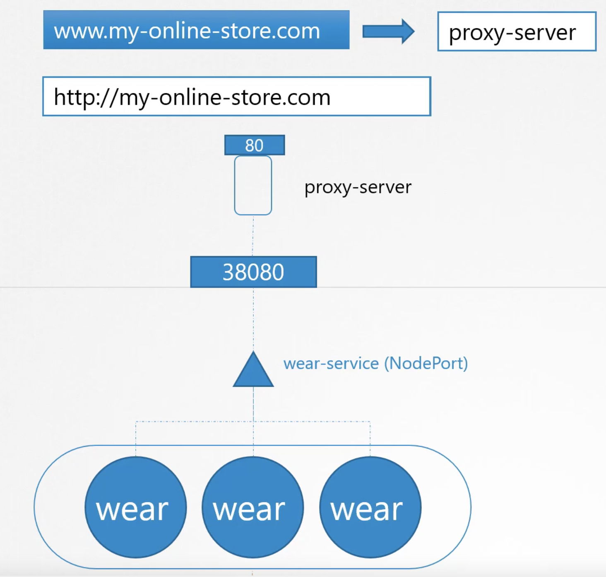
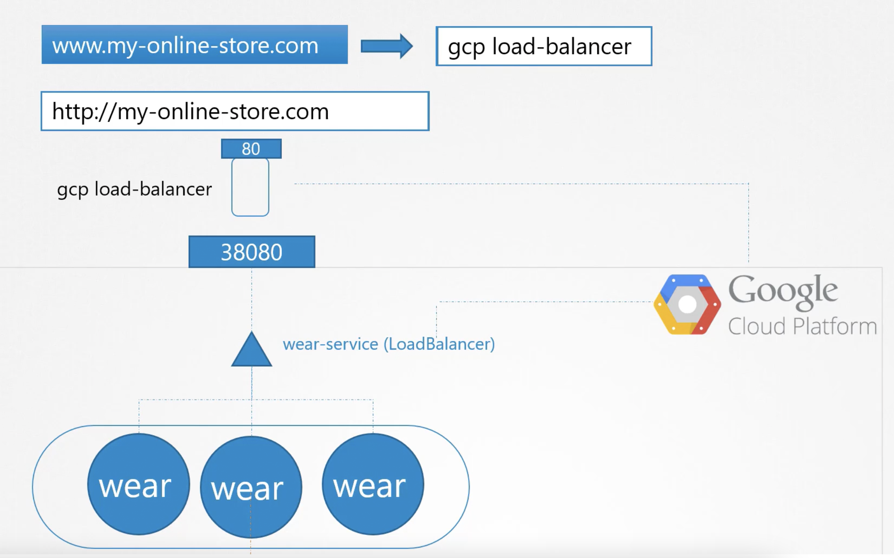
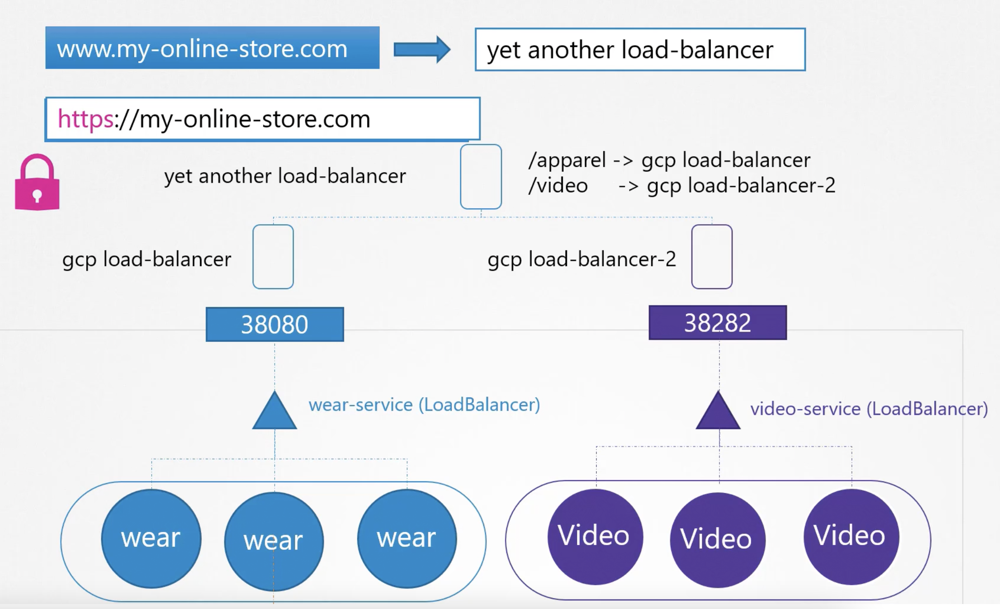
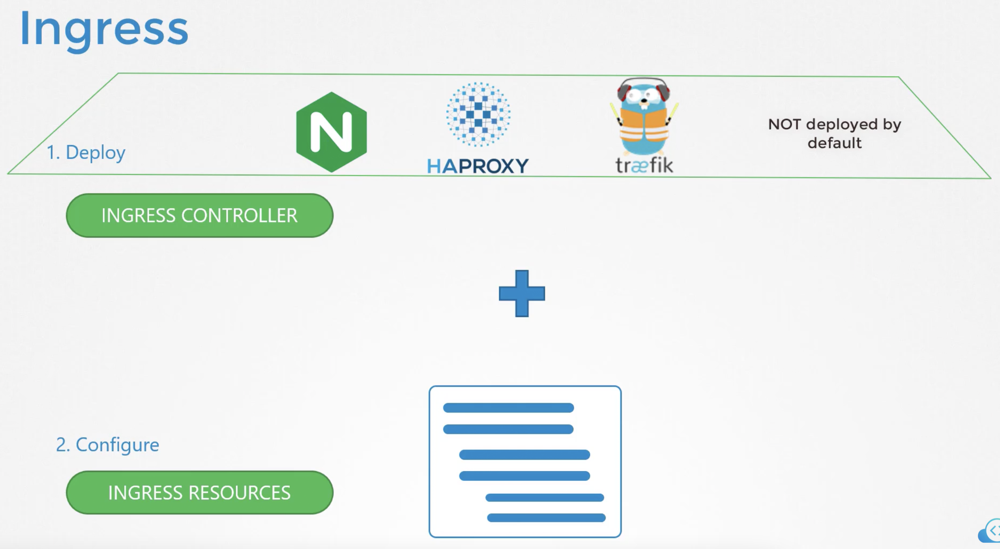
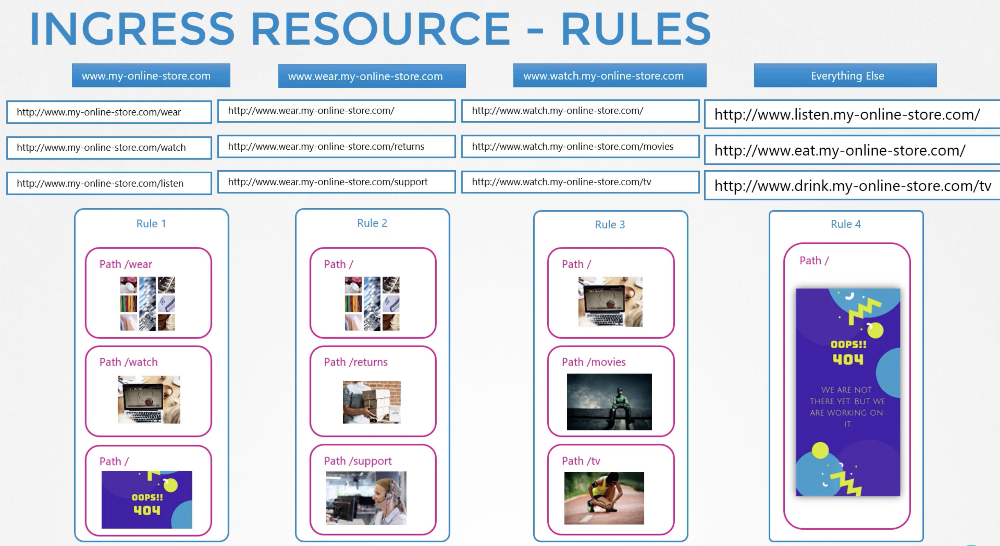

Предположим, мы разрабатываем приложения для онлайн-магазина и оно будет доступно по адресу `www.my-online-store.com`.

Мы упаковали приложение (wear) в Docker-образ и развернули в K8s в виде pod-а в Deployment.

Также для приложения потребуется pod с БД MySQL и Service типа ClusterIP под названием `mysql-service`, чтобы сделать БД доступной для нашего приложения.

Чтобы сделать приложение доступным извне, мы создаем другой тип Service - NodePort под названием `wear-service`, публикация на порт `38080` на нодах кластера.

Теперь пользователи могут получить доступ к приложению по `http://<node-ip:38080>`.

Если увеличится нагрузка на приложение, мы можем просто увеличить количество pod-ов в ReplicaSet, а Service позаботится о разделении трафика между pod-ами.

 

В production environment пользователь не захочет каждый раз вводить IP-адрес, поэтому мы настроим DNS, чтобы ссылаться на IP-адреса нод кластера.

Теперь пользователи смогут получить доступ к приложению по ссылке `http://my-online-store.com:38080`.

Однако мы не хотим, чтобы пользователь также указывал номер порта, тем более такое большое значение.

Для этого мы поставим перед нашим кластером proxy-сервер, который будет проксировать запросы с порта `80` на порт `38080` на нодах.

Теперь мы настроим DNS, чтобы ссылаться на IP-адрес proxy-сервера и пользователи смогут получить доступ к приложению по ссылке `http://my-online-store.com`.

 

Это был сценарий размещения кластера On-Premise в дата-центре, теперь вернемся немного назад и рассмотрим вариант размещения в Google Cloud Platform.

Вместо создания Service типа NodePort, мы создадим другой тип Service - LoadBalancer.

После этого K8s сделает все тоже самое - выставит порт `38080` на нодах, но в дополнение пошлет запрос в GCP на создание балансировщика нагрузки.

После получения запроса GCP автоматически создаст балансировщик, настроенный для маршрутизации трафика на порт Service на всех нодах кластера и вернет эту информацию в K8s.

Балансировщик имеет внешний IP, мы настроим DNS, чтобы ссылаться на этот IP-адрес и в результате пользователи смогут получить доступ к приложению по ссылке `http://my-online-store.com`.

 

Наш бизнес растет - мы хотим запустить новый стриминговый сервис, чтобы он был доступен по адресу `www.my-online-store.com/watch`, а старое приложение теперь будет доступно по адресу `www.my-online-store.com/wear`.

Мы развернули новый Deployment для стримингового приложения в том же кластере, создали Service типа LoadBalancer под названием `video-service`, K8s выставил порт `38282` на нодах для этого Service, а также автоматически создался балансировщик нагрузки в GCP.

Новый балансировщик имеет отдельный внешний IP и важно помнить, что мы платим деньги за каждый из балансировщиков, соответственно, если у нас будет много LB - это сильно увеличит наш ежемесячный платеж за услуги Cloud-провайдера.

Как мы будем направлять трафик на каждый из этих LB в зависимости от введенной пользователем ссылки?

Нам нужен отдельный Proxy или LoadBalancer, который будет перенаправлять трафик в зависимости от введенной пользователем ссылки.

Соответственно каждый раз, когда мы будет добавлять новый сервис (приложение), мы должны будем переконфигурировать этот вышестоящий Proxy/LB.

Кроме того нам нужен SSL, чтобы пользователи входили по ссылке `https://my-online-store.com`.

Где нужно настроить SSL? Это можно сделать на разных уровнях - в самом приложении, на proxy-сервере или на балансировщике.

Мы не хотим просить разработчиков настраивать SSL в приложении, т.к. разные команды сделают это по разному, а хотим настроить SSL в одном месте с минимальным дальнейшим обслуживанием.

 

Настройка потребует много усилий и управлять этим станет еще сложнее, когда приложение будет масштабироваться, потребуются специалисты из разных команд для настройки, нужно будет настраивать правила на firewall для каждого нового сервиса (приложения), и это будет дорого, т.к. каждый раз нужно будет создавать LoadBalancer у cloud-провайдера.

Было бы здорово управлять всем этим процессом непосредственно в кластере K8s и сделать всю конфигурацию просто в формате еще одного YAML-файла, который хранится вместе с остальными файлами для деплоя приложения.

И здесь нам поможет Ingress!

Ingress дает возможность получить доступ к приложению, используя единый доступный извне URL, и мы можем настроить маршрутизацию к разным Services в кластере, основываясь на URL path, а также настроить SSL.

Ingress стоит рассматривать как L7 балансировщик нагрузки, встроенный в K8s кластер, который может быть настроен как еще один объект K8s.

Важно понимать, что мы должны сделать Ingress доступным извне кластера, то есть опубликовать как NodePort или cloud-native LoadBalancer

Забегая вперед, балансировка нагрузки, аутентификация, SSL, URL based routing будет осуществляться Ingress контроллером

Как все это можно реализовать без Ingress?

Можно использовать такие решения как Nginx, HAPROXY, Traefik, развернуть их в кластере K8s и настроить для маршрутизации трафика на другие сервисы

Ingress реализован в K8s похожим образом - первым делом мы разворачиваем какое-либо из поддерживаемых решений из списка выше и затем указываем набор правил для настройки Ingress

Решение, которое мы развернем, называется Ingress Controller, а набор правил, которые мы настроим, называется Ingress Resources

Ingress Resources создаются с помощью файлов, аналогичных для создания pod-ов, Deployments и Services

Важно помнить, что K8s кластер по умолчанию не имеет Ingress Controller

 

Соответственно мы должны Ingress самостоятельно, на рынке есть несколько решений - GCP HTTP(S) Load Balancer (GCE), Nginx, Contour, HAPROXY, Traefik, Istio

GCE и Nginx поддерживаются проектом K8s

В этом уроке мы подробнее рассмотрим Nginx; это не просто балансировщик нагрузки или Nginx сервер, балансировщик нагрузки является лишь частью Ingress, который имеет дополнительную встроенную логику для мониторинга кластера на предмет новых Ingress Resources и настройки Nginx сервера соответственно

Nginx Controller разворачивается всего лишь как Deployment в K8s, пример в файле ingress-nginx.yaml

Это специальный билд Nginx, используемый в качестве Ingress Controller в K8s и он имеет свой набор требований

Внутри образа сама программа находится по пути `/nginx-ingress-controller`, соответственно мы должны передать эту команду для запуска сервиса Nginx контроллера

Также мы можем создать ConfigMap с конфигурацией Nginx, это не является обязательным условием для запуска, но в дальнейшем это упростит нам процесс изменения настроек в конфигурации

Еще нам нужно указать две environment variables, содержащие имя pod-а и имя namespace, в котором он развернут, т.к. они нужны сервису Nginx для чтения данных конфигурации из pod-а; а также порты используемые Ingress контроллером

Далее нам нужно создать Service типа NodePort для того, чтобы выставить Ingress во внешний мир, пример в файле

Как мы уже говорили Ingress имеет дополнительную встроенную логику для мониторинга кластера на предмет новых Ingress Resources и настройки Nginx сервера соответственно, для этого нужен Service Account с соответствующими permissions

---

Ingress Resources - это набор правил и конфигураций, применяемых на Ingress Controller

Например мы можем настроить правила таким образом, чтобы весь входящий трафик перенаправлялся на одно приложение или на разные приложения в зависимости от URL, например www.my-online-store.com/wear для одного приложения и www.my-online-store.com/watch для другого

Или мы можем маршрутизировать трафик в зависимости от введенного доменного имени - wear.my-online-store.com и watch.my-online-store.com соответственно

Пример Ingress Resources представлен в файле ingress-wear.yaml

Трафик маршрутизируется к Service приложения, а не напрямую к pod-у

Смотреть Ingress: `kubectl get ingress`

Предположим мы хотим создать правила согласно схеме ниже, чтобы трафик перенаправлялся на соответствующие ресурсы:

 

Пример перенаправления трафика в зависимости от введенного URL path - в файле ingress-wear-watch.yaml

Defautl backend - куда пользователь будет перенаправлен, если введет URL не соответствующий ни одному правилу

Посмотреть его можно в выводе команды: `kubectl describe ingress ingress-wear-watch`

Важно создать Service с таким именем - default-http-backend

Пример перенаправления трафика в зависимости от введенного domain name - в файле ingress-wear-watch2.yaml

Если не указать имя host как в примере ingress-wear-watch.yaml, то будет считаться значение *

Далее в правилах можно комбинировать domain name + URL path

Создать Ingress командой: `kubectl create ingress <ingress-name> --rule="host/path=service:port"`

Пример хостом: `kubectl create ingress ingress-test --rule="wear.my-online-store.com/wear*=wear-service:80"`

Пример только с URL path: `kubectl create ingress ingress-test --rule="/pay=pay-service:8282"`

Пример с двумя URL path: `kubectl create ingress ingress-wear-watch --rule="/wear=wear-service:8080" --rule="/watch=video-service:8080"`