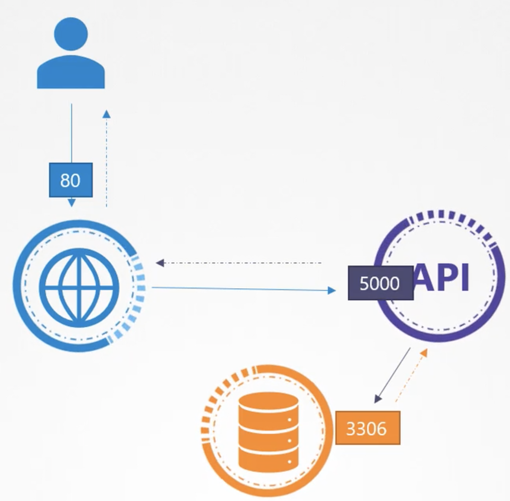
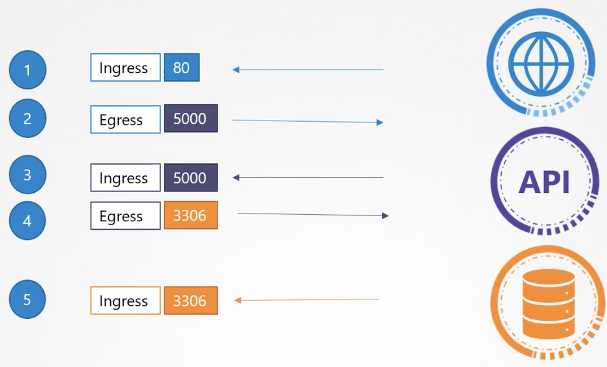
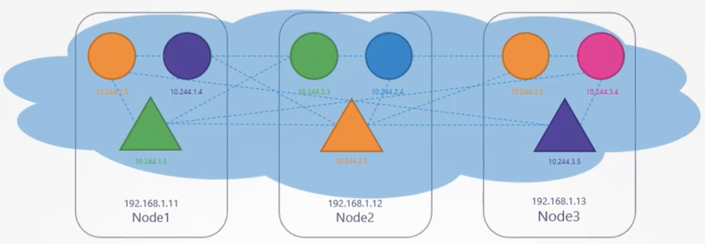

Предположим у нас есть следующая схема:

<br>

Пользователь посылает запрос на порт 80 веб-сервера, веб-сервер посылает запрос к API серверу на порт 5000, API сервер делает выборку из БД, обращаясь на порт 3306 и затем ответ возвращается пользователю.

Существует два типа трафика - Ingress и Egress.

Трафик, который является Egress для одного сервиса, в то же время будет являться Ingress для другого сервиса.

Вот какие правила нам нужно создать для нашей схемы:

<br>

Одно из главных требований при деплое кластера K8s - возможность сетевого взаимодействия между pod-ами, находящимися на разных нодах, без дополнительных настроек вроде маршрутов.

На схеме ниже pod-ы находятся в одной виртуальной частной сети, которая "растянута" на все ноды кластера.

Соответственно pod-ы могут достучаться друг до друга по IP-адресу или имени, или с помощью Services сконфигурированных для этого.

<br>

По умолчанию в K8s сконфигурировано правило "All Allow", разрешающее трафик от любого pod-а к любому другому pod-у или Service.

Возвращаясь к первой схеме, по умолчанию все три pod-а (веб-сервер, API и БД) могут взаимодействовать по сети друг с другом.

Но предположим, мы не хотим чтобы pod с веб-сервером имел доступ к pod-у с БД.

Здесь и приходят на помощь Network Policy, который также является еще одним объектом K8s.

Network Policy линкуется к одному или нескольким pod-ам, внутри самой Network Policy определяются правила.

Мы создаем одно из правил - для pod-а с БД разрешить Ingress трафик на порт 3306 от pod-а API.

После создания правила весь остальной трафик блокируется.

Каким образом Network Policy линкуется к pod-у? С помощью механизма Labels & Selectors.

В данном примере ограничивается только Ingress трафик, а т.к. в секции `policyTypes` не указано `Egress`, значит разрешается любой Egress трафик.

```yaml
apiVersion: networking.k8s.io/v1
kind: NetworkPolicy
metadata:
  name: db-policy
spec:
  podSelector:
    matchLabels:
      role: db       #Labels pod-а к которому применяется Network Policy
  policyTypes:
  - Ingress
  ingress:
  - from:
    - podSelector:
        matchLabels:
          name: api-pod   #Labels pod-а от которого разрешается входящий трафик на наш pod с БД
    ports:
    - protocol: TCP
      port: 3306
```

Важно понимать, что Network Policies обеспечиваются соответствующим сетевым решением использованным в кластере.

Не все сетевые решения позволяют использовать Network Policies, например Flannel.

Решения поддерживающие Network Policies:
- Kube-router
- Calico
- Romana
- Weave-net

Мы можем создавать Network Policies даже если сетевое решение не поддерживает их, в таком случае они просто не будут применяться.

Kubernetes Network Policies can control traffic flow at the OSI layer 3 or 4.