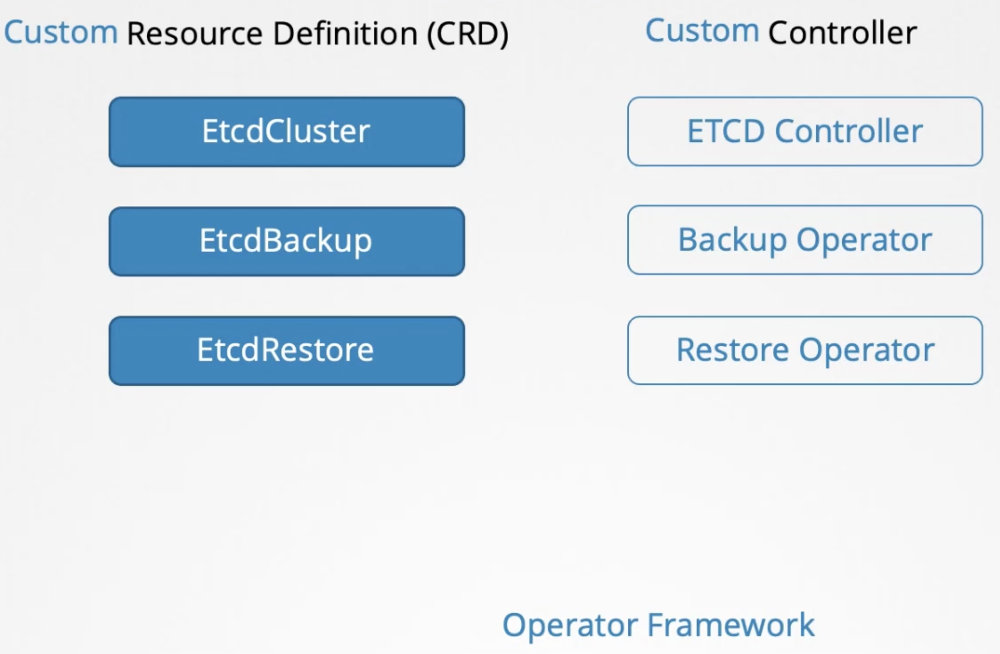

В прошлых урока мы рассмотрели процесс создания CRD и custom controller в виде отдельных сущностей. Мы вручную создали объект CRD и наш кастомный ресурс на его основе, затем развернули custom controller. Эти две сущности могут быть упакованы, чтобы в дальнейшем их можно было развернуть как единое целое, используя Operator Framework.

Когда разворачивается Operator definition-файл, он разворачивает объект CRD, кастомный ресурс на его основе и custom controller. Кроме этого Operator умеет много всего другого. Рассмотрим самый популярный Operator - etcd operator, который используется для деплоя кластера etcd в K8s. Он содержит CRD под названием EtcdCluster, ETCD Controller который смотрит за ресурсами типа etcd и деплоит etcd в кластере K8s. Кроме этого он умеет делать бэкапы кластера etcd - CRD EtcdBackup, восстанавливать бэкапы в etcd кластер - CRD EtcdRestore. За операции backup и restore отвечают соответствующие операторы.

 

K8s Operator делает то же самое, что делает оператор-человек - устанавливает приложение, обслуживает его, делает бэкапы, восстанавливает из бэкапов, устраняет проблемы в работе приложения.

Операторы доступны на сайте [operatorhub](https://operatorhub.io/)