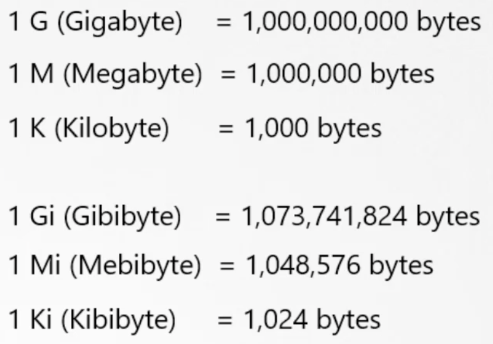

K8s Scheduler решает на какую ноду назначить pod

Scheduler смотрит сколько ресурсов требует pod и сколько доступно на ноде и в зависимости от этого принимает решение на какую ноду поместить pod

Если ни на одной из нод кластера не будет достаточно свободных ресурсов, требуемых для размещения pod-а, тогда Scheduler приостановит размещение pod-а и он будет висеть в статусе Pending

По умолчанию K8s считает, что для pod или контейнера внутри pod запрашивается 0.5 CPU и 256 Mi RAM

Это называется resource request - минимальное количество cpu или ram для контейнера

Когда Scheduler пытается определить ноду с достаточным количеством ресурсов для размещения pod-а, он ориентируется на эти значения

Если мы понимаем, что наше приложение потребует больше ресурсов, мы можем опеределить это в definition файле pod-а или Deployment в блоке resources => requests

Для cpu можно указать значение например 0.1 или 100m (милли), миниально 1m

1 CPU = 1 AWS vCPU = 1 GCP Core = 1 Azure Core = 1 Hyperthread

 

В мире Docker по умолчаню контейнер не имеет ограничений на потребление ресурсов Docker-хоста, соответственно может скушать вообще все ресурсы ноды и "задушить" процессы самого хоста

По умолчанию K8s устанавливает лимит на потребление ресурсов ноды в 1 CPU и 512 Mi RAM, мы можем опеределить это в definition файле pod-а или Deployment в блоке resources => limits

Важно! limits и requests устанавливаются для каждого контейнера в pod-е

Если контейнер в pod-е начнет выходить за рамки лимита по CPU, K8s ограничит его потребление заданными рамками

Что касается RAM, то контейнер может выйти за установленный лимит по памяти, но в таком случае K8s остановит работу такого pod-а

Задание небольшого CPU requests даёт pod-у хорошие шансы быть запланированным

Установка limits на ресурсы CPU, большего, чем requests, позволяет достичь 2 вещей:
- при увеличении нагрузки pod может задействовать дополнительные ресурсы CPU
- количество ресурсов CPU, которые pod может задействовать при повышении нагрузки, ограничено некоторой разумной величиной
