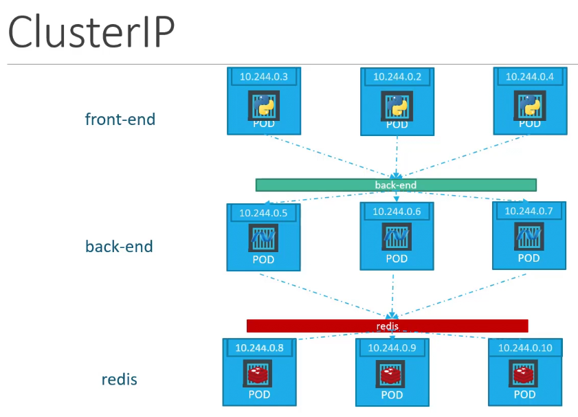

Предположим у нас есть три группы pod-ов: `front-end`, `back-end` и `redis`.

 

У каждого pod-а есть свой собственный IP-адрес, но мы не можем полагаться на них, т.к. pod-ы умирают и создаются вновь и соответственно меняются их IP-адреса.

Объект Service может помочь нам сгруппировать pod-ы и обеспечить единый интерфейс для доступа к целой группе pod-ов.

Пришедший запрос рандомно перенаправляется на один из pod-ов, находящихся под управлением Service.

Для каждой группы pod-ов можно безболезненно выполнять scale без влияния на связность с другими сервисами.

Каждый Service получает свой IP-адрес и имя внутри кластера, по которому другие pod-ы получают доступ к этому Service.