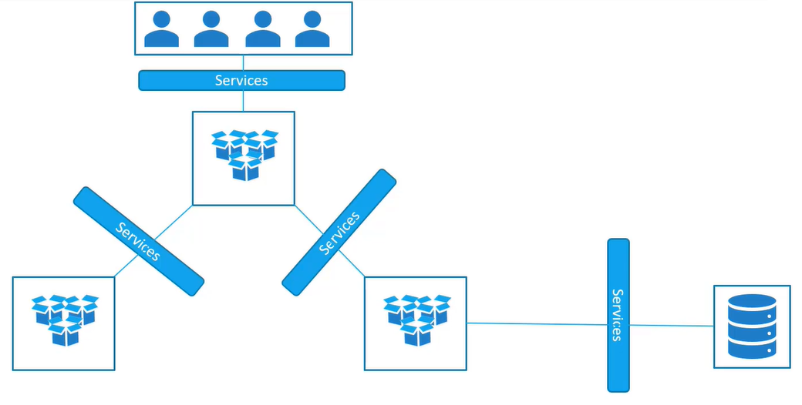

Services позволяют нам обеспечить взаимодействие между различными компонентами K8s.

Services позволяют объединить по сети наши приложения друг с другом и с конечными пользователями.

Например Services могут обеспечивать доступ конечным пользователям к группе frontend pod-ов, взаимодействие между backend и frontend pod-ами, а также взаимодействие backend pod-ов с внешними источниками данных.

<br>

Рассмотрим следующий пример:

<br>

Мы находимся в одной подсети с нодой K8s (подсеть `192.168.1.0/24`), на которой запущен pod с веб-сервером.

Сеть для pod-ов `10.244.0.0/16`, соответственно как мы можем получить доступ к веб-серверу?

Можно зайти на ноду по ssh и выполнить команду `curl http://10.244.0.2`, но это доступ непосредственно с ноды кластера.

А нам нужно получить доступ к веб-серверу извне, зная только IP-адрес ноды.

Здесь в игру вступает объект Service, один из сценариев его использования (`NodePort`) - слушать порт на ноде и перенаправлять пришедший запрос на порт pod-а с веб-сервером.

<br>

`ClusterIP` - в этом случае Service создает Virtual IP внутри кластера для взаимодействия одной группы pod-ов с другой группой pod-ов.

`LoadBalancer` - предоставляет балансировщик нагрузки для нашего приложения, доступен только в публичных облачных провайдерах.

Рассмотрим подробнее объект Service:

<br>

Здесь вовлечены три порта:

- *TargetPort* - целевой порт в pod-е, на который Service перенаправляет запрос
- *Port* - порт самого объекта Service; Service можно представить в виде виртуального сервера внутри ноды, он имеет свой IP-адрес внутри кластера (`10.106.1.12` в данном примере) и называется ClusterIP of the Service
- *NodePort* - порт ноды, на который приходит запрос извне, допустимый диапазон портов 30000 - 32767

```yaml
apiVersion: v1
kind: Service
metadata:
  name: myapp-service
spec:
  type: NodePort
  ports:
    - targetPort: 80   # порт pod-а
      port: 80         # порт объекта Service
      nodePort: 30008  # порт ноды кластера
  selector:
    app: myapp         #label нужного нам pod-а
    type: front-end
```

Обязательным является только параметр `port`, если не указать явно `targetPort`, то он будет равен значению параметра `port`. Если не указать параметр `nodePort`, то будет выбран рандомный доступный порт из диапазона `30000 - 32767`.

Можно указать сразу несколько портов, т.к. это список.

Service обнаруживает pod-ы с помощью Labels & Selectors.

Механизм балансировки между несколькими pod-ами - random, соответственно Service выступает в роли встроенного балансировщика.

В случае когда pod-ы распределены по нескольким нодам кластера, порт 30008 будет открыт на всех нодах и получить доступ к приложению можно обратившись к любой ноде.

Вывод команды `kubectl describe service myapp-service` покажет список endpoints - это все pod-ы, которые смог обнаружить Service по заданным labels.