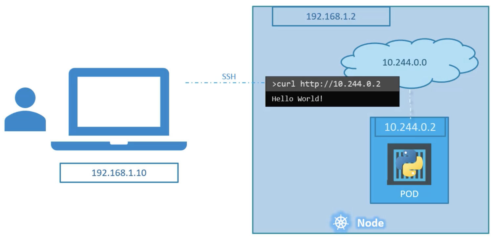
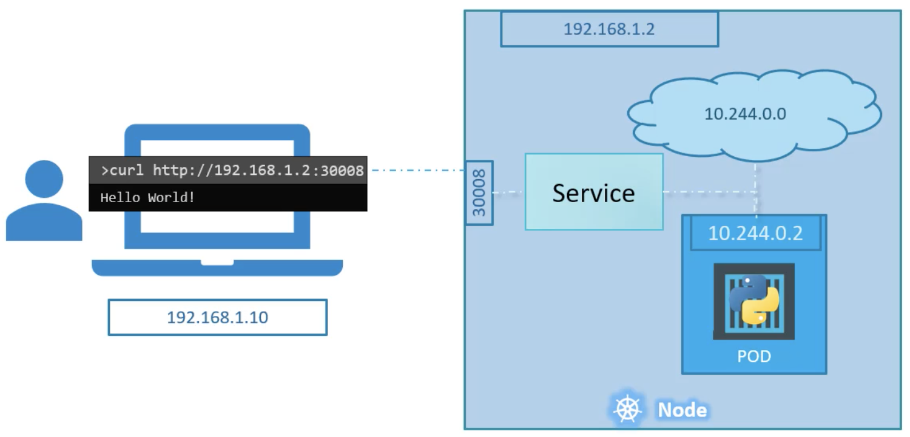
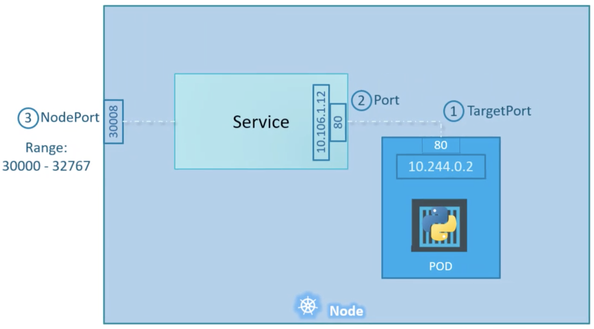

Services позволяют нам обеспечить взаимодействие между различными компонентами K8s

Services позволяют объединить по сети наши приложения друг с другом и с конечными пользователями

Например Services обеспечивают доступ конечным пользователям к группе frontend pod-ов, взаимодействие между backend и frontend pod-ами, взаимодействие backend pod-ов с внешними источниками данных

Рассмотрим пример ниже:

 

Мы находимся в одной подсети с K8s нодой (192.168.1.0), на которой запущен pod с веб-сервером

Сеть для pod-ов 10.244.0.0, соответственно как мы можем получить доступ к веб-серверу?

Можем зайти по ssh на ноду и выполнить команду `curl http://10.244.0.2`, но это доступ изнутри кластера

А нам нужно получить доступ к веб-серверу извне, зная только ip-адрес ноды

Здесь в игру вступает объект Service, один из сценариев его использования (NodePort) - слушать порт на ноде и перенаправлять пришедший запрос на порт pod-а с веб-сервером

 

ClusterIP - в этом случае Service создает virtual IP внутри кластера для взаимодействия одной группы pod-ов с другой группой pod-ов

LoadBalancer - предоставляет балансировщик нагрузки для нашего приложения, доступен только в публичных облачных провайдерах

Рассмотрим подробнее объект Service:

 

Здесь вовлечены три порта:
- TargetPort - целевой порт в pod-е, на который Service перенаправляет запрос
- Port - порт самого объекта Service; Service можно представить в виде виртуального сервера внутри ноды, он имеет свой IP-адрес внутри кластера и называется ClusterIP of the Service
- NodePort - порт ноды, на который приходит запрос извне, допустимый диапазон портов 30000 - 32767

Service обнаруживает pod-ы с помощью Labels & Selectors

Механизм балансировки между несколькими pod-ами - random, соответственно Service выступает в роли LB

В случае когда pod-ы распределены по нескольким нодам кластера, порт 30008 будет открыт на всех нодах и получить доступ к приложению можно обратившись к любой ноде

Вывод команды `kubectl describe service myapp-service` покажет список endpoints - это все pod-ы, которые смог обнаружить Service по заданным labels