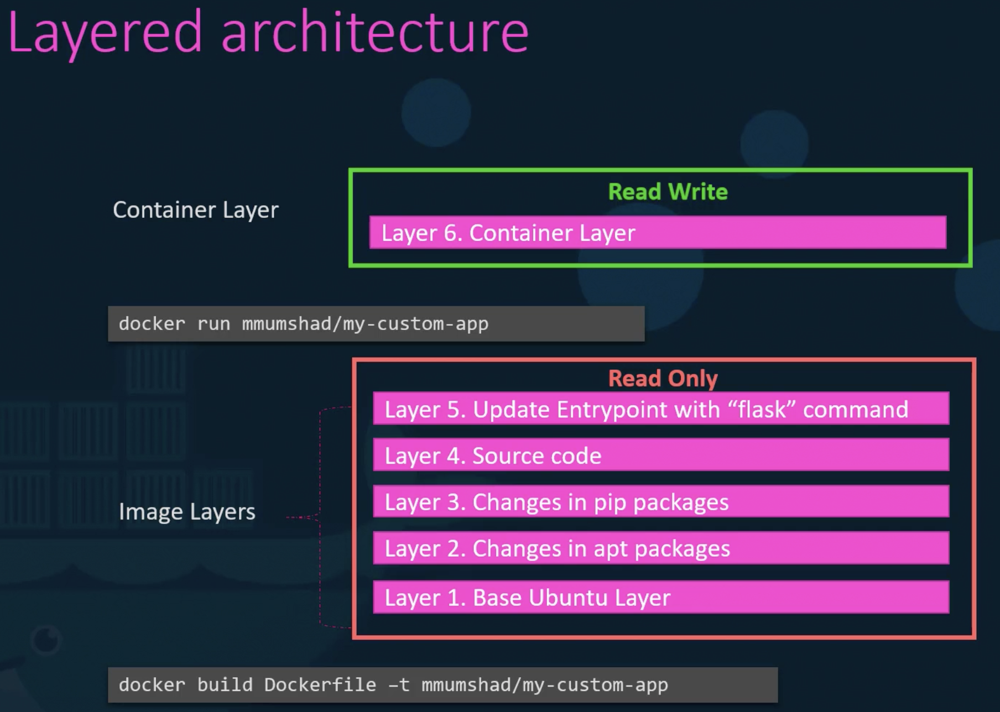

При установке Docker создает структуру директорий в /var/lib/docker, внутри находится множество поддиректорий - aufs, containers, image, volumes и т.д. Здесь по умолчанию Docker хранит данные

- containers - файлы относящиеся к контейнерам
- image - файлы образов
- volumes - вольюмы созданные контейнерами

Когда Docker собирает образы, он собирает их в многослойной архитектуре

Каждая строка в Dockerfile создает в образе новый слой, который содержит только дельту изменений по сравнению с предыдущим слоем

Чтобы понять преимущества многослойной архитектуры сравним Dockerfile и Dockerfile2

В них используется разный source code для разных приложений, соответственно разные entrypoint

Сборка первого образа: `docker build Dockerfile -t frenzy88/my-custom-app`

Сборка второго образа: `docker build Dockerfile2 -t frenzy88/my-custom-app-2`

При билде второго образа Docker не будет заново создавать первые три слоя, т.к. они одинаковые для обоих образов и уже были собраны для первого образа, он возьмет данные о первых трех слоях из кеша и начнет пересобирать только последние два слоя

Таким образом Docker собирает образы быстрее и эффективнее сохраняет дисковое пространство

Также это полезно, когда мы часто меняем source code нашего приложения, образ не ребилдится с нуля, таким образом экономит нам кучу времени

После завершения сборки образа мы уже не сможем изменить содержимое какого-либо слоя в образе, они будут read-only

Соответственно поменять содержимое какого-либо слоя возможно только путем сборки нового образа

После запуска контейнера Docker создает новый доступный для записи слой на самом верхнем уровне образа

Этот созданный слой нужен для хранения логов приложения, временных файлов контейнера или файлов созданных юзером в контейнере

Этот слой живет только пока запущен контейнер, как только контейнер удаляется исчезает и этот временный слой

 

Важно помнить, что один и тот же образ может быть использован для запуска нескольких контейнеров

Можно условно разделить контейнер на Image Layer (read-only) и Container Layer (read-write)

Код в файле app.py является в нашем случае частью Image Layer (read-only) и если мы захотим поменять код в файле app.py уже после запуска контейнера, то перед сохранением изменений Docker создаст копию этого файла в Container Layer (read-write), при этом файл app.py в Image Layer останется неизменным

Этот механизм называется copy-on-write

Что произойдет, когда мы избавимся от контейнера? Все данные в Container Layer также будут утеряны

Если же мы хотим сохранить данные из Container Layer даже после остановки контейнера, необходимо добавить persistent volume

Команда `docker volume create data_volume` создаст папку data_volume в `/var/lib/docker/volumes/`

Затем мы можем примонтировать созданный volume к Container Layer (read-write) при запуске контейнера:

`docker run -v data_volume:/var/lib/mysql mysql`

Теперь фактически все данные созданные БД MySQL будут сохраняться на volume на Docker-хосте

Даже если контейнер будет удален, данные сохранятся в целостности

Если запустить команду `docker run -v data_volume2:/var/lib/mysql mysql` без предварительного создания volume, то Docker создаст его автоматически. Это называется volume mounting - монтирование volume из директории `/var/lib/docker/volumes`

Если же нам требуется использовать для монтирования не дефолтную папку `/var/lib/docker/volumes`, а например `/data`, то при запуске контейнера мы указываем полный путь к этой папке на Docker-хосте:

`docker run -v /data/mysql:/var/lib/mysql mysql`

Это называется bind mounting - монтирование директории из любого location на Docker-хосте

Монтирование volume через опцию -v считается устаревшим, более современный подход использует опцию `--mount`:
`docker run --mount type=bind,source=/data/mysql,target=/var/lib/mysql mysql`, гед source - папка на Docker-хосте, target - папка в контейнере

Docker использует storage drivers для многослойной архитектуры:
- AUFS
- ZFS
- BTRFS
- Device Mapper
- Overlay
- Overlay 2

Выбор конкретного драйвера зависит от ОС Docker-хоста, например для Ubuntu это AUFS, который недоступен например на CentOS

Docker автоматически выбирает наиболее подходящий для ОС storage driver

Разные storage drivers выдают разную производительность и стабильность работы, так что мы можем выбрать подходящий под наши нужды
