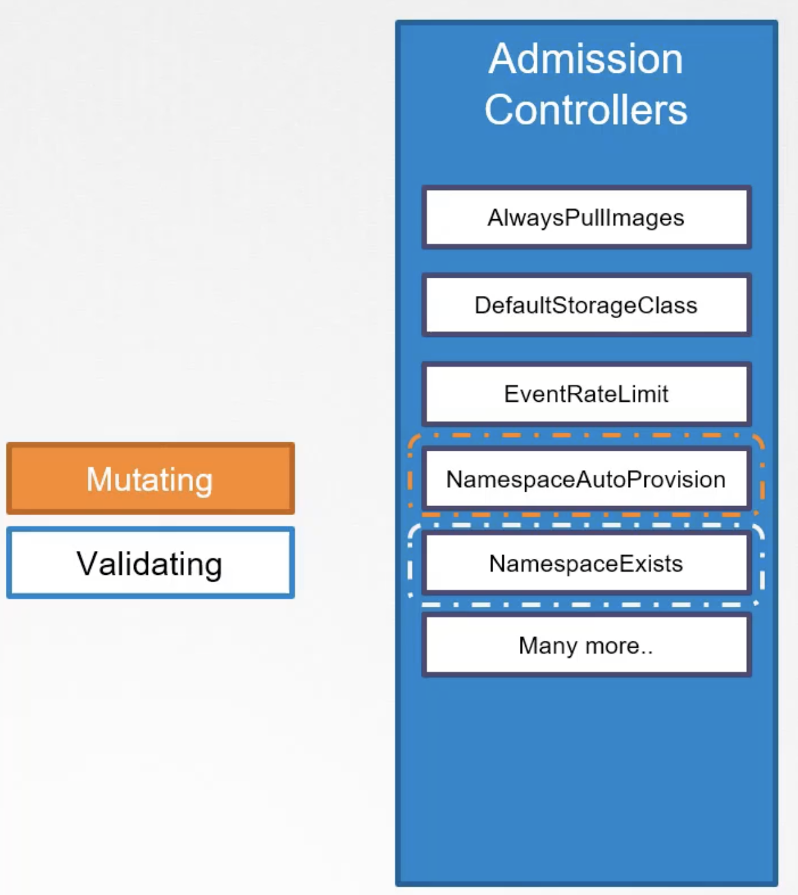
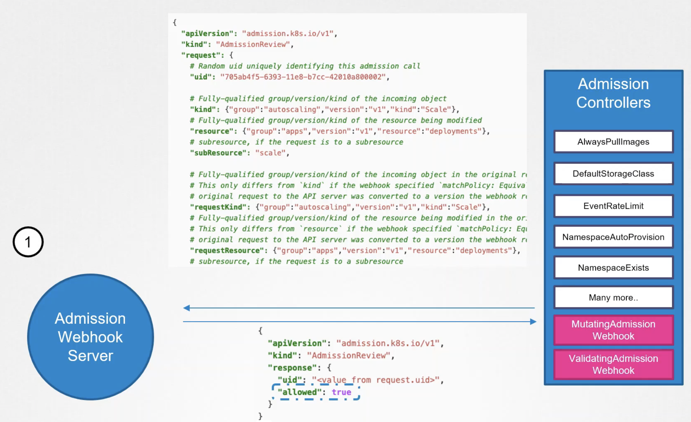

Ранее в уроке Admission Controllers мы рассматривали `NamespaceExists` и `NamespaceLifecycle` Admission Controller-ы, которые проверяют существует ли namespace и отклоняют запрос, если его не существует в кластере. Этот тип называется Validating Admission Controllers. Они валидируют запрос и по итогу принимают или отклоняют его.

Рассмотрим другой Admission Controller Plugin - `DefaultStorageClass`, который включен по умолчанию. Например мы сделали запрос на создание PVC. Он прошел процессы аутентификации, авторизации и Admission Controller. `DefaultStorageClass` Admission Controller смотрит за запросами на создание PVC и проверяет указан ли в них Storage Class. Если не указан, тогда он изменит запрос и добавит к нему Default Storage Class. Это можно увидеть после создания PVC командой `kubectl describe pvc myclaim`. Этот тип называется Mutating Admission Controllers. Они могут изменять объект перед его созданием.

Существуют Admission Controller-ы, которые могут и валидировать запрос и изменять его. 

Как правило первыми вызываются Mutating Admission Controllers, а уже после них Validating Admission Controllers.

 

Например на схеме выше `NamespaceAutoProvision` являющийся Mutating Admission Controller запускается первым и уже после него запускается Validating Admission Controller `NamespaceExists`. Если будет наоборот, тогда `NamespaceExists` Admission Controller всегда будет отклонять запросы для несуществующих namespace-ов и `NamespaceAutoProvision` Admission Controller никогда не будет вызван для создания несуществующего namespace. Если хотя бы один Admission Controller из всей цепочки отклонит запрос, тогда операция будет прервана и пользователь получит ошибку.

Все рассмотренные выше Admission Controller-ы являются встроенными в K8s и поставляются изначально "в коробке". Что если мы хотим создать свой собственный Admission Controller с определенной логикой? Для поддержки сторонних Admission Controller-ов существуют два специальных Admission Controller-а - `MutatingAdmissionWebhook` и `ValidatingAdmissionWebhook`. Мы можем настроить эти webhook-и с указанием сервера расположенного внутри K8s кластера или за его пределами. Этот сервер будет иметь свой собственный admission webhook service, состоящий из нашего кода и имеющий определенную логику. Когда запрос пройдет все встроенные Admission Controller-ы, он дойдет до настроенного webhook, который сделает вызов к admission webhook server путем передачи объекта AdmissionReview в формате JSON. Этот объект содержит все детали запроса - пользователь, пославший запрос, тип операции, которую хочет выполнить пользователь, над каким объектом операция должна быть выполнена и информация о самом объекте. При получении запроса admission webhook server ответит с помощью объекта AdmissionReview с результатом - разрешен запрос или нет. Если поле "allowed" в ответе равно "true", тогда запрос разрешен, если равно "false" - запрещен.

 

Каким образом выполняется настройка? Сначала нужно развернуть admission webhook server и затем настроить webhook в K8s путем создания webhook configuration object.

Admission webhook server - это по сути API сервер построенный на какой-либо платформе. Главное требование - возможность принимать mutate и validate APIs и отвечать в формате JSON-объекта, который ожидает веб-сервер.

Мы можем развернуть admission webhook server в кластере K8s как Deployment, также нам потребуется создать Service для доступа к Deployment.

Следующий шаг - создание объекта ValidatingWebhookConfiguration.