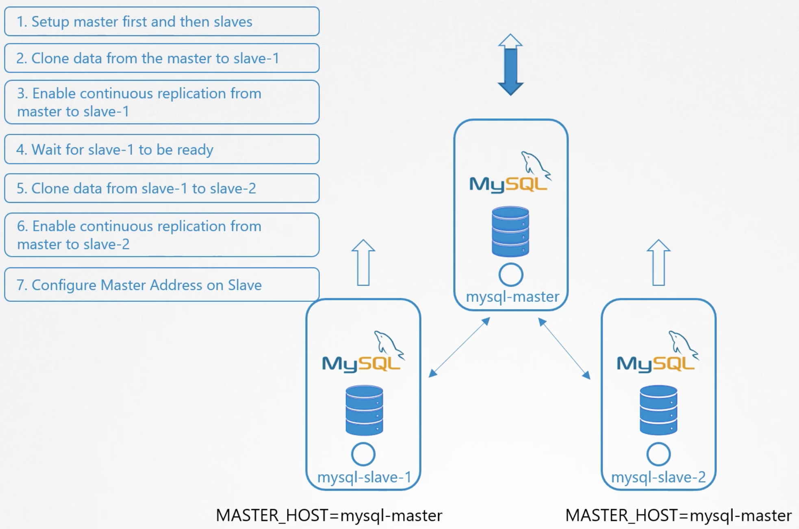

Для начала разберемся зачем нам нужны Stateful Sets? Почему мы не можем обойтись Deployments?

Начнем со старого доброго железного сервера. У нас есть задача развернуть на нем сервер БД. Соответственно мы установили и настроили MySQL и создали БД. Наша БД доступна и приложения пишут туда некоторые данные.

Для того чтобы противостоять сбоям, мы должны сделать HA-решение. Для этого мы добавили еще два физических сервера и установили на них MySQL. Теперь на этих двух добавленных сервера создана пустая БД.

Как нам реплицировать данные с первоначальной БД на новые сервера?

Рассмотрим самый простой вариант репликации - один master и несколько slaves. Все writes приходят на master, а reads могут обслуживаться любым сервером кластера - master-ом или slave-ми.

- Master должен быть установлен первым перед деплоем slave-ов
- Когда slave-ы развернуты, необходимо выполнить первоначальное клонирование БД с master-а на первый slave
- Когда первоначальное клонирование БД выполнено, необходимо включить continuous replication с master-а на первый slave, чтобы БД на первом slave всегда была синхронизирована с master-ом
- Аналогичную операцию нужно проделать со вторым slave, то есть сделать первоначальное клонирование БД с master-а, однако каждый раз подобная операция сильно нагружает master, особенно сетевой интерфейс. А так как у нас есть полная копия БД на первом slave, мы можем выполнить первоначальное клонирование БД не с master-а, а с первого slave. Соответственно мы ждем когда первый slave будет готов и выполняем клонирование БД со slave-1 на slave-2
- После этого мы также включаем continuous replication с master-а на второй slave
- Оба slave длжны быть настроены на адрес master-а. Когда инициализируется репликация вы указываете slave-у "смотреть" на hostname или ip-адрес master-а. Таким образом slave-ы знают где находится master.

 

Вернемся обратно в мир K8s и попытаемся развернуть описанную выше схему.

На первый взгляд мы могли бы использовать Deployment и легко масштабировать количество pod-ов с mysql.

Однако стоит вспомнить жедаемый порядок операций: первым поднимается master => затем slave-1 => первоначальное клонирование БД с master-а на slave-1 => поднимается slave-2 => первоначальное клонирование БД со slave-1 на slave-2.

При использовании Deployment мы не можем гарантировать подобную очередность выполнения, т.к. все pod-ы в рамках Deployment поднимаются одновременно. Кроме того для выполнения репликации нам нужно иметь возможность четко различать master и slave pod-ы, а также чтобы master имел постоянный ip-адрес или hostname. Однако как мы знаем при пересоздании pod-а его ip-адрес может поменяться, а pod-ам в рамках Deployment автоматически присваиваются рандомные имена. Соответственно мы не сможем назначить какой-то pod master-ом, а другие slave-ми.

И здесь на помощь приходит Stateful Sets. Это очень похоже на Deployment, pod-ы создаются на основе template, их количество может масштабироваться, доступны Rolling Update & Rollbacks. Но есть несколько отличий.

Pod-ы в рамках Stateful Sets создаются поочередно - первый pod должен дойти до состояния Running/Ready прежде чем запустится следующий. Это поможет нам сначала развернуть master, затем slave-1 и slave-2.

В рамках Stateful Sets каждому pod-у назначается уникальный порядковый индекс, начиная с 0 для первого pod-а и так далее, увеличиваясь на 1. Каждый pod получает уникальное имя, которое формируется из индекса + имя самого Stateful Set. Например mysql-0, mysql-1, mysql-2. Соответственно больше нет рандомных имен и мы можем быть уверены, что имя master-а теперь всегда будет mysql-0 и прописывать это имя на slave-ах при настройке репликации. Даже если pod mysql-0 упадет и будет поднят заново, его имя останется прежним.

---

Подытоживая, нам не всегда нужен Stateful Set, выбор зависит от типа используемого нами приложения.

Если нам требуется последовательный запуск pod-ов, если нужны постоянные имена pod-ов и т.д., тогда стоит использовать Stateful Set.

Чтобы создать definition-файл для Stateful Set, нужно создать аналогичный для Deployment definition-файл и изменить `kind` на `StatefulSet`.
Также требуется указать параметр `serviceName` - имя headless service.

В случае уменьшения количества реплик в Stateful Set, pod-ы начнут удаляться начиная с последнего.

StatefulSets do not provide any guarantees on the termination of pods when a StatefulSet is deleted. To achieve ordered and graceful termination of the pods in the StatefulSet, it is possible to scale the StatefulSet down to 0 prior to deletion.