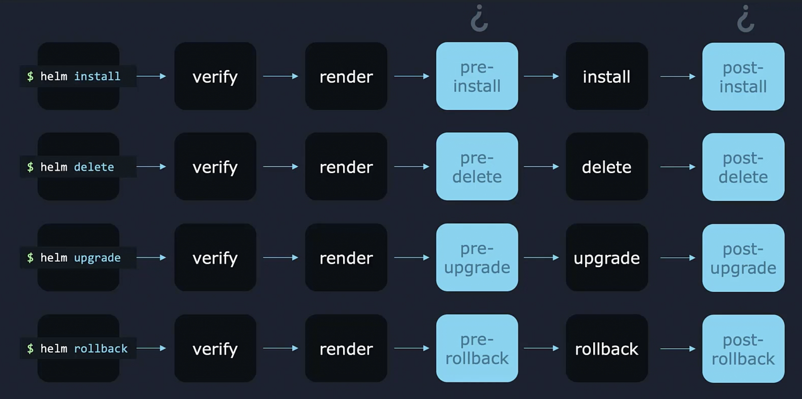

Кроме деплоя различных объектов в K8s в рамках установки нашего приложения Helm Charts могут делать некоторые дополнительные вещи. Например, при обновлении приложения WordPress может быть автоматически создана резервная копия базы данных перед началом процесса обновления и таким образом у нас будет шанс восстановить данные из бэкапа в случае, если что-то пойдет не так. Это реализуется с помощью Hooks.

Типичный workflow событий в Helm: `helm upgrade` => verify => render => upgrade. Когда пользователь устанавливает или обновляет Chart, сначала Helm верифицирует файлы, затем собирает итоговые manifest-файлы и в конце разворачивает объекты в кластере (фаза обновления). Наша задача выполнить бэкап БД непосредственно перед началом установки Chart (фазы обновления). Мы используем pre-upgrade hook, который запускает предопределенное действие, это может быть что угодно, в нашем случае - бэкап БД. В процессе выполнения pre-upgrade hook Helm будет ждать его полного завершения и только после этого начнет установку приложения в кластер. После завершения установки приложения (фазы обновления) нам возможно понадобится выполнить какую-либо очистку или послать нотификацию по почте например. Здесь нам понадобится post-upgrade hook, который запускается после успешного завершения фазы обновления.

Аналогично при выполнении команды установки приложения `helm install` могут запускаться pre-install и post-install hooks, pre-delete и post-delete hooks при удалении приложения, pre-rollback и post-rollback при откате приложения.

<br>

Каким образом мы можем запустить скрипт для выполнения бэкапа в K8s? С помощью запуска его в pod-е. Однако как мы знаем pod остается запущенным всегда, а нам нужно выполнить скрипт всего один раз. Для этого мы создаем job вместо pod:
```yaml
apiVersion: batch/v1
kind: Job
metadata:
  name: {{ .Release.Name }}-nginx
spec:
  template:
    metadata:
      name: {{ .Release.Name }}-nginx
    spec:
      containers:
      - image: alpine
        name: pre-upgrade-backup-job
        command: [ "/bin/script.sh" ]
      restartPolicy: Never
```

Файл с Job помещается внутри каталога templates нашего Chart. Как мы знаем все файлы внутри каталога templates собираются в manifest-файлы K8s, когда устанавливается Chart. Однако эта Job не будет работать так. Она будет запускаться перед фазой обновления как pre-upgrade hook. Каким образом Helm понимает, что созданная Job является не обычным шаблоном, а pre-upgrade hook-ом? Для этого нужно добавить аннотацию:
```yaml
apiVersion: batch/v1
kind: Job
metadata:
  name: {{ .Release.Name }}-nginx
  annotations:
    "helm.sh/hook": pre-upgrade
spec:
  template:
    metadata:
      name: {{ .Release.Name }}-nginx
    spec:
      containers:
      - image: alpine
        name: pre-upgrade-backup-job
        command: [ "/bin/script.sh" ]
      restartPolicy: Never
```
Теперь эта Job будет запускаться только перед фазой обновления в случае upgrade Chart. Аналогично настраиваются другие типы Hooks.

Иногда нам нужно запускать сразу несколько pre-upgrade hooks, например сначала послать нотификацию по e-mail, затем установить баннер на сайте о проводимых работах и в конце выполнить бэкап БД. Как определить очередность выполнения hooks? Мы можем задать weights для каждого hook. Это может быть положительное или отрицательное число. В процессе 