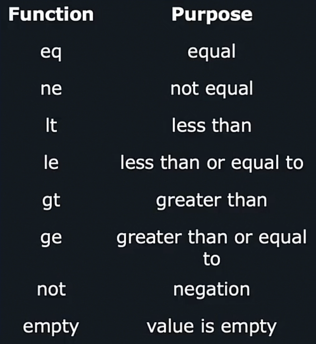

Допустим мы решили добавить Labels для объекта Service, которые будут помогать группировать объекты и значение Label может меняться в заисимости от организации. При этом, если в файле values.yaml не задано значение для переменной `orgLabel`, мы хотим, чтобы в Service.yaml не было такого поля Label. То есть мы хотим добавлять поле Label в объект Service в зависимости от того, задано ли для него значение в файле values.yaml или нет.
```yaml
metadata:
  name: {{ .Release.Name }}-svc
  {{ if .Values.orgLabel }}     #если задано значение для переменной orgLabel, тогда строки будут добавлены в итоговый манифест-файл
  labels:
    org: {{ .Values.orgLabel }}
  {{ end }}
```

После генерации итогового manifest-файла мы увидим в нем пустые строки, т.к. перед блоком if-end изначально есть пробелы:
```yaml
metadata:
  name: test1-svc

  labels:
    org: payroll

```

Чтобы избежать этого, нужно добавить символ "-" после второй фигурной скобки, который означает trim:
```yaml
metadata:
  name: {{ .Release.Name }}-svc
  {{- if .Values.orgLabel }}
  labels:
    org: {{ .Values.orgLabel }}
  {{- end }}
```

Можно добавить несколько условий (в этом примере даже если задать "hr", то вывод будет "hr", а не "human resources"):
```yaml
metadata:
  name: {{ .Release.Name }}-svc
  {{- if .Values.orgLabel }}
  labels:
    org: {{ .Values.orgLabel }}
  {{- else if eq .Values.orgLabel "hr" }}   #eq=equality, функция вернет true, если значение переменной orgLabel равно "hr"
  labels:
    org: human resources
  {{- end }}
```

Более удачный пример из лабы:
```yaml
apiVersion: v1
metadata:
  name: {{ .Values.configMap.name }}
  namespace: default
kind: ConfigMap
data:
  {{- if eq .Values.environment "production" }}
    APP_COLOR: pink
  {{- else if eq .Values.environment "development"}}
    APP_COLOR: darkblue
  {{- else}}
    APP_COLOR: green
  {{- end }}
```

Существует множество других функий сравнения:

<br>

Наиболее частый сценарий использования Conditionals - создавать или нет какой-либо объект. Например нам не всегда нужно создавать объект Service Account. И мы хотим дать возможность пользователю задавать этот параметр в values.yaml.
```yaml
{{- if .Values.serviceAccount.create }}
apiVersion: v1
kind: ServiceAccount
metadata:
  name: {{ .Release.Name }}-robot-sa
{{- end }}
```