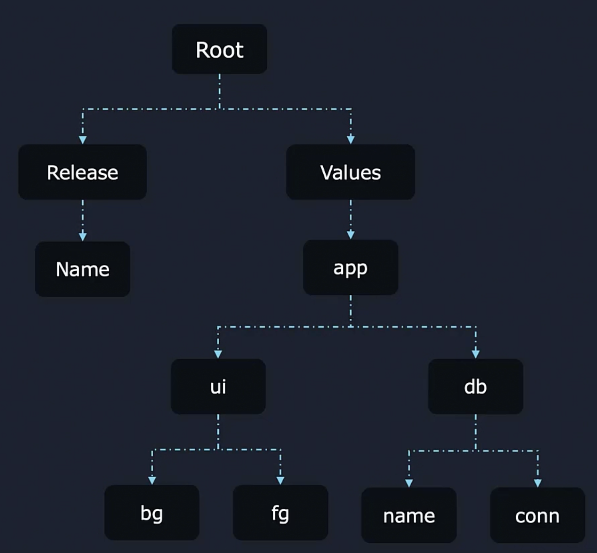

Допустим у нас есть manifest-файл для ConfigMap:
```yaml
apiVersion: v1
kind: ConfigMap
metadata:
  name: {{ .Release.Name }}-appinfo
data:
  background: {{ .Values.app.ui.bg }}
  foreground: {{ .Values.app.ui.fg }}
  database: {{ .Values.app.db.name }}
  connection: {{ .Values.app.db.conn }}
```

И файл values.yaml:
```yaml
app:
  ui:
    bg: red
    fg: black
  db:
    name: "users"
    conn: "mongodb://localhost:27020/mydb"
```
Иерархия scopes, начиная с root-level (.), схематично выглядит так:

<br>

По умолчанию мы всегда начинаем с root-level (.), поэтому в ConfigMap имеем множество записей-дублей вида `.Values.app.`. Мы можем избежать этого с помощью использования блока "with":
```yaml
apiVersion: v1
kind: ConfigMap
metadata:
  name: {{ .Release.Name }}-appinfo
data:
  {{- with .Values.app }}   #начинать поиск не с root, а сразу с .Values.app
    {{- with .ui }}         #далее еще задаем стартовый scope на .Values.app.ui
    background: {{ .bg }}
    foreground: {{ .fg }}
    {{- end }}
    {{- with .db }}         #далее еще задаем стартовый scope на .Values.app.db
    database: {{ .name }}
    connection: {{ .conn }}
    {{- end }}
  {{- end }}
```

Предположим мы добавили еще одно поле `release` внутри блока `data`, чтобы получить имя Release:
```yaml
apiVersion: v1
kind: ConfigMap
metadata:
  name: {{ .Release.Name }}-appinfo
data:
  {{- with .Values.app }}   #начинать поиск не с root, а сразу с .Values.app
    {{- with .ui }}         #далее еще задаем стартовый scope на .Values.app.ui
    background: {{ .bg }}
    foreground: {{ .fg }}
    {{- end }}
    {{- with .db }}         #далее еще задаем стартовый scope на .Values.app.db
    database: {{ .name }}
    connection: {{ .conn }}
    {{- end }}
    release: {{ .Release.Name }}
  {{- end }}
```

В итоге мы получим ошибку, т.к. Helm будет искать внутри `.Values.app` имя Release и не найдет его. Однако мы можем обратиться к root-level scope через символ доллара `$`:
```yaml
apiVersion: v1
kind: ConfigMap
metadata:
  name: {{ .Release.Name }}-appinfo
data:
  {{- with .Values.app }}   #начинать поиск не с root, а сразу с .Values.app
    {{- with .ui }}         #далее еще задаем стартовый scope на .Values.app.ui
    background: {{ .bg }}
    foreground: {{ .fg }}
    {{- end }}
    {{- with .db }}         #далее еще задаем стартовый scope на .Values.app.db
    database: {{ .name }}
    connection: {{ .conn }}
    {{- end }}
    release: {{ $.Release.Name }}
  {{- end }}
```