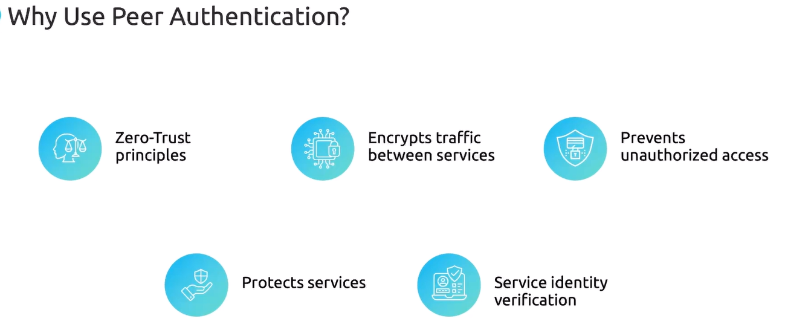

Zero Trust (нулевое доверие) – это модель безопасности, основанная на принципе "никогда не доверяй, всегда проверяй", даже внутри собственной сети.

Istio осуществляет нулевое доверие путем навязывания (enforce) mTLS для всех взаимодействий между сервисами. Однако навязывание  mTLS не включено "из коробки". Для его настройки нужно использовать ресурс PeerAuthentication, который определяет один из двух возможных режимов работы - Strict или Permissive.

В режиме Permissive разрешено взаимодействие по plaint text HTTP, независимо от того, имеет ли нагрузка envoy-прокси или нет.

В режиме Strict разрешено взаимодействие только по mTLS. Это будет работать только если нагрузка имеет инжектированный envoy-прокси.

Пример глобальной политики навязывания mTLS:

```yaml
apiVersion: security.istio.io/v1beta1
kind: PeerAuthentication
metadata:
  name: default
  namespace: istio-system
spec:
  mtls:
    mode: STRICT
```

Т.к. применяется она к namespace `istio-system`, то действие ее распространяется на весь Service Mesh.

Можно переопределить глобальную политику для определенного namespace:

```yaml
apiVersion: security.istio.io/v1beta1
kind: PeerAuthentication
metadata:
  name: default
  namespace: default
spec:
  mtls:
    mode: PERMISSIVE
```

<br>

Документация:

https://istio.io/latest/docs/reference/config/security/peer_authentication

https://istio.io/latest/docs/tasks/security/authentication/authn-policy/

### Demo

Ставим и включаем istio для namespace `default`, разворачиваем в нем приложение helloworld.

```shell
$ kubectl apply -f https://raw.githubusercontent.com/istio/istio/refs/heads/master/samples/helloworld/helloworld.yaml
```

Создаем тестовый namespace и нагрузку внутри него:

```shell
$ kubectl create ns test
$ kubectl -n test run test --image=nginx
```

Из тестового pod-а проверим доступность сервиса `helloworld`:

```shell
$ kubectl -n test exec -it test -- curl helloworld.default.svc.cluster.local:5000/hello

Hello version: v1, instance: helloworld-v1-5787f49bd8-r6f88
```

Все работает.

Включим mTLS глобально на уровне всего Service Mesh (*mesh-wide policy*):

```yaml
apiVersion: security.istio.io/v1beta1
kind: PeerAuthentication
metadata:
  name: default
  namespace: istio-system
spec:
  mtls:
    mode: STRICT
```

Из тестового pod-а вновь проверим доступность сервиса `helloworld`:

```shell
$ kubectl -n test exec -it test -- curl helloworld.default.svc.cluster.local:5000/hello

curl: (56) Recv failure: Connection reset by peer
command terminated with exit code 56
```

Не работает, т.к. для namespace `test` не включено istio injection и трафик уходит по plain text HTTP, а приложение в namespace `default` требует обязательного наличия mTLS.

Включим istio injection для namespace `test` и пересоздадим тестовый pod:

```shell
$ kubectl label ns test istio-injection=enabled
$ kubectl -n test delete pod test
$ kubectl -n test run test --image=nginx
```

Из тестового pod-а вновь проверим доступность сервиса `helloworld`:

```shell
$ kubectl -n test exec -it test -- curl helloworld.default.svc.cluster.local:5000/hello

Hello version: v1, instance: helloworld-v1-5787f49bd8-r6f88
```

Теперь заработало, т.к. мы включили istio и для namespace `test`.

Переопределим глобальную политику Peer Authentication для namespace `default` (*namespace-wide policy*):

```yaml
apiVersion: security.istio.io/v1beta1
kind: PeerAuthentication
metadata:
  name: default
  namespace: default
spec:
  mtls:
    mode: PERMISSIVE
```

Вот что получилось:

```shell
$ kubectl get peerauthentications.security.istio.io -A
NAMESPACE      NAME      MODE         AGE
default        default   PERMISSIVE   5s
istio-system   default   STRICT       6m56s
```

Создаем еще один тестовый namespace и нагрузку внутри него:

```shell
$ kubectl create ns app
$ kubectl -n app run test --image=nginx
```

Из тестового pod-а в namespace `app` проверим доступность сервиса `helloworld`:

```shell
$ kubectl -n app exec -it test -- curl helloworld.default.svc.cluster.local:5000/hello

Hello version: v1, instance: helloworld-v1-5787f49bd8-r6f88
```

Работает. Хотя для namespace `app` не включено istio injection, но permissive-режим, включенный для namespace `default` разрешает plain text HTTP.

Теперь разворачиваем в namespace `default` приложение bookinfo.

```shell
$ kubectl apply -f https://raw.githubusercontent.com/istio/istio/release-1.11/samples/bookinfo/platform/kube/bookinfo.yaml
```

Изменим нашу политику так, чтобы она действовала только на приложение `helloworld` (*workload-specific policy*):

```yaml
apiVersion: security.istio.io/v1beta1
kind: PeerAuthentication
metadata:
  name: default
  namespace: default
spec:
  selector:
    matchLabels:
      app: helloworld
  mtls:
    mode: PERMISSIVE
```

Из тестового pod-а в namespace `app` проверим доступность сервиса `helloworld`:

```shell
$ kubectl -n app exec -it test -- curl helloworld.default.svc.cluster.local:5000/hello

Hello version: v2, instance: helloworld-v2-6746879bdd-jwgzw
```

Работает. Т.к. на приложение `helloworld` точечно действует permissive-режим политики.

Из тестового pod-а в namespace `test` проверим доступность сервиса `helloworld`:

```shell
$ kubectl -n app exec -it test -- curl helloworld.default.svc.cluster.local:5000/hello

Hello version: v1, instance: helloworld-v1-5787f49bd8-r6f88
```

Тоже работает.

Теперь из тестового pod-а в namespace `test` проверим доступность сервиса `productpage`:

```shell
$ kubectl -n test exec -it test -- curl productpage.default.svc.cluster.local:9080

HTTP/1.1 200 OK
content-type: text/html; charset=utf-8
content-length: 1683
server: envoy
date: Fri, 25 Jul 2025 13:20:42 GMT
x-envoy-upstream-service-time: 2
```

Работает.

Теперь из тестового pod-а в namespace `app` проверим доступность сервиса `productpage`:

```shell
$ kubectl -n app exec -it test -- curl productpage.default.svc.cluster.local:9080

curl: (56) Recv failure: Connection reset by peer
command terminated with exit code 56
```

Не работает, т.к. permissive-режим политики не действует на приложение `productpage`.