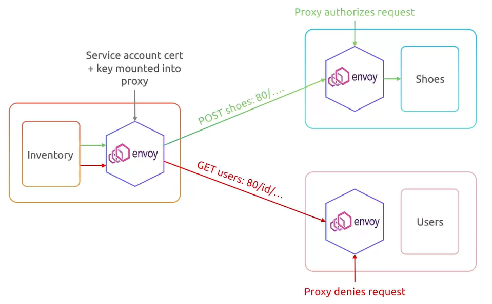
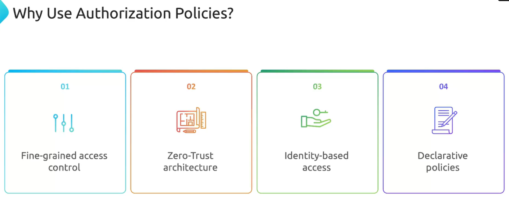

Когда мы приходим на какое-либо мероприятие (спортивный матч, концерт и пр.), то при входе предъявляем билет и удостоверение личности. После входа на стадион мы не можем занять любое место. Мы садимся на место, указанное в билете.

Istio работает схожим образом. Как только вы прошли аутентификацию, то можете взаимодействовать с любым сервисом в Service Mesh. Однако можно создать сущность Authorization Policy, которая определяет что вы можете делать, а что нет.

Например сервис Inventory может делать POST-запросы к сервису Shoes на порт 80, но не может делать GET-запросы к сервису Users на порт 80.

<br>

Пример разрешающей политики авторизации:

```yaml
apiVersion: security.istio.io/v1beta1
kind: AuthorizationPolicy
metadata:
  name: payments-allow-pol
  namespace: payments
spec:
  action: ALLOW
  rules:
  - from:
    - source:
        namespaces: ["app"]
    to:
    - operation:
        methods: ["POST"]
```

В данной конфигурации разрешаются POST-запросы из namespace `app` к любой нагрузке в namespace `payments`.

Пример запрещающей политики авторизации:

```yaml
apiVersion: security.istio.io/v1beta1
kind: AuthorizationPolicy
metadata:
  name: payments-deny-pol
  namespace: payments
spec:
  action: DENY
  rules:
  - from:
    - source:
        namespaces: ["app"]
    to:
    - operation:
        methods: ["GET"]
        paths: ["/credit-cards-info"]
```

В данной конфигурации запрещаются GET-запросы на location `/credit-cards-info` из namespace `app` к любой нагрузке в namespace `payments`.

Политики авторизации могут быть достаточно сложными и запутанными.

```yaml
apiVersion: security.istio.io/v1beta1
kind: AuthorizationPolicy
metadata:
  name: payments-allow-pol
  namespace: payments
spec:
  action: ALLOW
  rules:
  - from:
    - source:
        principals: ["cluster.local/ns/identity/sa/app"]   # разрешено ИЛИ от service account "app" в namespace "identity"
    - source:
        namespaces: ["app"]   # ИЛИ от чего угодно в namespace "app"
    to:
    - operation:
        methods: ["GET"]
        paths: ["/data"]
    - operation:
        methods: ["POST"]
        paths: ["/purchases"]
    when:
    - key:
      values: ["https://accounts.google.com"]   # если от google-аккаунта
```

Возможно вы задались вопросом - а зачем вообще использовать Authorization Policies, если есть встроенные в K8s Network Policies?

Network Policies работают на уровнях L3-L4 модели OSI.

```yaml
apiVersion: networking.k8s.io/v1
kind: NetworkPolicy
metadata:
  name: payments-allow-pol
  namespace: payments
spec:
  podSelector:
    matchLabels:
      app: payments
  policyTypes:
  - Ingress
  ingress:
  - from:
    - namespaceSelector:
        matchLabels:
          app: app
    ports:
    - protocol: TCP
      port: 8080
```

В данном примере разрешается входящий трафик от любого pod-а, находящегося в namespace `app`, на порт 8080. Здесь не учитываются запрашиваемые пути, методы и т.д.

Теперь посмотрим на схожую Authorization Policy:

```yaml
apiVersion: security.istio.io/v1beta1
kind: AuthorizationPolicy
metadata:
  name: payments-allow-pol
  namespace: payments
spec:
  action: ALLOW
  rules:
  - selector:
      matchLabels:
        app: payments
  - from:
    - source:
        namespaces: ["app"]
    to:
    - operation:
        methods: ["GET"]
        paths: ["/api"]
        ports: ["8080"]
```

В данном примере также разрешается входящий трафик от любого pod-а, находящегося в namespace `app`, на порт 8080, но только с использованием метода GET и на location `/api`. В этом заключается главное отличие от Network Policies. Authorization Policies работает на уровне L7 модели OSI.

<br>

Документация:

https://istio.io/latest/docs/reference/config/security/authorization-policy/

https://istio.io/latest/docs/tasks/security/authorization/

### Demo

Ставим и включаем istio для namespace `default`, разворачиваем в нем приложение httpbin.

```shell
$ kubectl apply -f https://raw.githubusercontent.com/istio/istio/refs/heads/master/samples/httpbin/httpbin.yaml
```

Создаем новый namespace и включаем Istio Injection:

```shell
$ kubectl create ns test
$ kubectl label ns test istio-injection=enabled
```

Создаем тестовый pod внутри него:

```shell
$ kubectl -n test run test --image=nginx
```

Проверим доступность сервиса `httpbin` из тестового pod-а:

```bash
$ kubectl -n test exec -it test -- curl -I http://httpbin.default.svc.cluster.local:8000

HTTP/1.1 200 OK
access-control-allow-credentials: true
access-control-allow-origin: *
content-security-policy: default-src 'self'; style-src 'self' 'unsafe-inline'; img-src 'self' camo.githubusercontent.com
content-type: text/html; charset=utf-8
date: Tue, 29 Jul 2025 05:49:10 GMT
x-envoy-upstream-service-time: 13
server: envoy
transfer-encoding: chunked
```

Включим mTLS глобально на уровне всего Service Mesh (*mesh-wide policy*):

```yaml
apiVersion: security.istio.io/v1beta1
kind: PeerAuthentication
metadata:
  name: default
  namespace: istio-system
spec:
  mtls:
    mode: STRICT
```

Создадим политику авторизации:

```yaml
apiVersion: security.istio.io/v1beta1
kind: AuthorizationPolicy
metadata:
  name: httpbin-auth-policy
  namespace: default
spec:
  action: ALLOW
  rules:
  - from:
    - source:
        namespaces: ["test"]
    to:
    - operation:
        methods: ["GET"]
```

Вновь проверим доступность сервиса `httpbin` из тестового pod-а:

```bash
$ kubectl -n test exec -it test -- curl -I http://httpbin.default.svc.cluster.local:8000

HTTP/1.1 403 Forbidden
content-length: 19
content-type: text/plain
date: Tue, 29 Jul 2025 05:51:05 GMT
server: envoy
x-envoy-upstream-service-time: 2
```

Почему мы получили 403? Потому что разрешили только метод GET, но не разрешили метод HEAD. Проверим без опции `--head`:

```bash
$ kubectl -n test exec -it test -- curl http://httpbin.default.svc.cluster.local:8000

<!DOCTYPE html>
<html>
<head>
  <meta http-equiv='content-type' value='text/html;charset=utf8'>
  <meta name='generator' value='Ronn/v0.7.3 (http://github.com/rtomayko/ronn/tree/0.7.3)'>
  <title>go-httpbin(1): HTTP Client Testing Service</title>
<...>
```

Так работает.

Добавим метод GET в разрешенные:

```yaml
apiVersion: security.istio.io/v1beta1
kind: AuthorizationPolicy
metadata:
  name: httpbin-auth-policy
  namespace: default
spec:
  action: ALLOW
  rules:
  - from:
    - source:
        namespaces: ["test"]
    to:
    - operation:
        methods: ["GET", "HEAD"]
```

Проверим еще раз:

```bash
$ kubectl -n test exec -it test -- curl -I http://httpbin.default.svc.cluster.local:8000

HTTP/1.1 200 OK
access-control-allow-credentials: true
access-control-allow-origin: *
content-security-policy: default-src 'self'; style-src 'self' 'unsafe-inline'; img-src 'self' camo.githubusercontent.com
content-type: text/html; charset=utf-8
date: Tue, 29 Jul 2025 07:47:44 GMT
x-envoy-upstream-service-time: 1
server: envoy
transfer-encoding: chunked
```

Заработало, т.к. мы добавили метод HEAD в разрешенные.

Теперь создаем еще один новый namespace `app` и включаем Istio Injection:

```shell
$ kubectl create ns app
$ kubectl label ns app istio-injection=enabled
```

Создаем тестовый pod внутри него:

```shell
$ kubectl -n app run test --image=nginx
```

Проверим доступность сервиса `httpbin` из namespace `app`:

```bash
$ kubectl -n app exec -it test -- curl -I http://httpbin.default.svc.cluster.local:8000

HTTP/1.1 403 Forbidden
content-length: 19
content-type: text/plain
date: Tue, 29 Jul 2025 07:52:51 GMT
server: envoy
x-envoy-upstream-service-time: 5
```

Не работает, т.к. политика разрешает доступ в namespace `default` только из namespace `test`.

Добавим namespace `app` в разрешенные:

```yaml
apiVersion: security.istio.io/v1beta1
kind: AuthorizationPolicy
metadata:
  name: httpbin-auth-policy
  namespace: default
spec:
  action: ALLOW
  rules:
  - from:
    - source:
        namespaces: ["test", "app"]
    to:
    - operation:
        methods: ["GET", "HEAD"]
```

Проверяем:

```bash
$ kubectl -n app exec -it test -- curl -I http://httpbin.default.svc.cluster.local:8000

HTTP/1.1 200 OK
access-control-allow-credentials: true
access-control-allow-origin: *
content-security-policy: default-src 'self'; style-src 'self' 'unsafe-inline'; img-src 'self' camo.githubusercontent.com
content-type: text/html; charset=utf-8
date: Tue, 29 Jul 2025 07:55:01 GMT
x-envoy-upstream-service-time: 1
server: envoy
transfer-encoding: chunked
```

Заработало!

Переконфигурируем разрешающую политику авторизации:

```yaml
apiVersion: security.istio.io/v1beta1
kind: AuthorizationPolicy
metadata:
  name: httpbin-auth-policy
  namespace: default
spec:
  action: ALLOW
  rules:
  - from:
    - source:
        namespaces: ["app"]
    to:
    - operation:
        methods: ["GET", "HEAD"]
        paths: ["/get"]
```

И создадим еще одну запрещающую политику авторизации:

```yaml
apiVersion: security.istio.io/v1beta1
kind: AuthorizationPolicy
metadata:
  name: httpbin-auth-deny-policy
  namespace: default
spec:
  action: DENY
  rules:
  - to:
    - operation:
        paths: ["/delay"]
```

Проверяем работу DENY-политики из двух namespace:

```bash
$ kubectl -n app exec -it test -- curl http://httpbin.default.svc.cluster.local:8000/delay/1
RBAC: access denied

$ kubectl -n test exec -it test -- curl http://httpbin.default.svc.cluster.local:8000/delay/1
RBAC: access denied
```

Проверяем работу ALLOW-политики из двух namespace:

```bash
$ kubectl -n test exec -it test -- curl http://httpbin.default.svc.cluster.local:8000/get    
RBAC: access denied

$ kubectl -n app exec -it test -- curl http://httpbin.default.svc.cluster.local:8000/get
{
  "args": {},
  "headers": {
    "Accept": [
      "*/*"
    ],
    "Host": [
      "httpbin.default.svc.cluster.local:8000"
    ],
    "User-Agent": [
      "curl/7.88.1"
    ],
<...>
```

Разрешающая политика разрешает доступ в namespace `default` только из namespace `app`, отсюда такой результат.

Теперь добавим селектор в разрешающую политику:

```yaml
apiVersion: security.istio.io/v1beta1
kind: AuthorizationPolicy
metadata:
  name: httpbin-auth-policy
  namespace: default
spec:
  action: ALLOW
  selector:
    matchLabels:
      app: httpbin
  rules:
  - from:
    - source:
        namespaces: ["app"]
    to:
    - operation:
        methods: ["GET", "HEAD"]
        paths: ["/get"]
```

The configuration presented above is designed to exclusively target workloads labeled with `app: httpbin`. However, if there is another workload within the same namespace, this configuration will not impact it, as it specifically pertains (относится) to the labels assigned within this namespace.

Разворачиваем в namespace `default` приложение bookinfo.

```shell
$ kubectl apply -f https://raw.githubusercontent.com/istio/istio/release-1.11/samples/bookinfo/platform/kube/bookinfo.yaml
```

Пересоздадим DENY-политику, чтобы она запрещала вообще все:

```yaml
apiVersion: security.istio.io/v1beta1
kind: AuthorizationPolicy
metadata:
  name: deny-all
  namespace: default
spec:
  action: DENY
  rules:
  - {}
```

```shell
$ kubectl get authorizationpolicies.security.istio.io 
NAME                  AGE
deny-all              4s
httpbin-auth-policy   16m
```

Проверяем доступность сервиса `httpbin` из двух namespace:

```bash
$ kubectl -n app exec -it test -- curl http://httpbin.default.svc.cluster.local:8000/get
RBAC: access denied

$ kubectl -n test exec -it test -- curl http://httpbin.default.svc.cluster.local:8000/get
RBAC: access denied
```

Не работает из обоих namespaces, не смотря на созданную разрешающую политику! Это происходит потому, что запрещающая политика всегда побеждает и "перезаписывает" разрешающую (видимо потому что применяется к одному и тому же namespace)! In Istio, DENY policies are evaluated with higher precedence.

Удалим DENY-политику.

Проверяем доступность сервиса `productpage` из namespace `app`:

```bash
$ kubectl -n app exec -it test -- curl -I http://productpage.default.svc.cluster.local:9080/productpage

HTTP/1.1 200 OK
content-type: text/html; charset=utf-8
content-length: 5179
server: envoy
date: Tue, 29 Jul 2025 08:31:14 GMT
x-envoy-upstream-service-time: 1607
```

Создадим новую DENY-политику:

```yaml
apiVersion: security.istio.io/v1beta1
kind: AuthorizationPolicy
metadata:
  name: deny-all-product
  namespace: default
spec:
  action: DENY
  selector:
    matchLabels:
      app: productpage
  rules:
  - {}
```

Вновь проверяем доступность сервиса `productpage` из namespace `app`:

```bash
$ kubectl -n app exec -it test -- curl -I http://productpage.default.svc.cluster.local:9080/productpage

HTTP/1.1 403 Forbidden
content-length: 19
content-type: text/plain
date: Tue, 29 Jul 2025 08:34:01 GMT
server: envoy
x-envoy-upstream-service-time: 6
```

Важно!!! Селектор смотрит на метки объекта Service, а не на Pod!

При использовании селектора ограничения, заданные например в разрешающей политике, накладываются только на выбранную нагрузку, на все остальные нагрузки эти ограничения не действуют.

Пустая DENY-политика, запрещающая все по умолчанию:

```yaml
apiVersion: security.istio.io/v1
kind: AuthorizationPolicy
metadata:
  name: deny-all
  namespace: istio-system
spec: {}
```

What is a recommended practice when implementing Istio's security features?

- Use a default `AuthorizationPolicy` that denies all traffic and then explicitly allows necessary access.