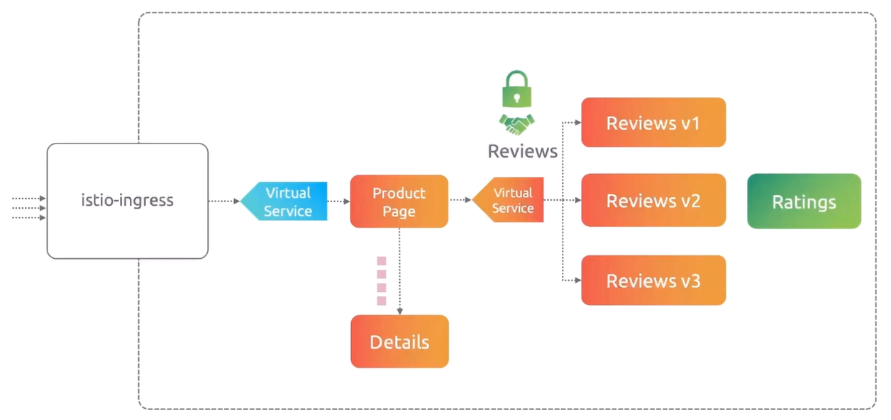
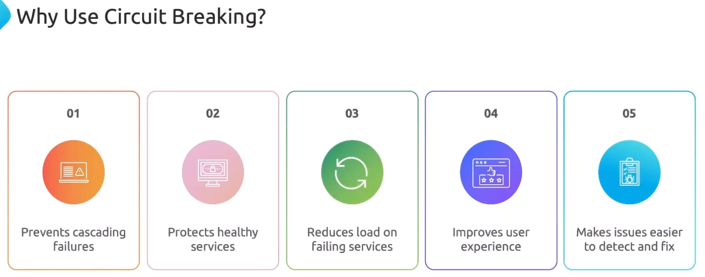

Можно провести аналогию с автоматическими выключателями в электрическом щитке. Они разрывают цепь в случае повышенной нагрузки и тем самым предотвращают перегрев кабеля и дальнейшее его возгорание.

Istio Circuit Breakers контролируют сетевой трафик между сервисами. Если один из сервисов стал работать медленно, перегружен или упал, Circuit Breaking помогает защитить остальные сервисы от перегрузки.

Допустим у вас в доме есть горячая вода, которая распределяется по всему дому - на кухню, в ванную, туалет и т.д. Если все помещения запросят горячую воду одновременно, то сервис подачи горячей воды будет перегружен, может сломаться или начать подавать холодную воду вместо горячей. Вы устанавливаете интеллектуальную систему управления подачей воды (как Istio Service Mesh), которая реализует следующие правила. Если горячую воду запрашивают одновременно более двух кранов, система останавливает приём дальнейших запросов на горячую воду на некоторое время - до тех пор пока один кран не освободится. Это и есть Circuit Breaking. Вы предотвращаете перегрузку системы, чтобы сохранить её "здоровой".

Мы знаем, что сервис "Product Page" взаимодействует с другими сервисами, например "Reviews" и "Details". Если по каким-либо причинам сервис "Details" упал либо начал тормозить и не в состоянии обслуживать сервис "Product Page", тогда все запросы от сервиса "Product Page" будут скапливаться в очереди к сервису "Details", по сути создавая задержку, т.к. сервис "Product Page" будет ждать ответа от сервиса "Details".

Таким образом один неработающий сервис определенно влияет на работу остальных сервисов.

В таких случаях мы хотели бы маркировать запросы как неуспешные сразу же после их отправки сервису "Details" вместо ожидания и отправлять их обратно к сервису "Product Page". Это известно как Circuit Breaking и позволяет нам создавать устойчивые микросервисные приложения, которые позволяют ограничивать влияние сбоев или других сетевых проблем.

То же самое верно, если мы хотим ограничить количество запросов, приходящих к самой "Product Page".

<br>

Рассмотрим другое приложение, состоящее из трех сервисов - "Homepage" (frontend), "Products" (backend) и "Database" (БД). Сервис "Homepage" взаимодействует с сервисом "Products", а сервис "Products" в свою очередь взаимодействует с сервисом "Database". Теперь представим, что БД стала работать очень медленно. Сервис "Products" ждет, ждет и ждет в надежде получить ответ от БД. В это время сервис "Homepage" тоже начинает работать медленнее, т.к. он ждет ответа от сервиса "Products". Это называется *cascading failure*. Все больше и больше запросов начинает приходить, приложение становится все более медленным и по итогу может вовсе упасть. Подытоживая, сбой сервиса Database повлиял на работу всей системы. Таким образом мы увидели, что может произойти без Circuit Breaking.

<br>

Теперь возьмем этот же пример, но применим Circuit Breaking. В этом случае Istio увидит, что БД стала работать медленно или упала, и сработает автоматический выключатель (Circuit Breaker). Сервис "Products" остановит отправку запросов к БД на какое-то время и сможет возвращать быстрые ответы об ошибках обратно сервису "Homepage", например что-то вроде "Out of stock" (распродано). Соответственно сервис "Homepage" останется отзывчивым на запросы пользователей.

<br>

Без Istio Service Mesh разработчикам понадобится потратить немало времени на разработку подобного функционала, который будет обрабатывать подобные типы проблем.

<br>

Для Circuit Breaking не существует выделенного CRD. Circuit Breaking конфигурируется внутри Destination Rule.

Пример манифеста:

```yaml
apiVersion: networking.istio.io/v1beta1
kind: DestinationRule
metadata:
  name: app-ds
  namespace: frontend
spec:
  host: app-svc
  trafficPolicy:
    connectionPool:
      tcp:
        maxConnections: 2              # максимум 2 соединения для HTTP/1
        connectTimeout: 30s            # таймаут
      http:
        http2MaxRequests: 2            # максимум 2 запроса для HTTP/2
        maxRequestsPerConnection: 10   # максимум 10 запросов на одно соединение
    outlierDetection:
      consecutive5xxErrors: 3          # сколько подряд 500-ых ошибок должно произойти
      interval: 5m                     # скан каждые 5 минут
      baseEjectionTime: 10m            # на какое время "выбросить" хост из-за обнаруженных проблем
```

Документация: https://istio.io/latest/docs/tasks/traffic-management/circuit-breaking/

### Demo

Ставим и включаем istio для namespace `default`, разворачиваем в нем приложение echo-server.

```yaml
apiVersion: apps/v1
kind: Deployment
metadata:
  name: echo-server
spec:
  replicas: 1
  selector:
    matchLabels:
      app: echo-server
  template:
    metadata:
      labels:
        app: echo-server
    spec:
      containers:
      - name: echo
        image: ealen/echo-server
        ports:
        - containerPort: 80
```

Также создадим Service:

```yaml
apiVersion: v1
kind: Service
metadata:
  name: echo-server
  labels:
    app: echo-server
spec:
  ports:
  - port: 80
    name: http
  selector:
    app: echo-server
```

Также развернем приложение для нагрузочного тестирования fortio:

```shell
$ kubectl apply -f https://raw.githubusercontent.com/istio/istio/release-1.25/samples/httpbin/sample-client/fortio-deploy.yaml
```

Из fortio проверим доступность сервиса `echo-server`:

```shell
$ kubectl exec fortio-deploy-74ffb9b4d6-lnrkg -c fortio -- /usr/bin/fortio curl -quiet http://echo-server | grep -o '"HOSTNAME":"[^"]*"'

HTTP/1.1 200 OK
content-type: application/json; charset=utf-8
content-length: 1244
etag: W/"4dc-yLdnt7WVMlvA7xVztJgiLCV228U"
date: Wed, 23 Jul 2025 05:38:05 GMT
x-envoy-upstream-service-time: 6
server: envoy

"HOSTNAME":"echo-server-5d7455c8b5-z9fr6"
```

Все работает.

Создадим Virtual Service:

```yaml
apiVersion: networking.istio.io/v1beta1
kind: VirtualService
metadata:
  name: echo-vs
  namespace: default
spec:
  hosts:
  - echo-server
  http:
  - route:
    - destination:
        host: echo-server
        port:
          number: 80
```

Плюс создадим Destination Rule:

```yaml
apiVersion: networking.istio.io/v1beta1
kind: DestinationRule
metadata:
  name: echo-dr
  namespace: default
spec:
  host: echo-server
  trafficPolicy:
    connectionPool:
      tcp:
        maxConnections: 1              # максимум 1 соединение для HTTP/1
      http:
        http1MaxPendingRequests: 1     # максимум 1 запрос для HTTP/1
        maxRequestsPerConnection: 1    # максимум 1 запрос на одно соединение
    outlierDetection:
      consecutive5xxErrors: 1          # сколько подряд 500-ых ошибок должно произойти
      interval: 5s                     # сканировать pod-ы каждые 5 секунд на предмет "здоровья", если они были "ejected"
      baseEjectionTime: 30s            # на какое время "выбросить" хост из-за обнаруженных проблем
      maxEjectionPercent: 100
```

В данном случае, если одновременно есть более одного ожидающего запроса (concurrent pending request), то гипотетически начнут появляться 500-е ошибки и сработает обнаружение аномалий (outlier detection). Таким образом, если сервис `echo-server` вернет хотя бы одну 500-ую ошибку, то он будет "выброшен" на 30 секунд.

Из fortio вновь проверим доступность сервиса `echo-server`:

```shell
$ kubectl exec fortio-deploy-74ffb9b4d6-lnrkg -c fortio -- /usr/bin/fortio curl -quiet http://echo-server | grep -o '"HOSTNAME":"[^"]*"'

HTTP/1.1 200 OK
content-type: application/json; charset=utf-8
content-length: 1244
etag: W/"4dc-2WRpRHrH8r5/0lYgLgWU6/IgPTQ"
date: Wed, 23 Jul 2025 05:44:26 GMT
x-envoy-upstream-service-time: 10
server: envoy

"HOSTNAME":"echo-server-5d7455c8b5-z9fr6"
```

Все работает, т.к. нет серьезной нагрузки, которая может вызвать Circuit Breaking.

Создадим нагрузку:

```shell
$ kubectl exec fortio-deploy-74ffb9b4d6-lnrkg -c fortio -- /usr/bin/fortio load -c 2 -qps 0 -n 20 -loglevel Warning http://echo-server

...
Code 200 : 19 (95.0 %)
Code 503 : 1 (5.0 %)
...
```

Опции fortio:

- `-c` - number of connections/goroutine/threads (default 4) (количество одновременных подключений)
- `-n` - run for exactly this number of calls instead of duration (количество запросов)
- `-qps` - queries per seconds or 0 for no wait/max qps (default 8)

Пока только один запрос завершился ошибкой. Увеличим нагрузку:

```shell
$ kubectl exec fortio-deploy-74ffb9b4d6-lnrkg -c fortio -- /usr/bin/fortio load -c 20 -qps 0 -n 80 -loglevel Warning http://echo-server

...
Code 200 : 8 (10.0 %)
Code 503 : 72 (90.0 %)
...
```

Как видно ситуация сильно ухудшилась, только 8 запросов были успешными. "Подкрутим" наш Destination Rule:

```yaml
apiVersion: networking.istio.io/v1beta1
kind: DestinationRule
metadata:
  name: echo-dr
  namespace: default
spec:
  host: echo-server
  trafficPolicy:
    connectionPool:
      tcp:
        maxConnections: 10             # максимум 10 соединений для HTTP/1
      http:
        http1MaxPendingRequests: 1     # максимум 1 запрос для HTTP/1
        maxRequestsPerConnection: 10   # максимум 10 запросов на одно соединение
    outlierDetection:
      consecutive5xxErrors: 1          # сколько подряд 500-ых ошибок должно произойти
      interval: 5s                     # сканировать pod-ы каждые 5 секунд на предмет "здоровья", если они были "ejected"
      baseEjectionTime: 30s            # на какое время "выбросить" хост из-за обнаруженных проблем
      maxEjectionPercent: 100
```

Проверим:

```shell
$ kubectl exec fortio-deploy-74ffb9b4d6-lnrkg -c fortio -- /usr/bin/fortio load -c 20 -qps 0 -n 80 -loglevel Warning http://echo-server

...
Code 200 : 23 (28.8 %)
Code 503 : 57 (71.2 %)
...
```

Посмотрим на логи istio-proxy:

```shell
$ kubectl exec fortio-deploy-74ffb9b4d6-lnrkg -c istio-proxy -- pilot-agent request GET stats | grep echo-server | grep pending

cluster.outbound|80||echo-server.default.svc.cluster.local.circuit_breakers.default.remaining_pending: 1
cluster.outbound|80||echo-server.default.svc.cluster.local.circuit_breakers.default.rq_pending_open: 0
cluster.outbound|80||echo-server.default.svc.cluster.local.circuit_breakers.high.rq_pending_open: 0
cluster.outbound|80||echo-server.default.svc.cluster.local.upstream_rq_pending_active: 0
cluster.outbound|80||echo-server.default.svc.cluster.local.upstream_rq_pending_failure_eject: 0
cluster.outbound|80||echo-server.default.svc.cluster.local.upstream_rq_pending_overflow: 125
cluster.outbound|80||echo-server.default.svc.cluster.local.upstream_rq_pending_total: 39
```