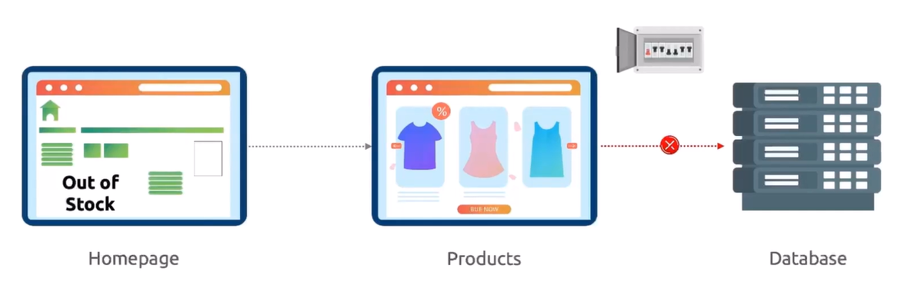

Можно провести аналогию с автоматическими выключателями в электрическом щитке. Они разрывают цепь в случае повышенной нагрузки и тем самым предотвращают перегрев кабеля и дальнейшее его возгорание.

Istio Circuit Breakers контролируют сетевой трафик между сервисами. Если один из сервисов стал работать медленно, перегружен или упал, Circuit Breaking помогает защитить остальные сервисы от перегрузки.

Допустим у вас в доме есть горячая вода, которая распределяется по всему дому - на кухню, в ванную, туалет и т.д. Если все помещения запросят горячую воду одновременно, то сервис подачи горячей воды будет перегружен, может сломаться или начать подавать холодную воду вместо горячей. Вы устанавливаете интеллектуальную систему управления подачей воды (как Istio Service Mesh), которая реализует следующие правила. Если горячую воду запрашивают одновременно более двух кранов, система останавливает приём дальнейших запросов на горячую воду на некоторое время - до тех пор пока один кран не освободится. Это и есть Circuit Breaking. Вы предотвращаете перегрузку системы, чтобы сохранить её "здоровой".

Мы знаем, что сервис "Product Page" взаимодействует с другими сервисами, например "Reviews" и "Details". Если по каким-либо причинам сервис "Details" упал либо начал тормозить и не в состоянии обслуживать сервис "Product Page", тогда все запросы от сервиса "Product Page" будут скапливаться в очереди к сервису "Details", по сути создавая задержку, т.к. сервис "Product Page" будет ждать ответа от сервиса "Details".

Таким образом один неработающий сервис определенно влияет на работу остальных сервисов.

В таких случаях мы хотели бы маркировать запросы как неуспешные сразу же после их отправки сервису "Details" вместо ожидания и отправлять их обратно к сервису "Product Page". Это известно как Circuit Breaking и позволяет нам создавать устойчивые микросервисные приложения, которые позволяют ограничивать влияние сбоев или других сетевых проблем.

То же самое верно, если мы хотим ограничить количество запросов, приходящих к самой "Product Page".

<br>

Рассмотрим другое приложение, состоящее из трех сервисов - "Homepage" (frontend), "Products" (backend) и "Database" (БД). Сервис "Homepage" взаимодействует с сервисом "Products", а сервис "Products" в свою очередь взаимодействует с сервисом "Database". Теперь представим, что БД стала работать очень медленно. Сервис "Products" ждет, ждет и ждет в надежде получить ответ от БД. В это время сервис "Homepage" тоже начинает работать медленнее, т.к. он ждет ответа от сервиса "Products". Это называется *cascading failure*. Все больше и больше запросов начинает приходить, приложение становится все более медленным и по итогу может вовсе упасть. Подытоживая, сбой сервиса Database повлиял на работу всей системы. Таким образом мы увидели, что может произойти без Circuit Breaking.

<br>

Теперь возьмем этот же пример, но применим Circuit Breaking. В этом случае Istio увидит, что БД стала работать медленно или упала, и сработает автоматический выключатель (Circuit Breaker). Сервис "Products" остановит отправку запросов к БД на какое-то время и сможет возвращать быстрые ответы об ошибках обратно сервису "Homepage", например что-то вроде "Out of stock" (распродано). Соответственно сервис "Homepage" останется отзывчивым на запросы пользователей.

<br>

Без Istio Service Mesh разработчикам понадобится потратить немало времени на разработку подобного функционала, который будет обрабатывать подобные типы проблем.

<br>

Для Circuit Breaking не существует выделенного CRD. Circuit Breaking конфигурируется внутри Destination Rule.

Пример манифеста:

```yaml
apiVersion: networking.istio.io/v1beta1
kind: DestinationRule
metadata:
  name: app-ds
  namespace: frontend
spec:
  host: app-svc
  trafficPolicy:
    connectionPool:
      tcp:
        maxConnections: 2              # максимум 2 соединения для HTTP/1
        connectTimeout: 30s            # таймаут
      http:
        http2MaxRequests: 2            # максимум 2 запроса для HTTP/2
        maxRequestsPerConnection: 10   # максимум 10 запросов на одно соединение
    outlierDetection:
      consecutive5xxErrors: 3          # сколько подряд 500-ых ошибок должно произойти
      interval: 5m                     # скан каждые 5 минут
      baseEjectionTime: 10m            # на какое время "выбросить" хост из-за обнаруженных проблем
```

Документация: https://istio.io/latest/docs/tasks/traffic-management/circuit-breaking/