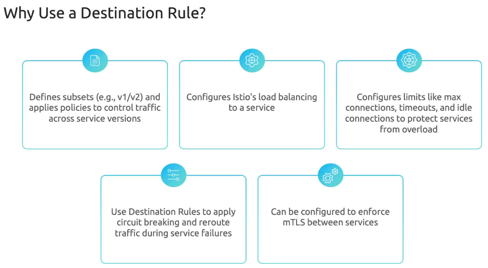

Virtual Service перехватывает трафик, предназначенный для сервиса (нагрузки), и маршрутизирует его, основываясь на заданой политике. Virtual Service работает в сочетании с Destination Rules.

Destination Rules определяет политики, которые применяются к трафику, предназначенному для сервиса (нагрузки), после того как маршрутизация уже произошла. Это означает, что как только трафик "приземлился" на Virtual Service, вы можете добавить различные правила. Например, у нас есть две версии приложения и мы хотим разделить трафик между ними в соотношении 50/50. Для этого мы можем использовать Destination Rules.

Предположим у нас есть две версии одного приложения:

```yaml
apiVersion: apps/v1
kind: Deployment
metadata:
  name: app-deployment-v1
  namespace: frontend
spec:
  replicas: 3
  selector:
    matchLabels:
      labels:
        app: frontend
        version: v1
  template:
    metadata:
      labels:
        app: frontend
        version: v1
    spec:
      containers:
      - name: app
        image: app:1.1
```

```yaml
apiVersion: apps/v1
kind: Deployment
metadata:
  name: app-deployment-v2
  namespace: frontend
spec:
  replicas: 3
  selector:
    matchLabels:
      labels:
        app: frontend
        version: v2
  template:
    metadata:
      labels:
        app: frontend
        version: v2
    spec:
      containers:
      - name: app
        image: app:2.1
```

И Service:

```yaml
apiVersion: v1
kind: Service
metadata:
  name: app-svc
  namespace: frontend
spec:
  ports:
    - port:80
      name: http
  selector:
    app: frontend
```

Для разделения трафика создадим Destination Rule:

```yaml
apiVersion: networking.istio.io/v1
kind: DestinationRule
metadata:
  name: app-ds
  namespace: frontend
spec:
  host: app-svc
  subsets:
  - name: v1
    labels:
      version: v1
  - name: v2
    labels:
      version: v2
```

Subsets по сути являются набором pod-ов, сгруппированных по меткам.

Также созадим Virtual Service:

```yaml
apiVersion: networking.istio.io/v1
kind: VirtualService
metadata:
  name: app-vs
  namespace: frontend
spec:
  hosts:
  - app-svc   # The address used by a client when attempting to connect to a service
  http:
  - match:
    - uri:
        prefix: /
    route:
    - destination:
        host: app-svc.frontend.svc.cluster.local
        port:
          number: 80
        subset: v1
      weight: 50
    - destination:
        host: app-svc.frontend.svc.cluster.local
        port:
          number: 80
        subset: v2
      weight: 50
```

<br>

Документация: https://istio.io/latest/docs/reference/config/networking/destination-rule/

### Demo

Ставим и включаем istio для namespace `default`, разворачиваем в нем приложение helloworld.

```shell
$ kubectl apply -f https://raw.githubusercontent.com/istio/istio/refs/heads/master/samples/helloworld/helloworld.yaml
```

Создаем тестовый namespace:

```shell
$ kubectl create ns test
```

Включим istio injection для namespace `test`:

```shell
$ kubectl label ns test istio-injection=enabled
```

Создаем нагрузку внутри namespace `test`:

```shell
$ kubectl -n test run test --image=nginx
```

Подключимся к тестовому pod-у и проверим доступность сервиса `helloworld`:

```
$ kubectl -n test exec -it test -- /bin/bash

root@test:/# curl helloworld.default.svc.cluster.local:5000/hello
Hello version: v2, instance: helloworld-v2-6746879bdd-dqqm4

root@test:/# curl helloworld.default.svc.cluster.local:5000/hello
Hello version: v1, instance: helloworld-v1-5787f49bd8-pncnp
```

Как видно, мы рандомно попадаем то на версию приложения v1, то на версию v2. У обоих pod-ов есть общая метка `app=helloworld`, по которой их находит service `helloworld`. А также уникальный метки с версиями - `version=v1` и `version=v2`.

```shell
$ kubectl get pods  --show-labels
NAME                             READY   STATUS    RESTARTS   AGE     LABELS
helloworld-v1-5787f49bd8-pncnp   2/2     Running   0          9m18s   app=helloworld,pod-template-hash=5787f49bd8,security.istio.io/tlsMode=istio,service.istio.io/canonical-name=helloworld,service.istio.io/canonical-revision=v1,version=v1
helloworld-v2-6746879bdd-dqqm4   2/2     Running   0          9m18s   app=helloworld,pod-template-hash=6746879bdd,security.istio.io/tlsMode=istio,service.istio.io/canonical-name=helloworld,service.istio.io/canonical-revision=v2,version=v2
```

Для разделения трафика создадим Destination Rule:

```yaml
apiVersion: networking.istio.io/v1beta1
kind: DestinationRule
metadata:
  name: hello-world-ds
  namespace: default
spec:
  host: helloworld
  subsets:
  - name: v1
    labels:
      version: v1
  - name: v2
    labels:
      version: v2
```

Т.к. без Virtual Service одинокий Destination Rule не имеет никакого смысла, создадим VS:

```yaml
apiVersion: networking.istio.io/v1beta1
kind: VirtualService
metadata:
  name: hello-world-vs
  namespace: default
spec:
  hosts:
  - helloworld
  http:
  - match:
    - uri:
        prefix: /
    route:
    - destination:
        host: helloworld.default.svc.cluster.local
        port:
          number: 5000
        subset: v1
      weight: 50
    - destination:
        host: helloworld.default.svc.cluster.local
        port:
          number: 5000
        subset: v2
      weight: 50
```

Вновь подключимся к тестовому pod-у и проверим как распределяется трафик между версиями:

```
$ kubectl -n test exec -it test -- /bin/bash

root@test:/# curl helloworld.default.svc.cluster.local:5000/hello
Hello version: v1, instance: helloworld-v1-5787f49bd8-pncnp

root@test:/# curl helloworld.default.svc.cluster.local:5000/hello
Hello version: v2, instance: helloworld-v2-6746879bdd-dqqm4

root@test:/# curl helloworld.default.svc.cluster.local:5000/hello
Hello version: v2, instance: helloworld-v2-6746879bdd-dqqm4

root@test:/# curl helloworld.default.svc.cluster.local:5000/hello
Hello version: v1, instance: helloworld-v1-5787f49bd8-pncnp
```

Теперь изменим распределение трафика между версиями:

```yaml
apiVersion: networking.istio.io/v1beta1
kind: VirtualService
metadata:
  name: hello-world-vs
  namespace: default
spec:
  hosts:
  - helloworld
  http:
  - match:
    - uri:
        prefix: /
    route:
    - destination:
        host: helloworld.default.svc.cluster.local
        port:
          number: 5000
        subset: v1
      weight: 95
    - destination:
        host: helloworld.default.svc.cluster.local
        port:
          number: 5000
        subset: v2
      weight: 5
```

Вновь подключимся к тестовому pod-у и проверим как распределяется трафик между версиями:

```
$ kubectl -n test exec -it test -- /bin/bash

root@test:/# curl helloworld.default.svc.cluster.local:5000/hello
Hello version: v1, instance: helloworld-v1-5787f49bd8-pncnp

root@test:/# curl helloworld.default.svc.cluster.local:5000/hello
Hello version: v1, instance: helloworld-v1-5787f49bd8-pncnp

root@test:/# curl helloworld.default.svc.cluster.local:5000/hello
Hello version: v1, instance: helloworld-v1-5787f49bd8-pncnp

root@test:/# curl helloworld.default.svc.cluster.local:5000/hello
Hello version: v1, instance: helloworld-v1-5787f49bd8-pncnp

root@test:/# curl helloworld.default.svc.cluster.local:5000/hello
Hello version: v1, instance: helloworld-v1-5787f49bd8-pncnp

root@test:/# curl helloworld.default.svc.cluster.local:5000/hello
Hello version: v1, instance: helloworld-v1-5787f49bd8-pncnp

root@test:/# curl helloworld.default.svc.cluster.local:5000/hello
Hello version: v1, instance: helloworld-v1-5787f49bd8-pncnp

root@test:/# curl helloworld.default.svc.cluster.local:5000/hello
Hello version: v1, instance: helloworld-v1-5787f49bd8-pncnp

root@test:/# curl helloworld.default.svc.cluster.local:5000/hello
Hello version: v1, instance: helloworld-v1-5787f49bd8-pncnp

root@test:/# curl helloworld.default.svc.cluster.local:5000/hello
Hello version: v1, instance: helloworld-v1-5787f49bd8-pncnp

root@test:/# curl helloworld.default.svc.cluster.local:5000/hello
Hello version: v1, instance: helloworld-v1-5787f49bd8-pncnp

root@test:/# curl helloworld.default.svc.cluster.local:5000/hello
Hello version: v1, instance: helloworld-v1-5787f49bd8-pncnp

root@test:/# curl helloworld.default.svc.cluster.local:5000/hello
Hello version: v1, instance: helloworld-v1-5787f49bd8-pncnp

root@test:/# curl helloworld.default.svc.cluster.local:5000/hello
Hello version: v2, instance: helloworld-v2-6746879bdd-dqqm4

root@test:/# curl helloworld.default.svc.cluster.local:5000/hello
Hello version: v1, instance: helloworld-v1-5787f49bd8-pncnp
```

Как видно, почти все запросы уходят на версию v1.