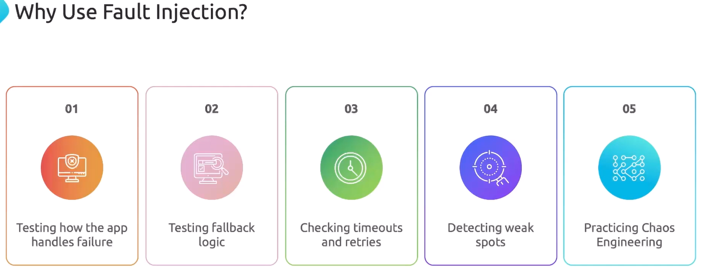

Проведем аналогию с учениями по пожарной безопасности на предприятии. Главная цель - подготовиться к чрезвычайной ситуации. Каждый должен знать и понимать, что он должен делать и где находиться.

Fault Injection в Istio - это своего рода учения по пожарной безопасности для ваших микросервисов. Мы намеренно добавляем ошибки и задержки между сервисами, чтобы понять как наше приложение справляется с проблемами (перед тем как они возникнут в реальной ситуации).

<br>

Для Fault Injection не существует выделенного CRD. Fault Injection конфигурируется внутри Virtual Service.

Пример с добавлением "искусственной" задержки:

```yaml
apiVersion: networking.istio.io/v1beta1
kind: VirtualService
metadata:
  name: app-vs
  namespace: frontend
spec:
  hosts:
  - app-svc
  http:
  - fault:
      delay:
        percentage:
          value: 100.0
        fixedDelay: 5s   # добавляем задержку в 5 секунд для 100% запросов
    route:
    - destination:
        host: app-svc.frontend.svc.cluster.local
        port:
          number: 80
        subset: v1
```

Пример с добавлением "искусственных" ошибок:

```yaml
apiVersion: networking.istio.io/v1beta1
kind: VirtualService
metadata:
  name: app-vs
  namespace: frontend
spec:
  hosts:
  - app-svc
  http:
  - fault:
      abort:
        percentage:
          value: 50.0
        httpStatus: 400   # добавляем 400-ую ошибку для 50% запросов
    route:
    - destination:
        host: app-svc.frontend.svc.cluster.local
        port:
          number: 80
        subset: v1
```

Документация: https://istio.io/latest/docs/reference/config/networking/virtual-service/#HTTPFaultInjection

### Demo

Ставим и включаем istio для namespace `default`, разворачиваем в нем приложение helloworld.

```shell
$ kubectl apply -f https://raw.githubusercontent.com/istio/istio/refs/heads/master/samples/helloworld/helloworld.yaml
```

Создаем тестовый pod:

```shell
$ kubectl run test --image=nginx
```

Проверим доступность сервиса `helloworld`:

```bash
$ kubectl exec -it test -- curl http://helloworld:5000/hello
Hello version: v2, instance: helloworld-v2-6746879bdd-42zzz

$ kubectl exec -it test -- curl http://helloworld:5000/hello
Hello version: v1, instance: helloworld-v1-5787f49bd8-x5n4v
```

Создадим Virtual Service и добавим задержку:

```yaml
apiVersion: networking.istio.io/v1beta1
kind: VirtualService
metadata:
  name: hello-world-vs
  namespace: default
spec:
  hosts:
  - helloworld
  http:
  - fault:
      delay:
        percentage:
          value: 100.0
        fixedDelay: 5s
    route:
    - destination:
        host: helloworld
        port:
          number: 5000
```

Вновь проверим доступность сервиса `helloworld`:

```bash
$ kubectl exec -it test -- curl http://helloworld:5000/hello
Hello version: v2, instance: helloworld-v2-6746879bdd-42zzz

$ kubectl exec -it test -- curl http://helloworld:5000/hello
Hello version: v1, instance: helloworld-v1-5787f49bd8-x5n4v
```

Теперь ответы приходят с 5-секундной задержкой.

Теперь вместо задержки добавим 500-е ошибки.

```yaml
apiVersion: networking.istio.io/v1beta1
kind: VirtualService
metadata:
  name: hello-world-vs
  namespace: default
spec:
  hosts:
  - helloworld
  http:
  - fault:
      abort:
        percentage:
          value: 100.0
        httpStatus: 500
    route:
    - destination:
        host: helloworld
        port:
          number: 5000
```

Вновь проверим доступность сервиса `helloworld`:

```bash
$ kubectl exec -it test -- curl -I http://helloworld:5000/hello

HTTP/1.1 500 Internal Server Error
content-length: 18
content-type: text/plain
date: Thu, 24 Jul 2025 05:58:08 GMT
server: envoy
```

Получили ошибку.

Изменим процентовку трафика на `50` и проверим в цикле:

```bash
$ kubectl exec -it test -- /bin/sh -c 'for i in $(seq 1 10); do curl -I http://helloworld:5000/hello; echo "---"; done'
```

Часть запросов завершилась успешно, а другая часть с ошибкой.