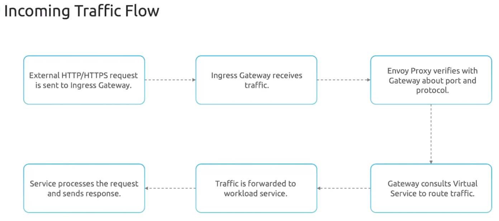
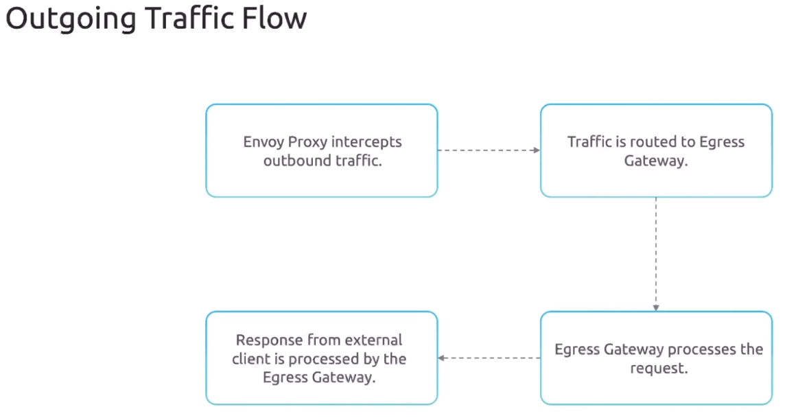

Gateway - это точка входа между внешним миром и Service Mesh. Gateway является опциональным (необязательным), если нет необходимости выставлять сервисы наружу (в public), то нет нужды включать Gateway, достаточно будет только Virtual Service.

Существует два типа Gateway. Ingress Gateway предназначен для управления входящим трафиком (трафик приходяший из внешнего мира в Service Mesh). Egress Gateway используется для управляения исходящим трафиком (трафик от сервисов внутри Service Mesh к внешним ресурсам).

По умолчанию Egress Gateway включен только в профиле "Demo". Однако мы можем настроить любой другой профиль и включить в нем Egress Gateway.

Pod-ы Ingress/Egress Gateway имеют соответствующие метки: `istio=ingress` и `istio=egress`.

Istio Gateway часто используется для терминации TLS. Он может управлять расшифровкой входящего и шифрованием исходяшего трафика, а также обрабатывать TLS-сертификаты. Istio Gateway может обрабатывать несколько протоколов в проходящем трафике - HTTP, HTTPS, TCP, gRPC.

Istio Gateway поддерживает HTTP/HTTPS-маршруты на основе заголовков, URL-путей, портов, а также поддерживаются TCP-соединения, что может быть очень полезно для сервисов основанных не на HTTP, например для баз данных.

gRPC-вызовы обычно используются для взаимодействия микросервисов в Istio, т.к. это как правило быстрее, чем REST API.

Освежим в памяти манифест нашего Virtual Service:

```yaml
apiVersion: networking.istio.io/v1v1beta1
kind: VirtualService
metadata:
  name: app-vs
  namespace: frontend
spec:
  hosts:
  - app-svc   # The address used by a client when attempting to connect to a service
  http:
  - match:
    - uri:
        prefix: /
    route:
    - destination:
        host: app-svc.frontend.svc.cluster.local
        port:
          number: 80
        subset: v1
      weight: 50
    - destination:
        host: app-svc.frontend.svc.cluster.local
        port:
          number: 80
        subset: v2
      weight: 50
```

И манфест для Destination Rule:

```yaml
apiVersion: networking.istio.io/v1v1beta1
kind: DestinationRule
metadata:
  name: app-ds
  namespace: frontend
spec:
  host: app-svc
  subsets:
  - name: v1
    labels:
      version: v1
  - name: v2
    labels:
      version: v2
```

Предположим, что нам нужно выставить нашего приложение наружу, в public. Для этого нам понадобится Gateway:

```yaml
apiVersion: networking.istio.io/v1v1beta1
kind: Gateway
metadata:
  name: ingress-app-gateway
  namespace: istio-system    # можно размещать в любом namespace
spec:
  selector:
    istio: ingress   # метка дефолтного ingress-gateway pod-а
  servers:
  - port:
      number: 80    # порт и протокол, на котором будет работать Gateway
      name: http
      protocol: HTTP
    hosts:
    - app.example.com   # заголовок Host в запросе пользователя, т.е. публичное имя хоста, к которому будут обращаться пользователи
```

Ingress Gateway должен иметь публичный IP-адрес.

Добавим `gateway` в манифест Virtual Service:

```yaml
apiVersion: networking.istio.io/v1v1beta1
kind: VirtualService
metadata:
  name: ingress-app-vs
  namespace: frontend
spec:
  hosts:
  - app-svc              # имя хоста внутри Service Mesh
  - "app.example.com"    # public-имя хоста, по которому пользователи обращаются извне
  gateways:
  - ingress-app-gateway
  http:
  - match:
    - uri:
        prefix: /
    route:
    - destination:
        host: app-svc.frontend.svc.cluster.local
        port:
          number: 80
        subset: v1
      weight: 50
    - destination:
        host: app-svc.frontend.svc.cluster.local
        port:
          number: 80
        subset: v2
      weight: 50
```

<br>

Ingress Gateway представляет собой всего лишь standalone Envoy Proxy.

Важно понимать, что для Ingress Gateway несомненно нужен Virtual Service для маршрутизации трафика. А вот для Virtual Service необязательно нужен Ingress Gateway. Virtual Service может работать независимо, ему даже не требуется Destination Rule.

Ниже представлена конфигурация Egress Gateway:

```yaml
apiVersion: networking.istio.io/v1v1beta1
kind: Gateway
metadata:
  name: egress-app-gateway
  namespace: istio-system    # можно размещать в любом namespace
spec:
  selector:
    istio: egress   # метка дефолтного egress-gateway pod-а
  servers:
  - port:
      number: 80    # порт и протокол, на котором будет работать Gateway
      name: http
      protocol: HTTP
    hosts:
    - *             # разрешено обращаться к любому внешнем хосту
  - port:
      number: 443
      name: https
      protocol: HTTPS
    hosts:
    - *
```

И пример соответствующего Virtual Service:

```yaml
apiVersion: networking.istio.io/v1v1beta1
kind: VirtualService
metadata:
  name: egress-app-vs
  namespace: frontend
spec:
  hosts:
  - api.example.com   # внешний хост, с которым мы хотим взаимодействовать
  gateways:
  - egress-app-gateway   # через какой gateway будет выходить трафик
  http:
  - match:
    - uri:
        prefix: /
    route:
    - destination:
        host: api.example.com
        port: 443
```

Зачем использовать Egress Gateway? Если нам нужно контролировать (ограничивать) исходящий трафик.

<br>

Egress Gateway используется не так часто как Ingress Gateway, т.к. большинство компаний используют FW для ограничения исходящего трафика.

Документация: https://istio.io/latest/docs/reference/config/networking/gateway/

### Demo

Ставим и включаем istio для namespace `default`, разворачиваем в нем приложение bookinfo.

```shell
$ kubectl apply -f https://raw.githubusercontent.com/istio/istio/release-1.11/samples/bookinfo/platform/kube/bookinfo.yaml
```

Создадим Virtual Service:

```yaml
apiVersion: networking.istio.io/v1beta1
kind: VirtualService
metadata:
  name: book-info-vs
  namespace: default
spec:
  hosts:
  - productpage
  http:
  - match:
    - uri:
        prefix: /
    route:
    - destination:
        host: productpage.default.svc.cluster.local
        port:
          number: 9080
```

Смотрим метки для pod-а с Istio Ingress Gateway:

```shell
$ kubectl -n istio-system describe pod istio-ingressgateway-69c68b6cd5-frd27 

Name:             istio-ingressgateway-69c68b6cd5-frd27
Namespace:        istio-system
Priority:         0
Service Account:  istio-ingressgateway-service-account
Node:             node01/172.30.2.2
Start Time:       Fri, 18 Jul 2025 14:01:11 +0000
Labels:           app=istio-ingressgateway
                  chart=gateways
                  heritage=Tiller
                  install.operator.istio.io/owning-resource=unknown
                  istio=ingressgateway
                  istio.io/rev=default
                  operator.istio.io/component=IngressGateways
                  pod-template-hash=69c68b6cd5
                  release=istio
                  service.istio.io/canonical-name=istio-ingressgateway
                  service.istio.io/canonical-revision=latest
                  sidecar.istio.io/inject=false
<...>
```

Создадим Gateway:

```yaml
apiVersion: networking.istio.io/v1beta1
kind: Gateway
metadata:
  name: istio-gateway
  namespace: default
spec:
  selector:
    istio: ingressgateway
  servers:
  - port:
      number: 80
      name: http
      protocol: HTTP
    hosts:
    - "book.info.com"
```

Смотрим IP-адрес объекта Service `istio-ingressgateway `:

```shell
k -n istio-system get svc
NAME                   TYPE           CLUSTER-IP      EXTERNAL-IP   PORT(S)                                                                      AGE
istio-egressgateway    ClusterIP      10.96.125.168   <none>        80/TCP,443/TCP                                                               12m
istio-ingressgateway   LoadBalancer   10.99.149.168   <pending>     15021:31905/TCP,80:30217/TCP,443:30616/TCP,31400:30836/TCP,15443:31110/TCP   12m
istiod                 ClusterIP      10.104.103.94   <none>        15010/TCP,15012/TCP,443/TCP,15014/TCP                                        13m
```

Пробуем постучаться curl-ом на полученный IP-адрес:

```shell
$ curl -I -H "Host: book.info.com" http://10.99.149.168

HTTP/1.1 404 Not Found
date: Fri, 18 Jul 2025 14:17:18 GMT
server: istio-envoy
transfer-encoding: chunked
```

В данном случае мы стучимся на внутренний IP-адрес сервиса с master-ноды кластера. Хотя в production это должен быть внешний IP-адрес, полученный от LoadBalancer и соответствующая A-запись в DNS.

Почему 404? Потому что Virtual Service не связан с Gateway. Сконфигурируем нащ Virtual Service:

```yaml
apiVersion: networking.istio.io/v1beta1
kind: VirtualService
metadata:
  name: book-info-vs
  namespace: default
spec:
  hosts:
  - productpage
  - "book.info.com"
  gateways:
  - istio-gateway
  http:
  - match:
    - uri:
        prefix: /
    route:
    - destination:
        host: productpage.default.svc.cluster.local
        port:
          number: 9080
```

Пробуем постучаться curl-ом повторно:

```shell
$ curl -I -H "Host: book.info.com" http://10.99.149.168

HTTP/1.1 200 OK
content-type: text/html; charset=utf-8
content-length: 1683
server: istio-envoy
date: Fri, 18 Jul 2025 14:30:51 GMT
x-envoy-upstream-service-time: 45
```

Теперь успешно.