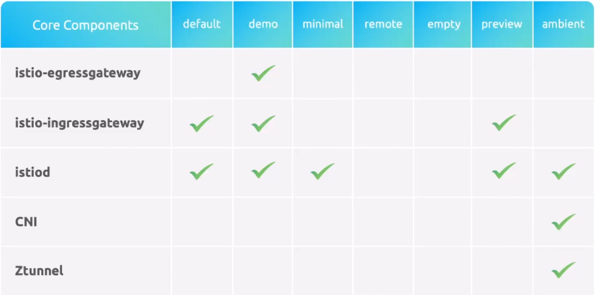
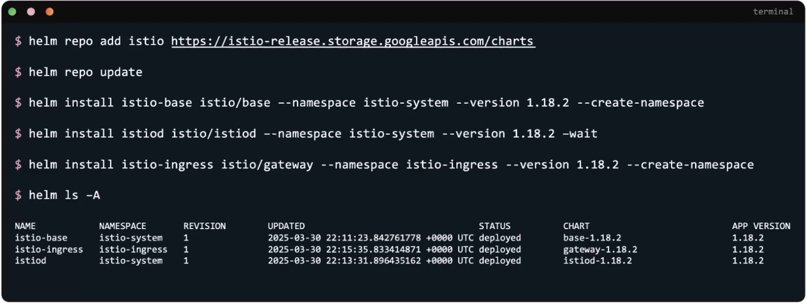

Страница релизов на GitHub: https://github.com/istio/istio/releases?page=9

Скачать утилиту `istioctl` можно командой:

```shell
$ curl -L https://istio.io/downloadIstio | ISTIO_VERSION=1.18.2 sh -
```

Далее добавляем новую директорию в PATH:

```shell
$ export PATH=$PWD/bin:$PATH
```

Либо копируем исполняемый файл из каталога `./bin/istioctl` в каталог `/usr/local/bin/`.

Смотреть доступные для установки профили:

```shell
$ istioctl profile list
```

<br>

Установка Istio:

```shell
$ istioctl install --set profile=demo -y
```

Валидация установки:

```shell
$ kubectl -n istio-system get pods
```

Второй вариант (занимает около 20-30 минут):

```shell
$ istioctl verify-install
```

Третий вариант:

```shell
$ istioctl analyze -n <namespace>
$ istioctl analyze -A
```

Включить Istio для определенного namespace:

```shell
$ kubectl label namespace default istio-injection=enabled
```

Валидация:

```shell
$ kubectl get ns default --show-labels
```

После включения Istio нужно удалить и развернуть заново имеющуюся нагрузку в namespace.

Также можно инжектировать Istio для определенного deployment, а не для всего namespace.

```shell
$ istioctl kube-inject -f bookinfo.yaml | kubectl apply -f -
```

Установка с помощью helm:

<br>

Выполнить валидацию yaml-файла, содержащего istio-компонент:

```shell
$ istioctl validate file.yaml
```

### Demo

Установка приложения bookinfo:

```shell
$ kubectl apply -f https://raw.githubusercontent.com/istio/istio/release-1.11/samples/bookinfo/platform/kube/bookinfo.yaml
```

Скачиваем утилиту `istioctl`:

```shell
$ curl -L https://istio.io/downloadIstio | ISTIO_VERSION=1.18.2 sh -
```

Далее добавляем новую директорию в PATH:

```shell
$ cd istio-1.18.2
$ export PATH=$PWD/bin:$PATH
```

Ставим core-компоненты istio:

```shell
$ istioctl install --set profile=demo -y
```

Выполняем валидацию:

```shell
$ istioctl analyze -n default
Info [IST0102] (Namespace default) The namespace is not enabled for Istio injection. Run 'kubectl label namespace default istio-injection=enabled' to enable it, or 'kubectl label namespace default istio-injection=disabled' to explicitly mark it as not needing injection.
```

Вешаем label на namespace для добавления sidecar-контейнеров istio:

```shell
$ kubectl label namespace default istio-injection=enabled
```

Пересоздадим pod-ы нашего приложения:

```shell
$ kubectl delete -f https://raw.githubusercontent.com/istio/istio/release-1.11/samples/bookinfo/platform/kube/bookinfo.yaml
$ kubectl apply -f https://raw.githubusercontent.com/istio/istio/release-1.11/samples/bookinfo/platform/kube/bookinfo.yaml
```

Теперь попробуем включить istio только для определенной нагрузки.

Создаем namespace и тестовый pod:

```shell
$ kubectl create ns db
$ kubectl -n db run redis-no-proxy --image=redis
```

Создадим манифест-файл `pod.yaml` для второго аналогичного pod-а:

```yaml
apiVersion: v1
kind: Pod
metadata:
  labels:
    run: redis
  name: redis
  namespace: db
spec:
  containers:
  - image: redis
    name: redis
```

Инжектируем istio на лету:

```shell
$ istioctl kube-inject -f pod.yaml | kubectl apply -f -
```

### Установка с помощью Helm

Добавляем новый репозиторий:

```shell
$ helm repo add istio https://istio-release.storage.googleapis.com/charts
$ helm repo update
```

Устанавливаем CRD:

```shell
$ helm install istio-base istio/base --namespace istio-system --version 1.18.2 --create-namespace --set profile=demo
```

Устанавливаем istiod:

```shell
$ helm install istiod istio/istiod --namespace istio-system --version 1.18.2 --set profile=demo --set pilot.resources.requests.memory=128Mi --set pilot.resources.requests.cpu=250m
```

Устанавливаем gateway:

```shell
$ helm install istio-ingress istio/gateway --namespace istio-ingress --version 1.18.2 --create-namespace
```

Вешаем label на namespace для добавления sidecar-контейнеров istio:

```shell
$ kubectl label namespace default istio-injection=enabled
```

Проверяем:

```shell
$ kubectl run redis --image=redis
```