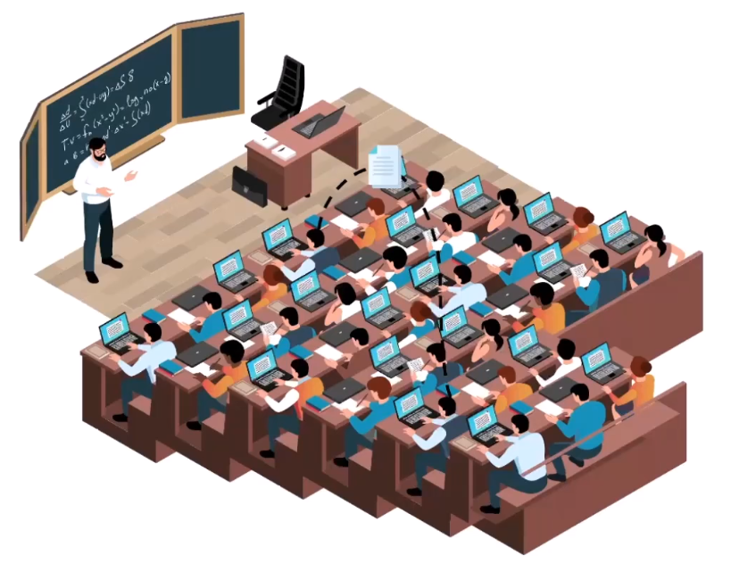
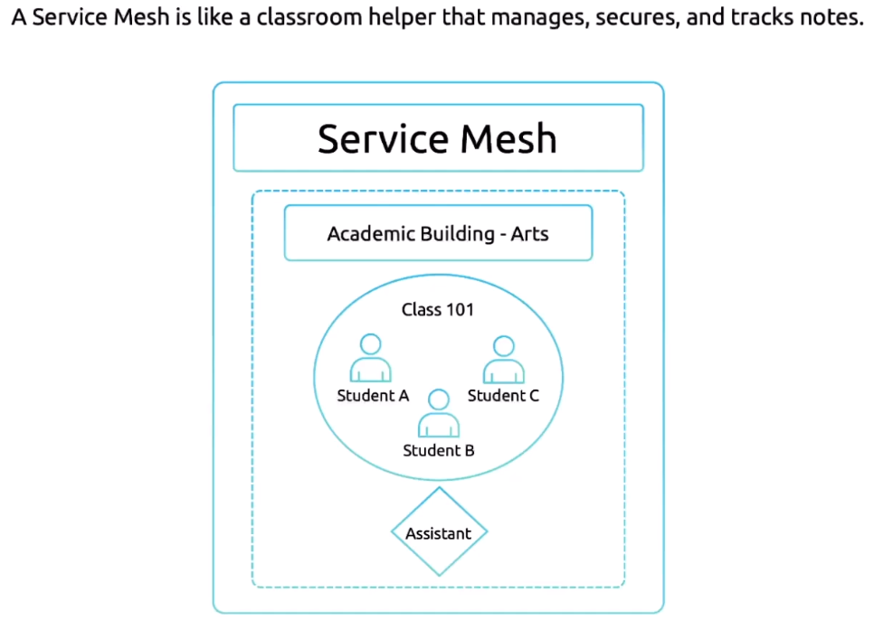
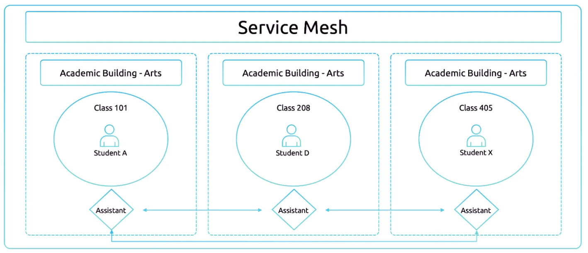

Все мы когда-то обменивались записками в классе, когда учились в начальной школе. Записка обычно содержит тему, время и участников.

Передать записку между двумя людьми очень легко, т.к. сразу известны отправитель и получатель. Даже когда появляется третий человек посередине, передать записку все равно довольно просто.

Теперь представим, что нужно передать записку через всю аудиторию. Это уже может быть довольно проблематично, т.к. возникает ряд вопросов.

- Как долго наше сообщение (записка) будет доставляться?
- Что если кто-либо из учеников потеряет (выбросит) нашу записку?
- Что если ответное сообщение не дойдет?
- Что если кто-то из учеников не захочет содействовать в передаче записки?
- Как убедиться, что наше сообщение прочитает только тот, кому оно предназначено и больше никто?
- Что если преподаватель "перехватит" передаваемое сообщение?

 

А что насчет передачи записки из одной аудитории в другую? А что насчет передачи записки внутри университетского кампуса из одного здания в другое?

Решение проблемы - Service Mesh.

Service Mesh - это своего рода помощник (classroom assistant), который будет организовывать, защищать и отслеживать передаваемые по классу записки. Он гарантирует, что коммуникация будет проходить гладко и без проблем.

Если студент A хочет передать сообщение студенту C, то ему нужно отправить записку помощнику, который в свою очередь обеспечит передачу записки студенту C (вероятно в лекции оговорка, зачем передавать студенту B???). Поскольку обрабатывает записку только помощник, это гарантирует, что никто другой не прочитает сообщение.

 

Эту же концепцию можно расширить на несколько классов. В каждом классе есть свой помощник. Если студент A хочет передать записку студенту X, то ему нужно отправить записку помощнику, а тот в свою очередь обменивается сообщениями с другими помощниками от имени студентов.

 

Роль Service Mesh:

- Гарантирует, что переписка между двумя сторонами останется конфиденциальной
- Гарантирует, что сообщения не потеряются и будут доставлены вовремя
- Логирует все происходящие события
- Обрабатывает возникающие проблемы (например если нужного студента нет на месте)

Главное преимущество заключается в том, что студенты могут сфокусироваться только на написании сообщений, а Service Mesh (Istio в данном случае) позаботится об остальном.