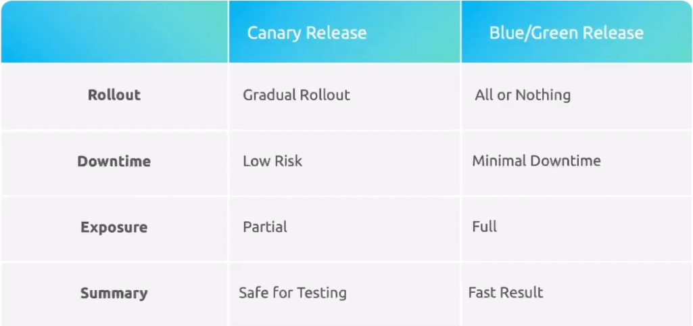
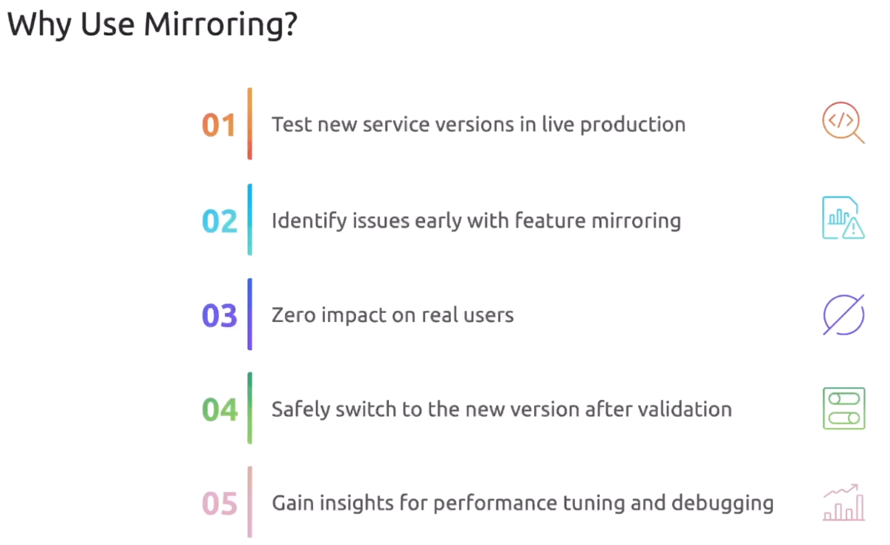

Канареечный релиз (canary release) - процесс ввода в эксплуатацию новой версии приложения. При таком подходе большая часть пользователей (например 90%) работает со стабильной версией приложения v1, и только небольшой процент пользователей (10%) направляется на новую версию приложения v2.

Blue/Green релиз - процесс переключения трафика со стабильной версии v1 на новую v2. Переключение происходит не постепенно, это так называемый hard switch.

У обоих подходов есть свои преимущества и недостатки:

<br>

Exposure - какой процент пользователей увидит новый функционал. При канареечном релизе мы не можем предугадать справится ли наша новая версия с нагрузкой, когда 100% пользователей будут переключены.

Однако есть способ, который собрал преимущества обоих вариантов релиза.

Зеркалирование (mirroring) - фича, позволяющая отправлять копию "живого" трафика на production и testing окружения.

Для зеркалирования не существует выделенного CRD. Это комбинация Virtual Service и Destination Rule.

Предположим у нас есть две версии одного приложения:

```yaml
apiVersion: apps/v1
kind: Deployment
metadata:
  name: app-deployment-v1
  namespace: frontend
spec:
  replicas: 3
  selector:
    matchLabels:
      labels:
        app: frontend
        version: v1
  template:
    metadata:
      labels:
        app: frontend
        version: v1
    spec:
      containers:
      - name: app
        image: app:1.1
```

```yaml
apiVersion: apps/v1
kind: Deployment
metadata:
  name: app-deployment-v2
  namespace: frontend
spec:
  replicas: 3
  selector:
    matchLabels:
      labels:
        app: frontend
        version: v2
  template:
    metadata:
      labels:
        app: frontend
        version: v2
    spec:
      containers:
      - name: app
        image: app:2.1
```

И Service:

```yaml
apiVersion: v1
kind: Service
metadata:
  name: app-svc
  namespace: frontend
spec:
  ports:
    - port:80
      name: http
  selector:
    app: frontend
```

Для разделения трафика создадим Destination Rule:

```yaml
apiVersion: networking.istio.io/v1
kind: DestinationRule
metadata:
  name: app-dr
  namespace: frontend
spec:
  host: app-svc
  subsets:
  - name: v1
    labels:
      version: v1
  - name: v2
    labels:
      version: v2
```

Также созадим Virtual Service:

```yaml
apiVersion: networking.istio.io/v1
kind: VirtualService
metadata:
  name: app-vs
  namespace: frontend
spec:
  hosts:
  - app-svc
  http:
  - route:
    - destination:
        host: app-svc.frontend.svc.cluster.local
        port:
          number: 80
        subset: v1
      weight: 100
    mirror:
      host: app-svc.frontend.svc.cluster.local
      port:
        number: 80
      subset: v2
    mirrorPercentage:
      value: 100
```

<br>

Документация: https://istio.io/latest/docs/reference/config/networking/virtual-service/#HTTPMirrorPolicy

### Demo

Ставим и включаем istio для namespace `default`, разворачиваем в нем две версии приложения echo-server.

```yaml
apiVersion: apps/v1
kind: Deployment
metadata:
  name: echo-server-v1
spec:
  replicas: 1
  selector:
    matchLabels:
      app: echo-server
      version: v1
  template:
    metadata:
      labels:
        app: echo-server
        version: v1
    spec:
      containers:
      - name: echo-server
        image: ealen/echo-server
        ports:
        - containerPort: 80

---
apiVersion: apps/v1
kind: Deployment
metadata:
  name: echo-server-v2
spec:
  replicas: 1
  selector:
    matchLabels:
      app: echo-server
      version: v2
  template:
    metadata:
      labels:
        app: echo-server
        version: v2
    spec:
      containers:
      - name: echo-server
        image: ealen/echo-server
        ports:
        - containerPort: 80
```

Также создадим Service:

```yaml
apiVersion: v1
kind: Service
metadata:
  name: echo-server
  labels:
    app: echo-server
spec:
  ports:
  - port: 80
    name: http
  selector:
    app: echo-server
```

Выведем логи обеих версий приложения:

```shell
$ kubectl logs -f echo-server-v1-699dcf589b-q9bkb 
$ kubectl logs -f echo-server-v2-6bc546d54c-mf2dl 
```

Создаем тестовый pod:

```shell
$ kubectl run test --image=nginx
```

Подключимся к тестовому pod-у и проверим доступность сервиса `echo-server`:

```
$ kubectl exec -it test -- /bin/bash

root@test:/# curl -s http://echo-server | grep -o '"HOSTNAME":"[^"]*"' | sed 's/"HOSTNAME":"\(.*\)"/HOSTNAME: \1/'
HOSTNAME: echo-server-v1-699dcf589b-q9bkb

root@test:/# curl -s http://echo-server | grep -o '"HOSTNAME":"[^"]*"' | sed 's/"HOSTNAME":"\(.*\)"/HOSTNAME: \1/'
HOSTNAME: echo-server-v2-6bc546d54c-mf2dl

root@test:/# curl -s http://echo-server | grep -o '"HOSTNAME":"[^"]*"' | sed 's/"HOSTNAME":"\(.*\)"/HOSTNAME: \1/'
HOSTNAME: echo-server-v1-699dcf589b-q9bkb

root@test:/# curl -s http://echo-server | grep -o '"HOSTNAME":"[^"]*"' | sed 's/"HOSTNAME":"\(.*\)"/HOSTNAME: \1/'
HOSTNAME: echo-server-v2-6bc546d54c-mf2dl
```

Попадаем то на v1, то на v2.

Создаем Destination Rule:

```yaml
apiVersion: networking.istio.io/v1beta1
kind: DestinationRule
metadata:
  name: echo-server
  namespace: default
spec:
  host: echo-server
  subsets:
  - name: v1
    labels:
      version: v1
  - name: v2
    labels:
      version: v2
```

Также создадим Virtual Service:

```yaml
apiVersion: networking.istio.io/v1beta1
kind: VirtualService
metadata:
  name: echo-server
  namespace: default
spec:
  hosts:
  - echo-server
  http:
  - route:
    - destination:
        host: echo-server
        subset: v1
      weight: 100
    mirror:
      host: echo-server
      subset: v2
    mirrorPercentage:
      value: 100.0
```

Вновь подключимся к тестовому pod-у и проверим доступность сервиса `echo-server`:

```
$ kubectl exec -it test -- /bin/bash

root@test:/# curl -s http://echo-server | grep -o '"HOSTNAME":"[^"]*"' | sed 's/"HOSTNAME":"\(.*\)"/HOSTNAME: \1/'
HOSTNAME: echo-server-v1-699dcf589b-q9bkb

root@test:/# curl -s http://echo-server | grep -o '"HOSTNAME":"[^"]*"' | sed 's/"HOSTNAME":"\(.*\)"/HOSTNAME: \1/'
HOSTNAME: echo-server-v1-699dcf589b-q9bkb

root@test:/# curl -s http://echo-server | grep -o '"HOSTNAME":"[^"]*"' | sed 's/"HOSTNAME":"\(.*\)"/HOSTNAME: \1/'
HOSTNAME: echo-server-v1-699dcf589b-q9bkb

root@test:/# curl -s http://echo-server | grep -o '"HOSTNAME":"[^"]*"' | sed 's/"HOSTNAME":"\(.*\)"/HOSTNAME: \1/'
HOSTNAME: echo-server-v1-699dcf589b-q9bkb

root@test:/# curl -s http://echo-server | grep -o '"HOSTNAME":"[^"]*"' | sed 's/"HOSTNAME":"\(.*\)"/HOSTNAME: \1/'
HOSTNAME: echo-server-v1-699dcf589b-q9bkb
```

Теперь мы попадаем только на v1, однако в логах pod-ов видно, что трафик приходит сразу на обе версии приложения (зеркалируется).