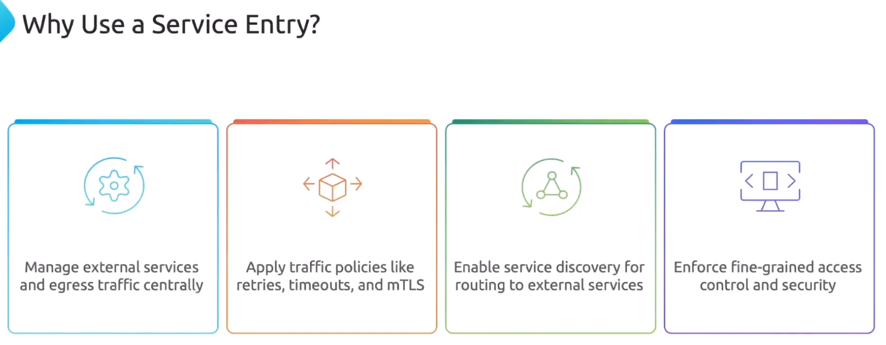

Когда вы устанавливаете Istio с помощью Istio Operator, то можете сконфигурировать режим для Outbound Traffic Policy - `meshConfig.outboundTrafficPolicy.mode`. Он может принимать два значения - `REGISTRY_ONLY` и `ALLOW_ANY`. По умолчанию используется режим `ALLOW_ANY`, т.е. разрешается взаимодействие с любыми внешними сервисами, даже если они не определены в Istio's Internal Service Registry.

Istio's Internal Service Registry отслеживает все сервисы внутри Service Mesh.

https://istio.io/latest/docs/reference/config/istio.mesh.v1alpha1/#MeshConfig-OutboundTrafficPolicy

Если установить режим `REGISTRY_ONLY`, то любой исходящий трафик к внешним сервисам (например БД или ВМ), которые не определены в Istio's Internal Service Registry, будет запрещен. И здесь в игру вступают Service Entries, которые добавляют записи для внешних сервисов в Istio's Internal Service Registry. Соответственно к этим сервисам можно будет маршрутизировать трафик.

Пример конфигурации Istio Operator с включенным режимом `REGISTRY_ONLY`:

```yaml
apiVersion: install.istio.io/v1alpha1
kind: IstioOperator
spec:
  components:
    base:
      enabled: true
    cni:
      enabled: false
    egressGateways:
    - enabled: false
      name: istio-egressgateway
    ingressGateways:
    - enabled: true
      name: istio-ingressgateway
    istiodRemote:
      enabled: false
    pilot:
      enabled: true
  hub: docker.io/istio
  meshConfig:
    outboundTrafficPolicy:
      mode: REGISTRY_ONLY
    defaultConfig:
      proxyMetadata: {}
```

Пример манифеста для Service Entry:

```yaml
apiVersion: networking.istio.io/v1
kind: ServiceEntry
metadata:
  name: postgres-db
  namespace: frontend
spec:
  hosts:
  - db.example.com
  ports:
  - number: 5432
    name: db
    protocol: TCP
  resolution: DNS
  location: MESH_EXTERNAL
```

Service Entry добавляется в определенный namespace. Таким образом, если мы включили режим `REGISTRY_ONLY`, то доступ к внешней БД будет работать только в namespace с соответствующим Service Entry и не будет работать в других namespace, где эта Service Entry отсутствует.

<br>

Документация по Service Entries: https://istio.io/latest/docs/reference/config/networking/service-entry/