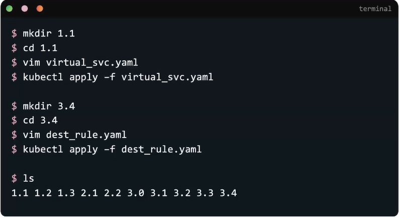

1. Вы должны очень хорошо ориентироваться в документации Istio. Самые важные разделы документации - это "Tasks" и "Reference".

2. Сдавать экзамен лучше на большом мониторе, т.к. подключать дополнительный монитор например к ноутбуку не разрешается. Соответственно на экране в 13 дюймов очень тяжело работать с заданием, терминалом и документацией одновременно.

3. Начинайте экзамен с вопросов, а не с заданий. Т.к. задания могут отнять много времени, есть шанс, что вы просто не успеете дойти до вопросов и соответственно не заработаете "легкие" баллы.

4. Создавайте под каждое задание отдельный каталог для хранения манифестов, чтобы избежать ситуации, когда в одной директории лежит куча файлов с непонятными именами.

    

5. Всегда используйте команду `istioctl analyze -n <namespace>` для валидации вашей работы.

6. Вы должно хорошо знать Vim и его горячие клавиши.

7. Вы должны уметь траблшутить проблемы с объектами K8s. Иначе говоря, если после настройки Istio у вас что-то не заработало, сначала нужно убедиться, что само приложение работает и работает объект service, который маршрутизирует на него запросы.

8. Не пропускайте выполнение задания, даже если вы не знаете как выполнить его от начала и до конца. Например вам нужно настроить Circuit Breaking. Создайте хотя бы DR с требуемым в задании именем, т.к. проверочный скрипт сначала смотрит существует ли в кластере объект с указанным именем и далее переходит к проверке его конфигурации. Таким образом вы можете заработать хотя бы часть баллов за подобное задание, а не 0.

9. Всегда следите за временем и не тратьте слишком много времени на один вопрос!