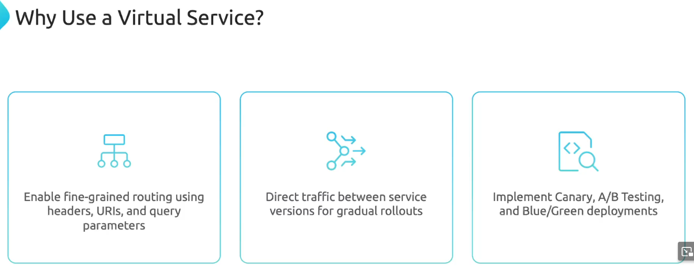
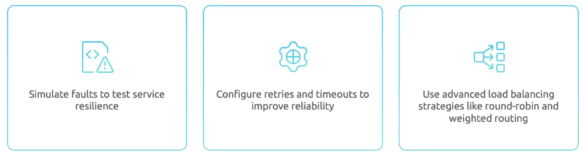

Virtual Services позволяет конфгурировать правила маршрутизации трафика для наших K8s-сервисов.

Предположим у нас есть простой Deployment:

```yaml
apiVersion: apps/v1
kind: Deployment
metadata:
  name: app-deployment
  namespace: frontend
spec:
  replicas: 1
  <...>
  template:
    metadata:
      labels:
        app: app
    spec:
      containers:
      - name: app
        image: app:1.1
```

И Service:

```yaml
apiVersion: v1
kind: Service
metadata:
  name: app-svc
  namespace: frontend
spec:
  ports:
    - port:80
      name: http
  selector:
    app: spp
```

Пример простого Virtual Service:

```yaml
apiVersion: networking.istio.io/v1
kind: VirtualService
metadata:
  name: app-vs
  namespace: frontend
spec:
  hosts:
  - app-svc   # The address used by a client when attempting to connect to a service
  http:
  - match:
    - uri:
        prefix: /
    route:
    - destination:
        host: app-svc.frontend.svc.cluster.local
        port:
          number: 80
  - match:
    - uri:
        prefix: /login
    rewrite:
      uri: /
    route:
    - destination:
        host: app-svc.frontend.svc.cluster.local
        port:
          number: 80
```

Зачем использовать Virtual Services, если есть стандартный объект Service? Стандартный Service не дает нам возможности управления трафиком на уровне L7.

<br>

<br>

Документация: https://istio.io/latest/docs/reference/config/networking/virtual-service/