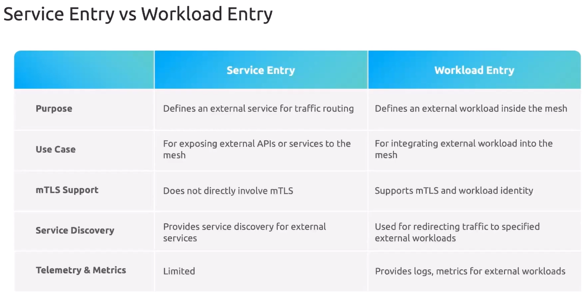

В первую очередь Service Entry используется для определения сервисов, которые находятся вне Service Mesh (внешние по отношению к K8s-кластеру, например БД).

Workload Entry - это способ регистрации non-Kubernetes сервиса (например AWS EC2) в Istio Service Mesh. Таким образом зарегистрированный сервис ведет себя как обычный pod.

Мы как будто говорим - "Эй, Istio, это ВМ, и она не запущена внутри K8s, но я хочу, чтобы она была частью Mesh".

Соответственно мы можем сказать Istio защищать трафик, применять политики, мониторить и в целом обращаться с этим сервисом точно как с обычным pod-ом.

Workload Entry содержит конфигурацию EC2 как минимум с одним label и мы используем этот label для отправки трафика на соответствующий endpoint.

Пример Workload Entry:

```yaml
apiVersion: networking.istio.io/v1beta1
kind: WorkloadEntry
metadata:
  name: external-app-we
  namespace: backend
spec:
  address: 54.146.220.232
  labels:
    app: external
```

Здесь мы сообщаем Istio, что существует некий внешний сервис с указанным IP-адресом и мы присваиваем ему label `app: external`.

Далее мы создаем Service Entry:

```yaml
apiVersion: networking.istio.io/v1beta1
kind: ServiceEntry
metadata:
  name: external-app-se
  namespace: backend
spec:
  hosts:
  - app.internal.com
  ports:
  - number: 80
    name: http
    protocol: TCP
  resolution: STATIC
  workloadSelector:   # здесь мы можем ссылаться как на pod-ы, так и на Workload Entries
    labels:
      app: external  
```

Таким образом мы регистрируем в Istio's Internal Service Registry новый endpoint `app.internal.com`, и трафик, приходящий на этот endpoint, будет маршрутизироваться на нагрузку, указанную в `workloadSelector` (т.е. на хост, указанный в Workload Entry).

<br>

Документация: https://istio.io/latest/docs/reference/config/networking/workload-entry/

Главно отличие между Workload Entry и Service Entry заключается в том, что Service Entry используется для маршрутизации трафика на внешний сервис (в случае когда исходящий из Mesh-а трафик жестко ограничен политикой), а Workload Entry используется для интеграции внешнего сервиса в Service Mesh.

Также в случае применения Workload Entry мы можем установить специальный агент на внешнюю ВМ и тогда сможем полноценно настроить mTLS, сбор логов и метрик с этой ВМ.

Workload Entry не может существовать сам по себе, работает только в связке с Service Entry.

### Demo

Ставим утилиту istioctl и делаем дамп профиля:

```shell
$ istioctl profile dump demo -o yaml > custom-profile.yaml
```

Внесем изменения в дамп профиля `custom-profile.yaml`:

```yaml
<...>
  meshConfig:
    outboundTrafficPolicy:
      mode: REGISTRY_ONLY
<...>
```

Валидируем:

```shell
$ istioctl validate -f custom-profile.yaml
```

Устанавливаем istio из созданного профиля:

```shell
$ istioctl install -f custom-profile.yaml -y
```

Чтобы сэмлуировать внешнее приложение, поставим непосредственно на ноду K8s-кластера Nginx:

```shell
$ sudo apt update && sudo apt install nginx -y
```

Проверяем работу Nginx:

```shell
$ curl http://localhost
```

Смотрим IP-адрес интерфейса `weave`:

```shell
$ ip -c addr show weave
```

Проверяем работу Nginx через этот интерфейс:

```shell
$ curl http://172.30.1.2
```

Все ок, работает.

Включим Istio Injection для namespace `default`:

```shell
$ kubectl label ns default istio-injection=enabled
```

Создадим тестовый pod:

```shell
$ kubectl run test --image=nginx
```

Из тестового pod-а проверим доступность Nginx по IP-адресу:

```shell
$ kubectl exec -ti test -- curl -I http://172.30.1.2

HTTP/1.1 502 Bad Gateway
date: Fri, 01 Aug 2025 05:15:40 GMT
server: envoy
transfer-encoding: chunked
```

Ожидаемо не работает.

Создадим Workload Entry:

```yaml
apiVersion: networking.istio.io/v1beta1
kind: WorkloadEntry
metadata:
  name: external-app-we
  namespace: default
spec:
  address: 172.30.1.2
  labels:
    app: external
```

Добавим Service Entry:

```yaml
apiVersion: networking.istio.io/v1beta1
kind: ServiceEntry
metadata:
  name: external-app-se
  namespace: default
spec:
  hosts:
  - app.internal.com   # создаем хост в istio internal registry
  ports:
  - number: 80
    name: http
    protocol: HTTP
  resolution: STATIC  # не DNS, потому что связан с Workload Entry
  workloadSelector:
    labels:
      app: external
```

The Service Entry defines the DNS to be added to Istio's Registry, in this case, `app.internal.com`. It also defines the port, protocol and the resolution of `STATIC` as opposed to `DNS`. Finally, we use the `workloadSelector` to tie (связывать) the Workload Entry to this Service Entry. Notice that the `labels` match the Workload Entry `labels`.

Из тестового pod-а вновь проверим доступность Nginx по IP-адресу:

```shell
$ kubectl exec -ti test -- curl -I http://172.30.1.2

HTTP/1.1 502 Bad Gateway
date: Fri, 01 Aug 2025 05:15:40 GMT
server: envoy
transfer-encoding: chunked
```

Не работает, т.к. мы обращаемся по IP-адресу. Но в Istio's Internal Registry есть только доменное имя. Проверим по нему:

```shell
$ kubectl exec -ti test -- curl -I http://app.internal.com

HTTP/1.1 200 OK
server: envoy
date: Fri, 01 Aug 2025 05:20:06 GMT
content-type: text/html
content-length: 615
last-modified: Fri, 01 Aug 2025 05:10:13 GMT
etag: "688c4c35-267"
accept-ranges: bytes
x-envoy-upstream-service-time: 1
```

По доменному имени работает!

Запустим еще один тестовый pod, но сразу зададим ему метку `app=external`, чтобы его "подхватил" наш Workload Entry:

```shell
$ kubectl run nginx --image=nginx --labels="app=external"
```

Чтобы различать Nginx, запущенный на ноде кластера, и Nginx, запущенны в pod-е, изменим его стартовую страницу:

```shell
$ kubectl exec nginx -- /bin/bash -c 'echo "This is an Nginx Pod" > /usr/share/nginx/html/index.html'
```

Из тестового pod-а вновь проверим доступность Nginx:

```shell
$ kubectl exec -ti test -- curl -I http://app.internal.com

This is an Nginx Pod

$ kubectl exec -ti test -- curl -I http://app.internal.com

<!DOCTYPE html>
<html>
<head>
<title>Welcome to nginx!</title>
<...>
```

Как видно мы попадаем то в pod, то на ноду кластера!