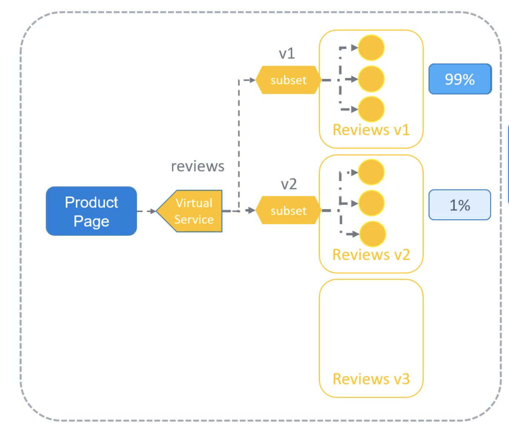

A/B Testing - очень популярный и мощный подход, используемый для понимания поведения пользователей. Это стимулирует экспериментирование и позволяет нам не строить догадки насчет того, каким образом наши приложения буду взаимодействовать, а увидеть все на реальных данных.

Мы уже видели это ранее в уроке про Virtual Services. С помощью Istio и Virtual Services мы теперь можем создать VirtualService вместо обычного Service. Затем мы определяем два destination routes для распределения трафика - subset v1 и subset v2 и задаем вес для каждого - 99% и 1% соответственно.

```yaml
apiVersion: networking.istio.io/v1alpha3
kind: VirtualService
metadata:
  name: reviews
spec:
  hosts:
    - reviews
  http:
  - route:
    - destination:
        host: reviews
        subset: v1
      weight: 99
    - destination:
        host: reviews
        subset: v2
      weight: 1
```

Теперь мы можем маршрутизировать 99% трафика на один сервис и 1% на другой, даже если сервис Reviews v2 имеет три и более pod-ов. Количество экземпляров теперь не имеет значения для распределения трафика и легко управляется через конфигурацию VirtualService.

<br>