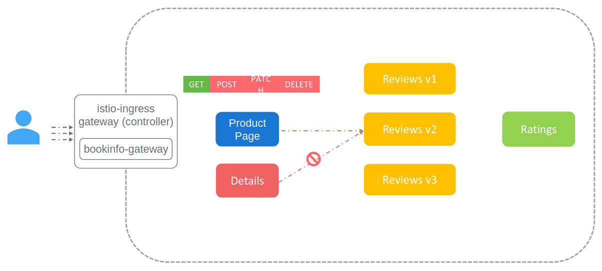

Авторизация в Istio обеспечивает гибкий подход к контролю доступа для входящего трафика. Мы можем контролировать какой сервис к какому из сервисов может обратиться, что называется east-west traffic, используя настройки авторизации. 

С политиками аутентификации мы имеем трафик конечных пользователей, также как и service-to-service трафик защищенным. Но что насчет контроля доступа?

Например мы хотим разрешить сервису Product Page доступ только к сервису Reviews и ограничить доступ до сервиса Details или до каких-либо других сервисов. Также сервису Product Page допускается выполнять только GET-вызовы до сервиса Reviews и запрещается выполнять POST или UPDATE-вызовы. Мы не хотим, чтобы кто-либо получил доступ к сервису Product Page для осуществления POST-вызовов к сервису Reviews для попытки изменения или обновления обзоров на книги.

<br>

Для этих целей Istio предоставляет механизмы авторизации, которые позволяют нам определять политики, разрешающие или запрещающие запросы, основываясь на определенных критериях.

Как обсуждалось ранее сами сервисы не требуют каких-либо изменений для включения авторизации. Это реализуется с помощью движка авторизации на Envoy Proxies в runtime-е. Когда запрос приходит на proxy, движок авторизации оценивает контекст относительно текущих политик авторизации и возвращает результат авторизации - разрешено либо запрещено.

Существует три действия, которые поддерживают политики авторизации - CUSTOM, DENY, ALLOW. 

Действие ALLOW разрешает прохождение запроса.

Действие DENY запрещает прохождение запроса.

Действие CUSTOM позволяет расширению (extension) обработать запрос.

Политики авторизации также могут быть настроены для аудита (AUDIT) запросов. С этой опцией, когда запрос достигает соответствующего правила, он подвергается проверке.

Давайте рассмотрим пример политики авторизации. Здесь тип объекта `AuthorizationPolicy`. Для этой политики настроено действие DENY. Данная политика запрещает все POST-запросы от namespace `bar` к namespace `bookinfo`.

```yaml
apiVersion: security.istio.io/v1beta1
kind: AuthorizationPolicy
metadata:
  name: authdenypolicy
  namespace: bookinfo
spec:
  action: DENY
  rules:
  - from:
    - source:
        namespaces: ["bar"]
    to:
    - operation:
        methods: ["POST"]
```