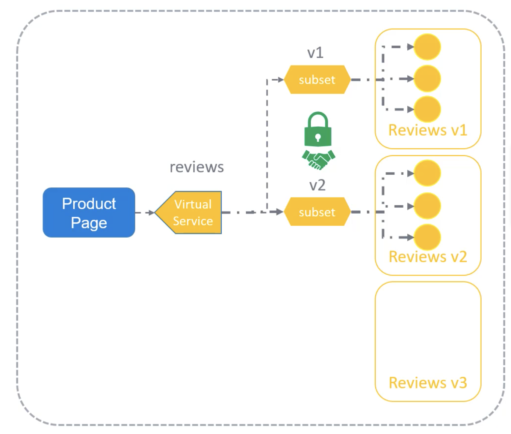

Destination Rules применяют политики маршрутизации после того как трафик смаршрутизирован на определенный сервис.

Ранее мы говорили о Virtual Services и каким образом сервис Reviews может быть сконфигурирован с помощью VirtualService для распределения определенного процента трафика на разные версии. Мы знаем, что 99% трафика посылается на subset v1 и 1% трафика посылается на subset v2.

```yaml
apiVersion: networking.istio.io/v1alpha3
kind: VirtualService
metadata:
  name: reviews
spec:
  hosts:
    - reviews
  http:
  - route:
    - destination:
        host: reviews
        subset: v1
      weight: 99
    - destination:
        host: reviews
        subset: v2
      weight: 1
```

Где и как определяются эти subsets? Subsets определяются в Destination Rules. Мы создаем объект с типом DestinationRule, задаем имя `reviews-destination` и host `reviews`. Далее мы определяем два subsets - v1 и v2, а также указываем Labels под ними.

```yaml
apiVersion: networking.istio.io/v1alpha3
kind: DestinationRule
metadata:
  name: reviews-destination
spec:
  host: reviews
  subsets:
  - name: v1
    labels:
      version: v1
  - name: v2
    labels:
      version: v2
```

Мы задали версии Version 1 и Version 2 соответственно. Это Labels, установленные на pod-ах для соответствующей версии Deployment `reviews`.

Вот так мы определяем отдельное подмножество (subset) сервисов, чтобы иметь возможность контролировать количество трафика, идущего на каждый subset.

```yaml
apiVersion: apps/v1
kind: Deployment
metadata:
  name: reviews-v1
spec:
  replicas: 3
  <...>
  template:
    metadata:
      labels:
        app: reviews
        version: v1
```

По умолчанию Envoy балансирует в round-robin манере. Это может быть настроено через DestinationRule путем указания политики трафика для балансировщика. Укажем для политики трафика значение `simple: PASSTHROUGH`. Трафик будет маршрутизироваться на хост, у которого меньше активных запросов.

```yaml
apiVersion: networking.istio.io/v1alpha3
kind: DestinationRule
metadata:
  name: reviews-destination
spec:
  host: reviews
  trafficPolicy:
    loadBalancer:
      simple: PASSTHROUGH
  subsets:
  - name: v1
    labels:
      version: v1
  - name: v2
    labels:
      version: v2
```

Существуют также другие простые алгоритмы, например round-robin, random и passthrough.

Что если мы хотим переопределить другую политику балансировки для определенных subsets? Например для subset v2 мы хотим задать политику балансировки random. Для этого мы просто задаем политику трафика на уровне subset и конфигурируем другую политику.

```yaml
apiVersion: networking.istio.io/v1alpha3
kind: DestinationRule
metadata:
  name: reviews-destination
spec:
  host: reviews
  trafficPolicy:
    loadBalancer:
      simple: PASSTHROUGH
  subsets:
  - name: v1
    labels:
      version: v1
  - name: v2
    labels:
      version: v2
      trafficPolicy:
        loadBalancer:
          simple: RANDOM
```

Таким образом мы можем настроить одну политику балансировки для всех subsets и отдельную для выбранного subset в случае необходимости.

Существует еще много других конфигураций поддерживаемых Destination Rules. Например, для настройки использования клиентом TLS укажите `SIMPLE` TLS:

```yaml
apiVersion: networking.istio.io/v1alpha3
kind: DestinationRule
metadata:
  name: reviews-destination
spec:
  host: reviews
  trafficPolicy:
    tls:
      mode: SIMPLE
```

Для настройки mutual TLS, установите mode в `MUTUAL` и укажите путь до файлов сертификатов:

```yaml
apiVersion: networking.istio.io/v1alpha3
kind: DestinationRule
metadata:
  name: reviews-destination
spec:
  host: reviews
  trafficPolicy:
    tls:
      mode: MUTUAL
      clientCertificate: /myclientcert.pem
      privateKey: /client_private_key.pem
      caCertificates: /rootcacerts.pem
```

<br>

Стоит отметить одну важную вещь - поле `host`. Сейчас оно имеет значение `reviews`, это сокращенное имя Service. Когда используются сокращенные имена вместо FQDN-имён, Istio будет интерпретировать сокращенное имя, основываясь на правилах namespace, а не на actual service's namespace. Это может привести к неправильной конфигурации, если ваше Service находится в другом namespace. Чтобы избежать этого рекомендуется использование FQDN-имён вместо сокращенных имён.

```yaml
apiVersion: networking.istio.io/v1alpha3
kind: DestinationRule
metadata:
  name: reviews-destination
spec:
  host: reviews.default.svc.cluster.local
  trafficPolicy:
    tls:
      mode: MUTUAL
      clientCertificate: /myclientcert.pem
      privateKey: /client_private_key.pem
      caCertificates: /rootcacerts.pem
```