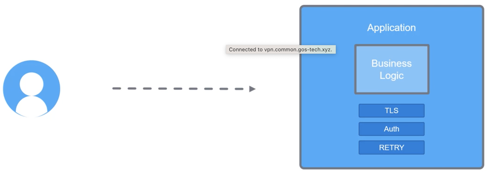
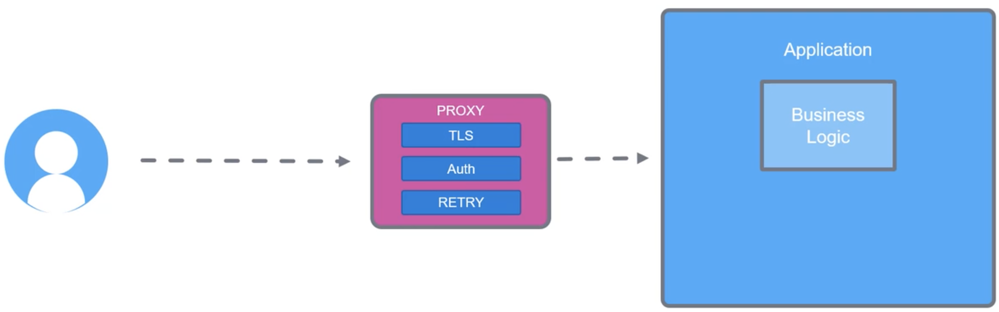
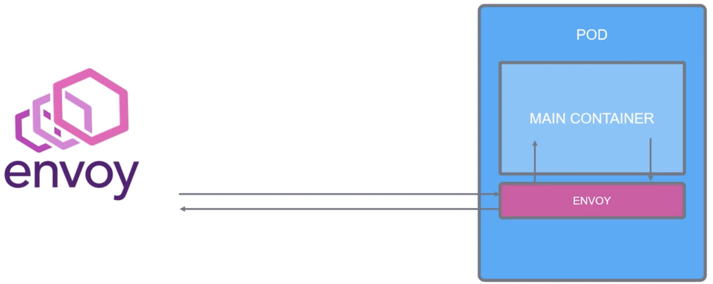

Envoy - наиболее распространненная proxy в мире Service Mesh. Но что же такое proxy?

Давайте забудем на секунду о контейнерах и K8s и поговорим о пользователе, который пытается подключиться к приложению.

Приложению прежде всего имеет какую-либо бизнес-логику. Кроме этого приложение может выполнять и другие функции, например защита соединений с помощью TLS-шифрования, аутентификация, повтор запросов, если в данный момент оно не может обслужить пользователя и т.д. Эти функции должны быть в коде приложения.

 

Но что, если весь этот дополнительный функционал вынести в отдельный сервис?

Тогда разработчики смогли бы сфокусироваться исключительно на разработке бизнес-логики. И вот тут мы приходим к proxy.

Теперь пользователь доходит до proxy, а proxy перенаправляет запрос к приложению.

 

Envoy - это open source proxy, разработанная для современной сервис-ориентированной архитектуры.

Envoy - это proxy и шина для взаимодействия с расширенными возможностями.

Она работает как sidecar рядом с вашим контейнером. Входищий и исходящий трафик нашего pod-а использует Envoy в качестве proxy.

 