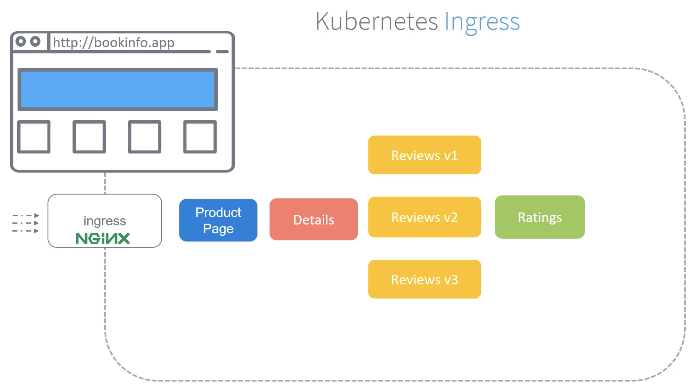

Теперь, когда мы развернули приложение и установили Service Mesh, как сделать сервисы доступными для внешних пользователей? В нашем случае страницей, которую должны использовать юзеры, является Product Page.

Наше требование - если кто-либо пойдет по URL http://bookinfo.app, то он должен увидеть Product Page с деталями обо всех продуктах. Как это может быть достигнуто? Когда мы изучали K8s, мы узнали об Ingress. Ingress контролирует трафик приходящий в K8s-кластер. Это реализуется с помощью развертывания Ingress-контроллера, например Nginx-контроллера, и дальнейшего определения набора routing rules, которые маршрутизируют трафик к соответствующим сервисам. С помощью Ingress мы можем настроить правила таким образом, чтобы любой приходящий в K8s-кластер трафик на hostname `bookinfo.app` должен быть направлен к Service `productpage`.

<br>

Далее представлен простой объект Ingress, который мы можем создать, чтобы направить приходящий в K8s-кластер трафик на hostname `bookinfo.app` к Service `productpage`.

```yaml
apiVersion: networking.k8s.io/v1beta1
kind: Ingress
metadata:
  name: ingress
spec:
  rules:
  - host: bookinfo.app
    http:
      paths:
      - path: /
        backend:
          serviceName: productpage
          servicePort: 8000
```

Также существует другой подход, который предлагает и рекомендует Istio, поддерживающий большее количество features, таких как расширенный мониторинг и правила маршрутизации. Он называется Istio Gateway.

Gateways - это балансировщики, которые располагаются на краю Mesh-а. Они являются главными конфигурациями, которые управляют входящим и исходящим трафиком Service Mesh.

Это рекомендованный подход в сравнении с использованием только голых Ingress.

Ранее обсуждалось, что когда мы разворачиваем Istio в кластере, он устанавливает два дополнительных компонента - `istio-ingressgateway` и `istio-egressgateway`. Это Istio Gateway контроллеры, прямо как Ingress-контроллер, о котором мы говорили ранее.

Ingress Gateway управляет всем входящим к сервисам трафиком, Egress Gateway управляет всем исходящим от сервисов трафиком.

Мы обсуждали, что Ingress разворачивается в K8s с использованием контроллеров, например таких как Nginx. Istio в свою очередь разворачивает Ingress Gateways с использованием Envoy Proxies. Мы изучали ранее, что все сервисы имеют в составе Envoy Proxy в формате sidecar-контейнера. Однако Ingress и Egress Gateways являются всего лишь standalone Envoy Proxy, находящихся на границе Service Mesh. Они не работают как sidecar-ы. Это дефолтные gateway-контроллеры, которые были развернуты в момент, когда в кластере был установлен Istio.

Однако мы также можем иметь наш собственный набор кастомных gateway-контроллеров.

Наша цель состоит в том, чтобы захватить весь трафик, проходящий через контроллер `istio-ingressgateway` и направить весь трафик идущий к `bookinfo.app` на нашу страницу продукта. Для этого первым делом мы создаем объект Gateway.

```yaml
apiVersion: networking.istio.io/v1alpha3
kind: Gateway
metadata:
  name: bookinfo-gateway
spec:
  selector:
    istio: ingressgateway
  servers:
  - hosts:
    - '*'
    port:
      name: http
      number: 80
      protocol: HTTP
```