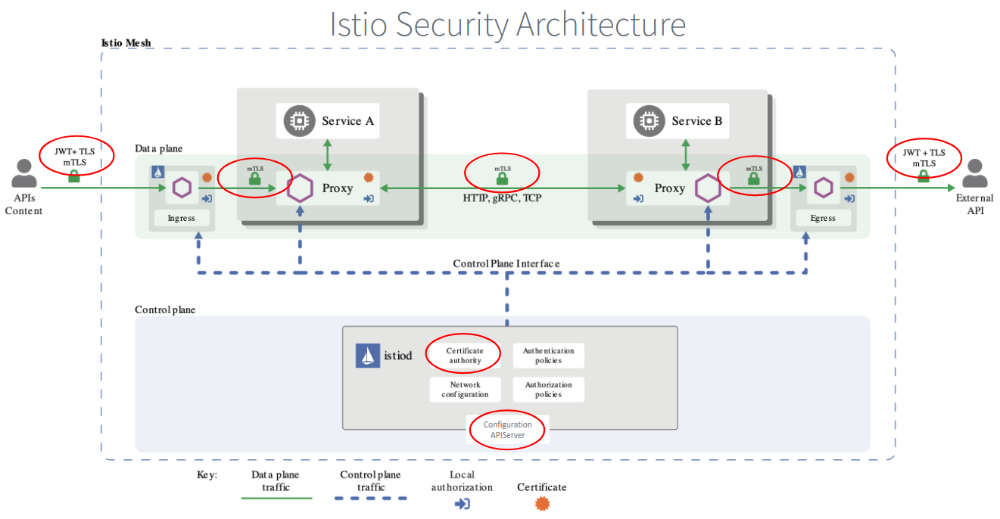

Ниже представлена архитектурная диаграмма из документации Istio.

 

Внутри istiod расположен центр сертификации (Certification Authority, CA), который управляет ключами и сертификатами Istio. Здесь проверяются сертификаты и утверждаются запросы на подпись сертификата.

Каждый раз, когда запускается какая-либо рабочая нагрузка, Envoy proxy запрашивает сертификат и ключ у Istio-агента. Это помогает обеспечивать безопасное взаимодействие между сервисами.

Компонент Configuration APIServer распространяет политики аутентификации, авторизации и безопасного именования ко всем proxy.

Sidecar и ingress/egress proxy работают в качестве точек применения политики (policy enforcement points).

Сертификаты, ключи, политики аутентификации, авторизации и безопасного именования посылаются этим proxy постоянно. Это означает, что каждая точка проходит проверку безопасности, а не только точка входа в сеть. Это называется "security in depth".