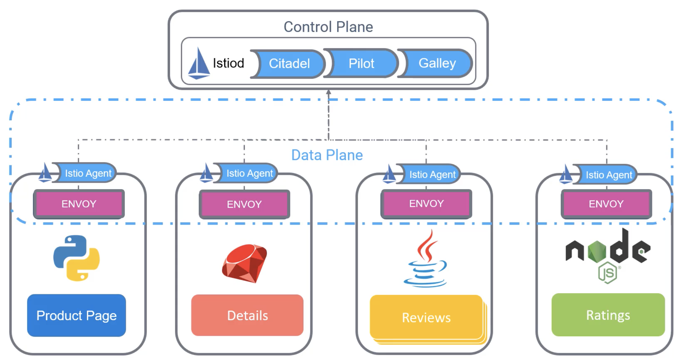

Istio - это free open-source Service Mesh, который предоставляет эффективный способ для защиты, соединения и мониторига сервисов. Istio работает с K8s и традиционными нагрузками, тем самым принося универсальное управление трафиком, телеметрию и безопасность в сложные deployment-ы.

Istio поддерживается и предоставляется ведущими cloud-провайдерами и консультантами.

Ранее мы говорил о proxy-сервисе, который заботится обо всех задачах, которые должны быть вынесены "на аутсорс" из микросервисов. Эти proxy и взаимодействие между ними формируют data plane.

В Istio эти proxy реализованы с помощью высокопроизводительного open-source proxy, известного как Envoy. Proxy взаимодействуют с компонентом серверной части известным как control plane. Изначально control plane состоял из трех компонент - Citadel, Pilot и Galley. Citadel управляла генерацией сертификатов, Pilot помогал с service discovery, а Galley осуществляла валидацию конфигурационных файлов. Позднее эти три компонента были объединены в единый демон под названием Istiod.

Каждый сервис или порт имеет в составе отдельный компонент (наравне с Envoy Proxy) называемый Istio Agent. Istio Agent отвечает за передачу configuration secrets к Envoy Proxy.

 